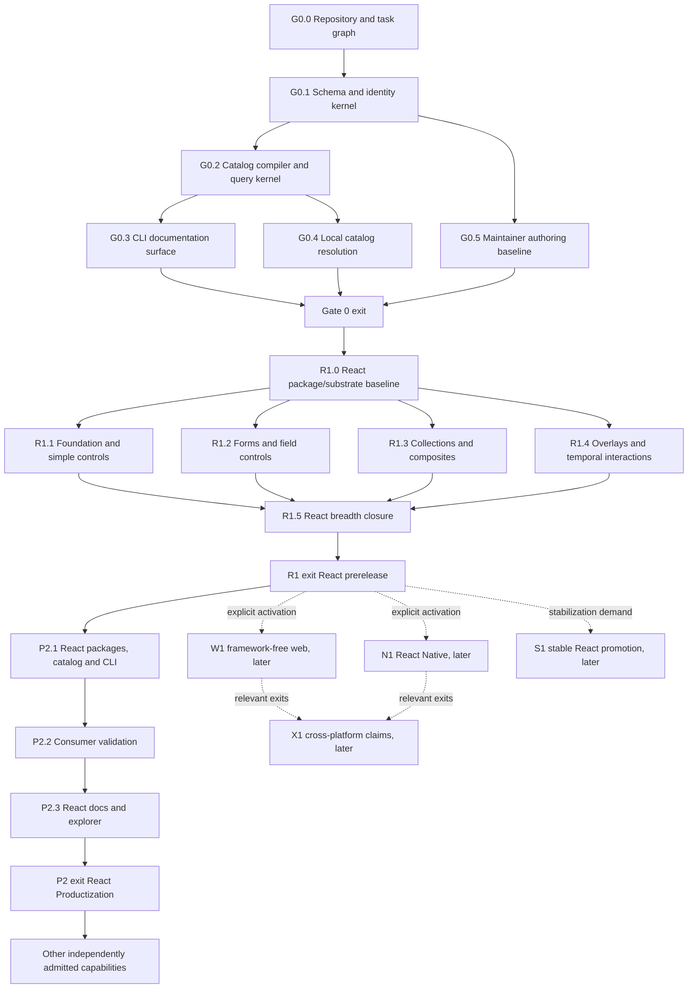

# Mux UI milestone roadmap

- Status: Execution baseline
- Product: Mux UI
- Architecture authority: [`monorepo-architecture.md`](./monorepo-architecture.md)
- Scope: implementation milestones, entry conditions, deliverables, acceptance
  evidence, dependencies, and scope controls

## Purpose and authority

Decision 0012 and Product Scope `8.0.0` reset only the current product and
machine identity to Mux UI / `muxui` / `@muxui/*`. Existing milestone states,
the 53-family R1 allocation, accepted proof meaning, platform deferrals, and
release stops do not change. Historical evidence and locators remain under
their original predecessor identities; current and future delivery uses Mux UI
identities.

This roadmap turns the Mux UI architecture into evidence-bearing delivery
milestones. It does not replace or reinterpret the architecture. If this
roadmap conflicts with the architecture, the architecture wins and the roadmap
must be corrected before work continues.

The roadmap is dependency-based, not calendar-based. A milestone completes
only when its retained acceptance evidence proves the exit condition. Code
completion, a demonstration, elapsed time, or agreement that a milestone is
“close enough” is not completion.

The governing delivery rule is:

> Build the smallest operability spine that a real renderer slice needs, prove
> the primary React slice against its exact `web.react` contract, and admit
> broader tooling or a secondary renderer only when an observed workflow and
> the applicable R1/P2/W1/N1 entry authority justify it.

## How to use this roadmap

### Status vocabulary

Every milestone uses one of these states:

| State | Meaning |
| --- | --- |
| `not-ready` | One or more entry conditions are unproved. Work may explore, but it may not publish or become a dependency. |
| `ready` | Every entry condition is proved and the milestone scope is locked. |
| `active` | Work is underway within the locked scope. |
| `evidence-review` | Deliverables are complete and the retained evidence packet is under review. |
| `complete` | Every exit assertion passes with no expired or disallowed exception. |
| `blocked` | A canonical-source, safety, compatibility, integrity, or required-proof failure prevents progress. |

Ordinary scheduling conflicts, missing later-gate infrastructure, optional
dashboard work, and unproved product ideas are not architectural blockers.

### Milestone completion rule

A milestone is complete only when all of the following are true:

1. Every entry condition was true when work began and remained true at
   evidence capture.
2. Every required deliverable exists under its named owner.
3. Every required assertion has retained evidence tied to exact source,
   artifact, binding, package, catalog, and environment revisions as
   applicable.
4. All negative-path fixtures pass; success-path demonstrations alone are
   insufficient.
5. Generated output has been reproduced from canonical input and was not
   patched.
6. Scope remained within the milestone, or a separately approved roadmap
   change re-established entry and exit conditions.
7. Active operational exceptions, if permitted, only narrow support and are
   visible in diagnostics and release metadata.

### Evidence packet contract

Each milestone produces one immutable evidence index. Individual evidence
records follow the architecture’s proof schema and identify:

- milestone and assertion ID;
- source revision and catalog version/digest;
- artifact, binding, binding-spec revision, renderer package, and runtime
  profile where applicable;
- evidence kind, tool version, environment, input and canonical example IDs;
- outcome, retained artifact URI or digest, disclosure class, owner, timestamp,
  and retention/expiry policy;
- active exception or advisory references; and
- the exact command or reproducible procedure used to produce the result.

Public evidence exposes only sanitized metadata and digests. Restricted or
internal payloads remain access-controlled. A transient log cannot satisfy an
exit condition.

Evidence used for a current milestone entry or exit assertion must follow
that assertion's existing proof owner and exact source, executed, and
proof-tool identity relationship. Historical evidence and internal
applicability-maintenance roots remain retrievable audit records but cannot
substitute for current proof. In the superseded historical sequence, G1.0,
G1.1, and G1.2 retained separate evidence indexes, assertions, acceptance, and
dependency states and each had to be independently proved ready before G1.3
could enter `ready`. That past dependency cannot route or satisfy current R1
entry; R1 uses only an explicit reusable-proof binding or bounded reproof.

### Acceptance cadence

| Cadence | Minimum evidence |
| --- | --- |
| Pull request | Schema and relation validity, generation identity, field ownership, affected types and units, changed examples, focused package fixture, and basic accessibility checks. |
| Scheduled | Full browser/device matrices, visual permutations, performance, broad consumer fixtures, and repeated agent evaluations. |
| Gate exit | Every milestone assertion for that gate, cross-cutting fixtures enabled by the gate, exact release-manifest correlation, and no expired exception. |
| Stable release | All deterministic gates, supported-profile smoke tests, digest parity, required manual accessibility evidence, compatibility review, and support-lifetime evidence retention. |

## Execution guardrails

### Renderer-first priority

- R1 React renderer tranches are the critical path after Gate 0.
- An enabling-system milestone must name the renderer or acceptance fixture it
  unblocks. Unattached infrastructure returns to `not-ready`.
- A later capability cannot block an earlier renderer milestone unless the
  renderer would violate a canonical-source, safety, compatibility, integrity,
  or required-proof rule without it.
- Shared foundation code is added only after a real slice demonstrates the
  repeated semantic, logic, or interaction shape.
- React breadth proceeds only inside the fixed family allocations against the exact
  shared baseline. Framework-free/native breadth and broad tooling wait for
  their own activation and entry evidence.

### Scope admission

A proposal for a new artifact kind, durable relation, revision axis, package,
manifest, command, integration, or public capability must include:

1. an observed workflow that existing records and relations cannot express;
2. one authoritative owner and at least one named consumer;
3. its query or operation shape;
4. validation, proof, compatibility, and migration effects;
5. scaffold, semantic diff, diagnostics, and affected-closure support; and
6. a removal or deprecation path.

Admission preference is: derive a projection, add a typed relation, add a
bounded field to an existing kind, and only then introduce a new kind. Missing
admission evidence means defer, not “implement experimentally in stable
output.”

### Scope lock and change control

At `ready`, the milestone’s deliverables and exit assertions are locked. New
work is classified as one of:

- **Required correction:** necessary to satisfy an existing assertion. It stays
  in the milestone.
- **Adjacent improvement:** useful but unnecessary for exit. It becomes a
  separately tracked follow-up.
- **New capability or ontology:** requires scope admission and a roadmap
  amendment.
- **Later-gate dependency:** remains unavailable and must not be simulated by
  an undocumented shortcut.

No milestone may silently broaden its target matrix, supported runtime profile,
public API, or evidence claim. Narrowing support requires an explicit canonical
disposition or permitted operational exception.

From G1.9 onward, the separately admitted `ChangeIntentEnvelope` capability may
provide an optional read-only preview for its named authoring workflows. It is
not a repository-wide merge prerequisite and is not an R1 component-delivery
prerequisite. A later write-capable protocol, if admitted, must establish its
own approval, journal, and stale-preview rules.

### Repository delivery boundary

Repository delivery controls are implementation policy, not roadmap milestones
or renderer entry conditions. Ordinary R1 component work uses canonical owners,
proportional deterministic and risk-selected proof, protected CI, and protected
pull-request review. No private delivery profile, operation descriptor,
tranche-lock digest, or separate evidence-acceptance gate is required for an R1
component or routine protected-PR operation.

### Non-waivable rules

No operational exception or milestone decision may:

- patch a generated projection;
- create a second authoring owner;
- broaden support or compatibility;
- bypass package, catalog, signature, provenance, or lockfile integrity;
- turn missing evidence into a passed result;
- promote a stable binding without mandatory accessibility and safety proof;
- let hosted/latest guidance masquerade as installed-local truth;
- execute an unconfirmed mutation; or
- use a stochastic model result to override deterministic failure.

## Dependency map



Completed G1.0–G1.2 and their evidence remain immutable historical inputs.
G1.3–G1.9, the old Gate 1 exit, and the old G2 sequence no longer own current
React delivery. A historical result satisfies a new entry only when the new
milestone explicitly binds the exact reusable fact and its applicability.

## Roadmap overview

| Gate | Outcome | Release boundary | Gate must not include |
| --- | --- | --- | --- |
| Gate 0 | One canonical artifact compiles and is retrieved locally through deterministic API, human, JSON, and dense CLI surfaces. | Internal foundation; no public product claim. | Broad catalog, public MCP, docs application, planner, project mutation, migration, semantic search. |
| R1 | A standalone React package delivers accepted component tranches and disposition-complete coverage of the applicable pinned React Aria surface. | Package-only `@muxui/react` prereleases under `next`; no stable or secondary-renderer claim. | Framework-free/native counterparts, public CLI/catalog product, stable lifecycle, cross-platform equivalence. |
| P2 | Compatible catalog/tooling, exact installed-local guidance, consumer validation, React docs/explorer/local MCP, and enabled safe operations are productized. | React Productization release candidate; stable only through S1. | Secondary renderer completion, hosted write access, arbitrary agent patches, unproved extensions. |
| Gate 3 | Operational scale and independently justified integrations are enabled without changing kernel authority. | Capability-specific releases. | Any capability lacking observed demand, owner, bounded protocol, proof, and lifecycle. |

## Gate 0 — schema and query kernel

### G0.0 Repository, ownership, and task graph

**Objective:** Establish the predictable repository topology and the smallest
root workflow before product sources multiply.

**Entry conditions**

- The architecture is accepted as the normative source.
- The package manager and supported runtime policy are recorded in one
  repository decision.
- No existing generated inventory is treated as canonical input.

**Primary ownership**

- Root workspace configuration
- Root `AGENTS.md` and local navigation files
- Declarative task graph and repository policy checks

**Deliverables**

- The architecture-defined `catalog/`, `packages/`, `apps/`, `tooling/`,
  `tests/`, and `decisions/` boundaries.
- pnpm workspaces with a dependency-aware task graph.
- The memorable root commands: `check`, `check:all`, `generate`,
  `generate:check`, `test:agent`, and `release:prepare`.
- Generated-file markers, canonical/projection path policy, slug convention,
  and alias audit.
- A short root `AGENTS.md` containing only the route map, discovery loop,
  source ownership, and verification entry points.

**Acceptance evidence**

| ID | Required assertion | Retained evidence |
| --- | --- | --- |
| `E-G0.0-01` | A clean checkout discovers every major owner from the root route map without a repository-wide component inventory. | Cold-navigation transcript and path audit. |
| `E-G0.0-02` | Root tasks invoke package-owned tasks in dependency order and affected mode does not skip a required dependent. | Synthetic dependency fixture and task-graph report. |
| `E-G0.0-03` | Canonical and generated paths are distinguishable; a projection edit is rejected with its source pointer. | Positive/negative repository-policy fixture. |
| `E-G0.0-04` | A clean second generation run leaves the worktree unchanged. | Generation identity digest and clean-worktree assertion. |

**Scope controls**

- Do not create a component registry, docs site, MCP server, semantic-search
  service, or release dashboard.
- Do not add package-specific scripts to the root when a filtered task can own
  them.
- Do not create extra foundation packages before real slices prove separate
  distribution value.

**Exit condition:** The repository has one predictable navigation path, one
task graph, enforced ownership boundaries, and reproducible no-op generation.

### G0.1 Schema, identity, and revision kernel

**Objective:** Define the minimum closed schemas and identity rules required to
compile one real component without pre-building the full ontology.

**Entry conditions**

- G0.0 is complete.
- The first proof artifact and initial platform identifiers are selected.
- Every proposed field has an authored, derived, or proved classification.

**Primary ownership**

- `@muxui/schema`
- Canonical serialization and revision policy
- Minimal relation registry

**Deliverables**

- Immutable `ArtifactRef` syntax and uniqueness checks.
- Minimum schemas for a component concept, platform binding, example, guide,
  capability, token source, query envelope, and diagnostic.
- Closed-schema behavior, explicit `schemaVersion`, lifecycle and strategy
  enums, platform/runtime-profile IDs, and minimal typed relations.
- Authored/derived/proved field metadata and one-owner validation.
- Canonical serialization plus `contentRevision` and binding `specRevision`
  closure calculation.
- Guidance-impact classification and the rule that implementation-relevant
  examples are normative regardless of an authored editorial label.
- Response-envelope versioning and append-only error-code policy.
- Schema evolution rules for patch, minor, major, deprecation, and explicit
  source migration.
- Token-source schema with closed typed layers, modes, aliases, override
  policies, and canonical ownership of authored and derived fields.
- Versioned query schemas for bounded token sections, cursors, summary
  metadata, diagnostics, and deterministic compatibility negotiation.
- Closed `TokenSectionPageBudgetProfile` grammar for the query/lexer versions,
  canonical cost/order rule, envelope preimage/reserve, limits, progress,
  2,048-token budget, and stable oversize diagnostic.

**Acceptance evidence**

| ID | Required assertion | Retained evidence |
| --- | --- | --- |
| `E-G0.1-01` | Valid minimal records compile; unknown fields, duplicate IDs, invalid relations, and unowned fields fail closed. | Positive and negative schema corpus. |
| `E-G0.1-02` | Whitespace/key-order changes preserve revisions while a meaningful authored change updates the correct revision. | Canonicalization fixture and digest comparison. |
| `E-G0.1-03` | Editorial-only input changes content identity but not renderer compatibility; normative binding input changes `specRevision`. | Revision-closure fixture. |
| `E-G0.1-04` | Renderer/package/source locations are derived and cannot be authored as duplicate inventory. | Field-ownership audit. |
| `E-G0.1-05` | Schema compatibility fixtures enforce the declared patch/minor/major rules and every source/query version, migration, absence, page-profile, negotiation, and notice-boundary clause required by the active accepted correction profile. | Source/query version-negotiation matrix bound to the accepted correction-profile ID. |

**Scope controls**

- Do not add generic page, journey, flow, free-standing rationale, or consumer
  overlay kinds.
- Do not encode the full TypeScript, JSX, DOM, or React Native host type system.
- Do not create a revision axis without a named compatibility decision that
  existing revisions cannot express.
- Experimental fields stay inert and cannot affect stable query behavior.

**Exit condition:** One minimal canonical record family has stable identity,
closed validation, explicit ownership, and deterministic content/spec revision
semantics.

### G0.2 Catalog compiler and pure query kernel

**Objective:** Compile canonical sources into one immutable local catalog and
query it through a side-effect-free API.

**Entry conditions**

- G0.1 is complete.
- One minimal canonical component and its relations validate.
- Canonical ordering and digest algorithms are fixed by tests.

**Primary ownership**

- `@muxui/catalog`
- Catalog compiler and search-index builder

**Deliverables**

- Deterministic catalog compiler, relation graph, search index, catalog digest,
  and immutable bundle format.
- Pure `getManifest`, `listArtifacts`, `searchArtifacts`, and `getArtifact`
  operations.
- Deterministic lexical/metadata search with match reasons; no required hosted
  or semantic search.
- Platform, detail, section, example-purpose, limit, and cursor request
  semantics.
- Resolution/provenance metadata in every implementation-guidance response.
- Query response schemas and stable type discriminators.
- Explicit source pointers and bounded relation traversal.
- Stable, complete, sectional `tokens` retrieval with query-version/content-
  bound cursors and no unbounded current response.
- Catalog-owned `TokenSectionPageBudgetProfile` canonical values and
  budget-aware page selection. The profile's canonical JSON enters catalog
  identity; `limit` is an item ceiling, the catalog reserves the declared
  envelope, emits the greatest fitting non-empty prefix, and fails a single
  oversize entry without truncation.

**Acceptance evidence**

| ID | Required assertion | Retained evidence |
| --- | --- | --- |
| `E-G0.2-01` | Two clean builds from the same sources produce byte-identical catalogs, indices, ordering, and digests. | Dual-build digest report. |
| `E-G0.2-02` | Programmatic list/search/get requests are deterministic and include exact match reasons, provenance, authority, and compatibility context. | Golden API corpus. |
| `E-G0.2-03` | Pagination is stable under the same query API, catalog digest, token-source revision, section, and selector state and rejects invalid, cross-version, or cross-digest cursors. | Cursor integrity and historical-version fixture. |
| `E-G0.2-04` | Search returns bounded summaries; under the current sectional contract, retrieval returns selected complete records without copying the whole graph and continuation enumerates every token/crosswalk entry within response and dense-page budgets. A single oversize entry fails closed without truncation. Explicitly negotiated historical inline compatibility responses remain deterministic and parity-proved but are not represented as sectional-budget proof. | Response-size, completeness, oversize, historical-compatibility, and relation-boundary test bound to the accepted correction-profile ID. |
| `E-G0.2-05` | Query operations perform no writes, network requests, code execution, or environment-dependent ranking. | Hermeticity and side-effect audit. |

**Scope controls**

- `planComposition` remains unavailable.
- No docs application, MCP transport, project analysis, mutation, or hosted
  fallback is implemented here.
- Query logic stays transport-independent; adapters cannot fork it later.

**Exit condition:** The minimal artifact graph compiles reproducibly and the
pure local API retrieves it deterministically with complete provenance.

### G0.3 CLI documentation baseline

**Objective:** Make the CLI the first human, agent, and software documentation
surface over the query kernel.

**Entry conditions**

- G0.2 is complete.
- Success and error envelope schemas are published by `@muxui/schema`.
- A token budget exists for each baseline command and detail level.

**Primary ownership**

- `@muxui/tooling`
- Declarative command registry and output renderers

**Deliverables**

- `muxui manifest`, `muxui list`, `muxui search`, and `muxui get`.
- One declarative command registry generating parser metadata, `--help`, shell
  completion, manifest, response types, and future MCP schemas.
- Human, JSON, and dense renderers over the same response object.
- Common platform/detail/section/purpose/pagination selectors.
- One JSON value on stdout; progress and diagnostics on stderr.
- Versioned query envelopes, append-only codes, meaningful exit statuses, and
  safe `nextCommand` objects with effect and confirmation metadata.
- `muxui manifest --json` as cold-start discovery; bare `muxui --json` recovery.
- Dense golden snapshots and per-command token budgets.
- Generated `section`, `limit`, and `cursor` request/response types and help for
  bounded `tokens` retrieval, including summary/continuation behavior.
- Human, JSON, and dense rendering of catalog-selected pages without adapter-
  owned entry costing or page-boundary selection.

**Acceptance evidence**

| ID | Required assertion | Retained evidence |
| --- | --- | --- |
| `E-G0.3-01` | API and CLI JSON normalize to the same response for identical requests. | Surface-parity matrix. |
| `E-G0.3-02` | Human, dense, and JSON outputs contain the same IDs, applicability, defaults, omissions, revisions, and follow-up actions. | Cross-renderer golden corpus. |
| `E-G0.3-03` | Dense output is deterministic, round-trippable to the response object, and within the 2,048-token page budget across early page breaks, minimum progress, and oversize-entry rejection. | Snapshot, continuation, and token-count report. |
| `E-G0.3-04` | Manifest, parser, help, completion, request/response types, section values, pagination metadata, and deprecation diagnostics agree; an undeclared command or response fails CI. | Command-registry consistency test. |
| `E-G0.3-05` | Error consumers can branch on code and structured details without parsing prose; mutating suggestions require confirmation. | Error-schema and exit-status fixture. |
| `E-G0.3-06` | An unprimed agent discovers the manifest and retrieves the artifact without repository crawling. | Informational cold-start smoke transcript. |

**Scope controls**

- No public `validate`, `plan`, `doctor`, `init`, or `migrate` behavior.
- Dense is a renderer, not a second content source.
- Static agent files are not created as large catalog dumps.

**Exit condition:** The CLI is a self-describing, deterministic documentation
API with equivalent human, JSON, and dense views of the same local record.

### G0.4 Project-local catalog package and resolver

**Objective:** Ensure implementation guidance resolves to the exact local
project dependency graph and never silently to hosted or highest-compatible
data.

**Entry conditions**

- G0.2 defines the catalog bundle and digest.
- G0.3 defines compatibility-aware query envelopes and diagnostics.
- Synthetic renderer descriptors and package graphs exist for resolver proof.

**Primary ownership**

- `@muxui/catalog` package format
- `@muxui/tooling` local resolver

**Deliverables**

- Published-package layout tying package version to `catalogVersion`, digest,
  query API, schema range, and source revision.
- Deterministic workspace discovery through the active package manager.
- Direct project-local catalog resolution; no parent/sibling/highest-version
  scan.
- Manifest/lockfile/installed-graph drift and integrity checks.
- Compatibility matching across schema, tooling, binding revision, renderer
  package/export, token range, and release manifest.
- Explicit content-addressed cache selection only by version and digest.
- Resolver error precedence and all seven architecture-defined error codes.
- Relative-path diagnostics and privacy-safe exact next commands.
- Package/query compatibility metadata. The catalog owns deterministic
  negotiation for retained query API v1.1, v1.2 notice, and v2 sectional
  behavior; tooling selects a compatible installed catalog, forwards explicit
  version intent, and rejects unsupported tuples without reinterpretation.

**Acceptance evidence**

| ID | Required assertion | Retained evidence |
| --- | --- | --- |
| `E-G0.4-01` | Hoisted, sibling, ancestor, and newer cached catalogs never replace the selected workspace’s direct declaration. | Multi-workspace resolver matrix. |
| `E-G0.4-02` | Every reachable resolver code, precedence path, secondary detail, and safe next command is exercised. | Resolver taxonomy fixture. |
| `E-G0.4-03` | Integrity, declaration drift, ambiguous resolution, incompatible binding/token tuples, and unsupported query/cursor versions fail without network fallback or silent response reinterpretation. | Negative package-graph and query-version corpus. |
| `E-G0.4-04` | Installed-local authority and exact package/catalog/query/schema tuple appear in every applicable response, including historical v1.1/v1.2 retrieval. | Query metadata assertion. |
| `E-G0.4-05` | JSON exposes no absolute root, credentials, secret, access-bearing URL, or unrestricted storage locator. | Privacy scan. |

**Scope controls**

- Do not invent `muxui.lock`; package manifests and the package-manager
  lockfile remain dependency authority.
- A global CLI is bootstrap convenience only.
- Hosted discovery remains unavailable and cannot repair a local resolution
  failure.

**Exit condition:** Local guidance is offline, deterministic, project-correct,
privacy-safe, and fails with typed cause-specific remediation.

### G0.5 Maintainer authoring baseline

**Objective:** Make the correct canonical edit path easier to discover than an
informal projection patch from the first artifact onward.

**Entry conditions**

- G0.1 owns minimal source schemas and revisions.
- G0.2 can compile and locate canonical sources.
- G0.0 enforces generated/canonical path boundaries.

**Primary ownership**

- `@muxui/schema` authoring metadata
- `@muxui/tooling` maintainer-only authoring helpers

**Deliverables**

- Schema-aware editor metadata and completion.
- Minimal canonical scaffold for the first artifact family.
- Source-linked diagnostics naming the earliest editable owner.
- Semantic diff distinguishing editorial, compatible, and incompatible change.
- Revision explainer listing normalized inputs for content/spec digests.
- Affected-closure view over sources, projections, and required checks.
- Preview-only, semantics-preserving autofixes with explicit changed paths.
- Source-crosswalk scaffolding, source-linked coverage/grouping diagnostics,
  semantic disposition diff, revision/affected-closure explanation, and a hard
  autofix prohibition for authored `adopt`/`adapt`/`defer`/`reject` decisions.

**Acceptance evidence**

| ID | Required assertion | Retained evidence |
| --- | --- | --- |
| `E-G0.5-01` | A maintainer scaffolds, validates, compiles, retrieves, breaks, diagnoses, and repairs the minimal artifact without editing a projection. | Authoring round-trip transcript and fixture. |
| `E-G0.5-02` | The semantic diff and revision explainer identify the exact owning field and correct version/revision effect. | Golden change corpus. |
| `E-G0.5-03` | Autofix rejects any change to intent, lifecycle, accessibility, public API, token meaning, migration, source-crosswalk disposition/grouping/rationale, or exception. | Negative autofix policy tests. |
| `E-G0.5-04` | A new stable schema field, including `sourceCrosswalk`, fails readiness until scaffold, diff, diagnostics, revision explanation, and affected-closure support understand it. | Schema-authoring coupling fixture. |

**Scope controls**

- No general code generator, consumer scaffold, model-authored product decision,
  or automatic mutation.
- The authoring helper cannot own a second registry.
- Full change-intent closure is completed in Gate 1 against real renderer
  changes.

**Exit condition:** The minimum canonical source has a complete, owner-linked,
non-mutating authoring and diagnosis path.

### Gate 0 integration exit

Gate 0 completes only when G0.0 through G0.5 are complete and one evidence
packet proves this uninterrupted path:

```text
scaffold canonical source
  -> validate ownership and relations
  -> compile deterministic catalog
  -> resolve project-local authority
  -> manifest/list/search/get through API and CLI
  -> render human/JSON/dense equivalently
  -> explain revisions and repair a deliberate source error
```

Gate 0 does not wait for renderer breadth, public MCP, a docs application,
planning, project mutation, migration, hosted services, or model-evaluation
stability.

#### Retired pre-R1 token-correction sequence

The pre-R1 token-correction sequence and its phase profiles were migration-only
delivery records. Their exact bytes are preserved only in the ignored preflight
archive and are not current roadmap authority. The active token contract is
defined by the canonical catalog, Product Scope 8.0.0, and the current R1
milestones; no historical evidence is reinterpreted as a current Mux UI
outcome.

Gate 0 still requires deterministic schema, catalog, query, CLI, and authoring
proof. Token retrieval is bounded and complete, generated surfaces remain
projections of canonical records, and any migration capability remains deferred
to its separately gated milestone.

## R1 — React-primary component delivery

R1 is the current first public component-library sequence. Every milestone is
React-only unless it explicitly says otherwise. Framework-free web, React
Native, React Native Web, cross-platform comparison, and stable promotion are
separate later tracks and cannot block or inherit R1 proof.

### R1 shared tranche contract

Every R1 tranche uses the exact React Aria Components 1.20.0 internal
substrate, standalone package graph, reusable proof baseline, canonical
component/binding/example revisions, deterministic closure, and risk-selected
review appropriate to the exported behavior. The accepted immutable 53-family
inventory, Stage 1 snapshot, and R1.0 baseline are the common lock for R1.1
through R1.4. No further tranche-lock decision or per-component authorization
is required for those families. Button is the first visible R1.1 component.

The approved R1 package graph includes one resolved
`@internationalized/date@3.12.3` instance as a direct internal runtime
dependency of `@muxui/react`, used only for Mux UI value adapters in
`DateField`, `DatePicker`, `DateRangePicker`, `TimeField`, `Calendar`,
and `RangeCalendar`. Public values remain ISO dates `YYYY-MM-DD`, local
times `HH:mm[:ss[.fraction]]`, and Mux UI-owned `{start,end}` ranges. No
upstream temporal or React Aria public type, value, import path, export,
lifecycle, or ownership crosses the public boundary.

The graph also includes the exact internal, replaceable
`lucide-react@1.37.0` edge for existing control affordances and the nine
R1.6 roots `AlertDialog`, `CommandPalette`, `HeaderNav`, `Lightbox`,
`MultiSelect`, `PaymentInput`, `Sidebar`, `TagSelect`, and
`TextEditor`. Its integrity, ISC license, Feather-derived MIT notice, React
peer compatibility, lockfile pin, module isolation, and packed-consumer proof
are required. Existing control affordances remain bounded to their established
Mux UI modules; no Lucide export, public Icon API, decorative component, or
new decorative affordance is admitted.

R1.6 also admits the exact internal, replaceable `react-aria@3.51.0` edge
for `Resizable`, `marked@13.0.3` for the typed Markdown parser boundary,
and the eight `@tiptap/*@3.22.3` packages for `TextEditor`. Their
integrity, license/notice, peer-compatibility, lockfile, module-isolation,
tree-shaking, SSR/hydration, packed-consumer, and Markdown security proof is
required. No upstream implementation type or object is public.

Each bounded change updates the earliest canonical owner, regenerates
projections, keeps React Aria internal, and runs focused checks proportional to
the exported behavior. Protected CI, ordinary review, accessibility/privacy
proof, and the publication/final-merge boundaries remain required.

### R1.0 React package and substrate baseline

**Entry**

- The immutable Stage 1 snapshot, fixed 53-family table, and R1.0
  package/substrate baseline are materialized and remain fail-closed authority
  and release inputs.
- Canonical token/theme facts are selected and bound to current Mux UI owners.
- `muxui:component:button#web.react` is the named first renderer slice.

**Deliverables**

- Standalone `@muxui/react` package graph with React Aria Components
  `1.20.0`, React/React DOM peer ranges, compiled CSS/assets, generated
  package guidance, and no Mux UI workspace runtime dependency.
- The upstream evaluation snapshot and closed styling/interaction disposition
  grammar.
- Shared styling, SSR/hydration, accessibility, compatibility,
  descriptor, release-manifest, packed-consumer, and baseline proofs.
- A private generated React playground for canonical examples, theme/mode/state
  coverage, and visual contract comparison.
- The first Button implementation fixture and complete React-only proof.

**Evidence:** `E-R1.0-01` package/substrate identity;
`E-R1.0-02` Mux UI-owned contract/export/license-notice boundary;
`E-R1.0-03` CSS/SSR/hydration/private-playground baseline plus Button visual
contract comparison; `E-R1.0-04` accessibility/compatibility baseline;
`E-R1.0-05` packed clean-consumer and generated-guidance proof, including
negative runtime-edge cases.

**Exit:** the exact reusable baseline is fixed and Button implementation may
begin. No component publication or support claim follows.

### R1.1 Foundation and simple controls

**Entry:** the fixed R1.0 baseline and fixed 53-family R1.1 allocation.

**Deliverables:** Button first, then the remaining foundation, action, and
disclosure components; one tranche implementation sequence, exception ledger,
Mux UI-owned CSS, generated package surfaces, and packed proof.

**Evidence:** `E-R1.1-01` canonical/binding closure;
`E-R1.1-02` React behavior, types, Mux UI-owned CSS, visual contract,
SSR/hydration, and automated accessibility; `E-R1.1-03` generated
descriptor/guidance/export parity and packed consumer; `E-R1.1-04`
risk-selected browser/manual results, advisories, exceptions, and release
manifest.

**Exit:** every committed family in the fixed R1.1 allocation is export-ready;
an exact `0.1.0-alpha.N` publication may be proposed.

### R1.2 Forms and field controls

**Entry:** the fixed R1.0 baseline and fixed 53-family R1.2 allocation.

**Deliverables:** TextField, Switch, Form, and other form/field components with
value, state, label, description, error, validation, submission, and
composition contracts under Mux UI-owned hooks and tokens.

**Evidence:** `E-R1.2-01` canonical/binding closure;
`E-R1.2-02` form/input/label/error behavior and types;
`E-R1.2-03` browser and required accessibility proof;
`E-R1.2-04` generated/packed/release correlation.

**Exit:** the fixed R1.2 allocation's exact export and prerelease conditions
pass.

### R1.3 Collections and composites

**Entry:** the fixed R1.0 baseline and fixed 53-family R1.3 allocation.

**Deliverables:** Select, Tabs, and collection/composite components with explicit
focus, keyboard, selection, composition, and state ownership, plus visual
contract comparisons.

**Evidence:** `E-R1.3-01` canonical/binding closure;
`E-R1.3-02` keyboard/focus behavior; `E-R1.3-03`
selection/form/composition behavior; `E-R1.3-04` required accessibility
evidence; `E-R1.3-05` generated/packed/release correlation.

**Exit:** the fixed R1.3 allocation's exact export and prerelease conditions
pass.

### R1.4 Overlays and temporal interactions

**Entry:** the fixed R1.0 baseline and fixed 53-family R1.4 allocation.

**Deliverables:** Dialog, Toast, and overlay/temporal components with focus,
dismissal, portal/global-effect, ordering, timing, announcement, concurrency,
and teardown ownership, plus visual contract comparisons that never override
responsible focus/accessibility fixes.

**Evidence:** `E-R1.4-01` canonical/binding closure;
`E-R1.4-02` overlay/focus/dismissal behavior;
`E-R1.4-03` temporal/announcement/concurrency behavior;
`E-R1.4-04` manual and assistive-technology proof required by the exact risk
profiles; `E-R1.4-05` teardown/advisory/exception proof;
`E-R1.4-06` generated/packed/release correlation.

**Exit:** every family in the fixed R1.4 allocation is export-ready and has
complete evidence for its exact contract and risk profile. Missing required
proof keeps the component unexported and blocks R1.4 completion. An exact alpha
publication candidate may be prepared only after all seven R1.4 families
satisfy this exit. No publication, secondary-renderer, stable, `latest`, or
equivalence claim follows.

### R1.5 React breadth closure

**Entry:** R1.1–R1.4 complete. R1.5 closes the fixed 53-family inventory and
release proof; it does not introduce another implementation inventory.

**Deliverables:** an exact `53/53` committed-family reconciliation: every
documented family in the React Aria snapshot maps to a committed Mux UI family
root, contract, export, lifecycle ledger, evidence/support record, and packed
prerelease graph. A `defer`, `exclude`, or `not-a-component` disposition
outside the fixed 53 families cannot alter an R1.5 family outcome. Every
committed family remains export-ready at R1 exit.

**Evidence:** `E-R1.5-01` upstream disposition completeness;
`E-R1.5-02` canonical/binding/export/CSS coverage;
`E-R1.5-03` risk-profile and visual contract proof;
`E-R1.5-04` package/guidance/descriptor parity; `E-R1.5-05`
compatibility and performance; `E-R1.5-06` informational agent discovery
and final exception/advisory closure.

**Exit:** the exact committed-family reconciliation is `53/53`; no defer,
exclude, or not-a-component completion path remains; R1.6 may begin. The
`@muxui/react@0.1.0-rc.1` proposal remains gated by R1.6 and exact R1 exit
conditions.

### R1.6 React parity and private Mux theme authoring

**Objective:** Complete the current Mux UI-owned token/theme contract and
applicable React Aria visual/interaction parity, then make the ported Scale
application a functioning private authoring surface before React publication
is eligible.

**Entry:** R1.5's fixed 53-family reconciliation and Decision 0013. R1.6
preserves the React Aria identity while admitting supplemental families only
through the exact `SCOPE-REACT-DONOR-SUPPLEMENTAL-001` mapping and proof.

**Primary ownership:** `catalog/tokens/` owns canonical token/theme facts;
`@muxui/tokens` owns transforms; `@muxui/react` owns React CSS and
behavior; `apps/scale` owns only the private editor/projection; current
Storybook owns neither canonical examples nor token/theme data.

**Deliverables**

- A classification-complete inventory of current React Aria-backed styles,
  explicit applicable roots and support styles, and explicit exclusions for
  unrelated marketing/layout roots. Every applicable mapping receives a Mux
  UI-owned binding identity; no blanket standalone API/export requirement or
  non-Aria component is added.
- The exact 21 supplemental roots:
  `AlertDialog`, `ButtonGroup`, `Card`, `CheckboxField`,
  `ColorModeToggle`, `CommandPalette`, `HeaderNav`, `InputTags`,
  `Input`, `MultiSelect`, `PaymentInput`, `ProgressCircle`,
  `RadioField`, `Sidebar`, `SwitchField`, `TagSelect`, `TextArea`,
  `TextEditor`, `Resizable`, `Lightbox`, and `Markdown`.
  `Resizable` uses `react-aria/useMove`; `Lightbox` and `Markdown`
  are indirect React Aria-backed roots. `Drawer` and `FileUpload` are
  standalone vanilla controls outside this supplemental React Aria scope;
  `RadioGroup` and `ToggleGroup` are already covered by existing mappings.
  These 21 candidates require Mux UI binding mapping and proof before export or
  availability claims.
- Mux-namespaced token/theme data covering admitted values, modes, palette
  families, Inter, Playfair Display, and Roboto Mono font families,
  display/heading/title/label/body/mono/expressive typography roles, and
  standard and mono presets. Canonical Mux UI names are the public vocabulary;
  bundled local fonts retain applicable third-party license notices.
- Matched light/dark fixtures comparing CSS, anatomy, interaction, variants,
  and states for every applicable mapped component. Missing states or fixtures
  fail closed; existing Mux screenshot regressions cannot substitute for this
  proof.
- Current Storybook examples render canonical Mux UI tokens and themes.
- A functioning private `apps/scale` authoring path loads, edits, previews,
  imports, exports, persists, and round-trips themes under canonical types,
  modes, aliases, and override safety, with explicit loss/rejection
  diagnostics.
- An optional Tailwind consumer adapter and clean consumer compilation proof.
  Tailwind remains a consumer build dependency only and is absent from Mux
  runtime, peer, generated-source, and styling-engine closure.
- Exact internal, replaceable dependencies remain at owning Mux modules:
  Lucide for the nine listed roots, `react-aria@3.51.0` for `Resizable`,
  `marked@13.0.3` for the typed Markdown parser boundary, and the eight
  `@tiptap/*@3.22.3` packages for `TextEditor`. Their license/notice,
  integrity, peer-compatibility, lockfile, isolation, tree-shaking,
  SSR/hydration, packed-consumer, and Markdown security proofs are required;
  no upstream implementation type or object becomes public.

**Acceptance evidence**

Acceptance uses representative visual states, meaningful interactions, and
ordinary Mux checks. It does not require ongoing equality with an external
implementation or a continuing external comparison record.

| ID | Required assertion | Retained evidence |
| --- | --- | --- |
| `E-R1.6-01` | The current style inventory is complete, every applicable React Aria-backed root/support style maps to a Mux UI-owned binding identity through the explicit supplemental list where needed, unrelated marketing/layout roots have explicit exclusion reasons, and missing state/fixture coverage fails. | Complete style inventory, supplemental mapping, and negative coverage report. |
| `E-R1.6-02` | All admitted token values, modes, palette families, font families, typography roles, and standard/mono presets are represented in the Mux UI namespace with canonical ownership, applicable third-party font notices, and no external runtime/build/dev/peer/generated-source edge. | Token/theme/font/typography transfer and dependency-closure report. |
| `E-R1.6-03` | Matched light/dark fixtures compare CSS, anatomy, interaction, variants, and states; all differences are reported and only explicit Mux UI safety adaptations are permitted. | Visual and interaction parity matrix plus failed-state fixture corpus. |
| `E-R1.6-04` | Current Storybook examples use canonical Mux UI tokens/themes and remain projections rather than a second owner. | Storybook example ownership and generation report. |
| `E-R1.6-05` | Private Scale loads, edits, previews, imports, exports, persists, and round-trips themes with canonical types, aliases, modes, override safety, and visible loss/rejection diagnostics. | Scale authoring and round-trip fixture matrix. |
| `E-R1.6-06` | The optional Tailwind adapter compiles a clean consumer while Tailwind remains outside Mux runtime, peer, generated-source, and styling-engine closure. | Consumer compilation and dependency-closure report. |
| `E-R1.6-07` | Shared token/theme sources remain renderer-neutral; React Native and framework-free web remain deferred; no publication, stable support, hosted Scale, or external design-tool interchange claim is inferred. | Platform, release, and negative-boundary audit. |

**Scope controls:** The historical fixed 53-family R1 inventory remains
unchanged; supplemental React Aria families are admitted only through
`SCOPE-REACT-DONOR-SUPPLEMENTAL-001` and their mapping/list, never through a
count shortcut. General external design-tool interchange remains G3.5. Scale
is private and may be disabled without changing canonical truth. Safety,
accessibility, runtime ownership, and platform differences are recorded
explicitly and cannot be hidden to claim 100% parity.

**Exit:** all seven R1.6 assertions pass against canonical Mux UI sources. R1
exit publication eligibility still requires its existing exact tarball,
release, registry, rollback, and human authorization conditions.

### Post-R1.6 IconButton addition

Decision 0014 adds IconButton under `SCOPE-REACT-DONOR-SUPPLEMENTAL-001` and
explicitly defers Field. Deliver the artifact, Button composition, square styles,
root export, examples, generated guidance, and focused proof through an ordinary
protected PR before preparing the next R1-exit candidate. Existing assertions
`E-R1.6-01`, `E-R1.6-03`, `E-R1.6-04`, and `E-R1.6-07` cover current mapping,
representative interaction/style behavior, projections, and release boundaries.
Retain the completed initial R1.6 migration and its 74-family evidence unchanged;
this follow-up establishes the expanded 75-family source surface independently.
Field has no implementation deliverable until the custom-control consumer trigger
in Decision 0014 is met and separately admitted.

### R1 exit — React prerelease publication

**Entry:** R1.5 complete plus exact tarball, release manifest, provenance,
registry control, checks, rollback plan, and human publish authorization.

**Evidence:** `E-R1-EXIT-01` exact tarball/export/install tuple;
`E-R1-EXIT-02` registry/provenance/integrity; `E-R1-EXIT-03` published clean-
consumer verification; `E-R1-EXIT-04` dist-tag and rollback verification.

**Exit:** only `@muxui/react@0.1.0-rc.1` is published to `next`. No `latest`,
stable, framework-free, native, React Native Web, parity, or equivalence claim
is made.

The R1 exit package graph includes the same exact internal,
replaceable `lucide-react@1.37.0` edge and its ISC plus Feather-derived MIT
notices. Exit proof must retain the Mux UI-only public surface and verify exact
SSR/hydration, tree-shaking, packed-consumer resolution, accessible labels and
decorative semantics, and visual contract invalidation. This does not add a
publication authorization or change the final R1-exit merge stop.

### Later tracks and Productization

- `P2.1` publishes compatible catalog/tooling packages, historical negotiation,
  public release descriptors, and CLI-as-documentation for the React tuple
  after R1 exit. Evidence: `E-P2.1-01…06`.
- `P2.2` proves packed React installation, offline installed-local authority,
  and bounded validation. Evidence: `E-P2.2-01…05`.
- `P2.3` proves React docs, explorer, bootstrap, and public local MCP against
  installed-local authority. The private R1 playground may supply generated
  adapters and fixtures but never satisfies this public surface. Evidence:
  `E-P2.3-01…05`.
- `P2 exit` completes React Productization without claiming another renderer.
  Evidence: `E-P2-EXIT-01…05`.
- `W1.0` activates framework-free web only after R1 exit, observed demand, an
  accepted exact lock, and explicit human activation. `W1.1…W1 exit` own its
  independent component/release proof.
- `N1.0` activates native only after R1 exit, observed demand, an accepted
  platform/profile/component lock, and explicit human activation. `N1.1…N1
  exit` own independent per-profile proof and native dependency decisions.
- `X1.0` owns any cross-platform semantic-comparison or feature-equivalence
  claim after the relevant renderer exits.
- `S1.0` owns stable React promotion after a published R1 prerelease, observed
  stabilization demand, and an accepted lifecycle/compatibility lock.

## Historical Gate 1 — superseded cross-platform sequence

The former cross-platform Gate 1 bodies and their migration-era evidence are
retired from current roadmap authority. Their exact bytes are preserved only in
the ignored preflight archive. Current work begins with the React-primary R1
sequence above; framework-free web, native, React Native Web, and cross-platform
comparison remain separately deferred tracks with independent activation,
binding, accessibility, privacy, support, and release proof.

No historical Gate 1 status, evidence packet, source identity, or retention
rule changes the immutable Product Scope 8.0.0 commitments or establishes a
current support, parity, publication, or platform claim.

## Historical Gate 2 — superseded productization sequence

The following G2 bodies are retained as historical planning context. Their
current React successors are P2.1–P2 exit above; framework-free and native
portions wait for W1/N1. Optional capabilities retain their independent
activation conditions.

Gate 2 turns the proved renderer/catalog system into installable, locally
authoritative products. Its workstreams may run in parallel after Gate 1, but
each capability remains unavailable until its own entry and evidence are
complete.

### G2.0 Post-`0.1` renderer proof extension: Tabs and Toast

**Objective:** Extend renderer proof into keyboard/layout state and
systemic/temporal host behavior before broad component expansion.

This milestone is required before broad component breadth, but it does not
block unrelated Gate 2 packaging, docs, or resolver productization.

**Entry conditions**

- Gate 1 is complete without counting Tabs or Toast as substitute slices.
- Tabs and Toast each have a bounded concept/binding proposal under existing
  schemas.
- The existing foundation and runtime ownership rules are evaluated before new
  abstractions are admitted.

**Deliverables**

- Tabs across applicable web, React, native, and React Native Web profiles,
  including keyboard/focus/layout state.
- Toast across applicable profiles, including provider/host ownership, queue
  transactions, timers, interruption, announcements, and cleanup.
- Canonical examples, descriptors, packed fixtures, query projections, and
  risk-proportionate evidence for both.

**Acceptance evidence**

| ID | Required assertion | Retained evidence |
| --- | --- | --- |
| `E-G2.0-01` | Tabs proves orientation, keyboard navigation, selection/focus ownership, panels, direction, disabled state, and native disposition. | Cross-profile interaction matrix. |
| `E-G2.0-02` | Toast proves host/provider ownership, ordering, timers, pause/resume, interruption, announcements, teardown, and concurrent producers. | Systemic/temporal evidence. |
| `E-G2.0-03` | Any new shared foundation logic is justified by repeated renderer evidence rather than abstraction preference. | Foundation-admission review. |

**Scope controls**

- No broad navigation framework, notification service, persistence layer, or
  application-level state manager.
- Failure cannot reopen or weaken the completed Gate 1 target matrix.

**Exit condition:** Tabs and Toast extend proof into their unique risk classes
without expanding foundation or host ownership beyond demonstrated need.

### G2.1 Publishable packages, compatibility, and release manifests

**Objective:** Package the proved system so consumers can verify the exact
catalog, renderer, schema, token, export, and evidence tuple they install.

**Entry conditions**

- Gate 1 is complete.
- Package boundaries match the architecture graph.
- Version-effect classification is available from semantic diff/change intent.

**Primary ownership**

- All public packages
- Release-manifest and descriptor compilers

**Deliverables**

- Publishable `@muxui/schema`, `tokens`, `foundation`, `web`, `react`,
  `react-native`, `catalog`, and `tooling` packages as applicable.
- Compact renderer descriptors generated after packing from actual exports,
  binding-spec revisions, lifecycle/strategy, schema/token ranges, token
  requirement digests, and provenance.
- Immutable release manifest aggregating package descriptors, catalog/schema/
  token/query versions, evidence digests, supported profiles, provenance, and
  active exception digests/restrictions/expiries.
- SemVer classification for shared intent, binding API, runtime profile, token,
  implementation-only, and editorial changes.
- Historical catalog retrieval and compatibility negotiation.
- Release preparation that rejects inconsistent binding ranges, missing
  exports, digest drift, or version effects.

**Acceptance evidence**

| ID | Required assertion | Retained evidence |
| --- | --- | --- |
| `E-G2.1-01` | Every package installs from its packed artifact and exposes only declared exports, types, styles, assets, and supported engines. | Packed consumer matrix. |
| `E-G2.1-02` | Descriptor bindings match actual tarball exports and exact binding/token revisions; source-tree-only success fails. | Pack-time descriptor audit. |
| `E-G2.1-03` | The release manifest verifies every package/catalog/evidence/exception digest and rejects repacked bytes under the same version. | Manifest integrity fixture. |
| `E-G2.1-04` | Representative compatible, incompatible, editorial, implementation-only, token, and schema changes produce the required version effects. | SemVer classification corpus. |
| `E-G2.1-05` | Historical compatible catalogs answer for installed tuples while hosted/latest data remains advisory. | Multi-version query matrix. |

**Scope controls**

- Renderer packages do not carry or depend on the catalog at runtime.
- Descriptors are generated indices, never an authored component registry.
- Do not publish a package whose supported profile lacks current required
  evidence.
- No per-component independent SemVer release train.

**Exit condition:** Packed packages and one verifiable release manifest describe
the same implemented binding, token, evidence, and compatibility reality.

### G2.2 Consumer validation and production local resolution

**Objective:** Prove that a clean consumer resolves exact offline guidance and
validates only what the installed renderer graph can implement.

**Entry conditions**

- G2.1 package artifacts and descriptors are available.
- G0.4 resolver fixtures pass against synthetic graphs.
- Supported package managers and workspace shapes are declared in the mutable
  compatibility/evidence profile.

**Primary ownership**

- `@muxui/tooling` local resolver and validator
- `tests/consumers`

**Deliverables**

- Official installation profiles including renderer packages plus project-local
  tooling and catalog dependencies.
- Production resolver over real packed descriptors and package-manager graphs.
- `muxui validate` for canonical catalog/examples first, then bounded
  consumer-project analysis with declared language/framework/version support.
- Project/root detection, installed tuple reporting, drift/integrity diagnosis,
  and safe inspection/install next commands.
- Consumer fixtures for HTML/CSS/JS, React, React Native iOS/Android, and
  supported React Native Web dispositions.
- False-positive policy, escape-hatch policy, and path confinement for any
  consumer analysis.

**Acceptance evidence**

| ID | Required assertion | Retained evidence |
| --- | --- | --- |
| `E-G2.2-01` | A clean consumer installs the declared profile and resolves exact local human/JSON/dense guidance with networking disabled. | Offline install/query fixture. |
| `E-G2.2-02` | Project-wide discovery filters bindings absent from the installed renderer graph instead of advertising catalog-only availability. | Mixed-version consumer fixture. |
| `E-G2.2-03` | Every resolver error and precedence rule passes against real packed packages and supported workspace layouts. | Production resolver matrix. |
| `E-G2.2-04` | Validation emits stable rule IDs, source locations, artifact/platform context, and exact repair commands without parsing prose. | Diagnostic golden corpus. |
| `E-G2.2-05` | Consumer analysis stays within declared project roots/languages/versions and meets its false-positive budget. | Confinement and supported-syntax corpus. |

**Scope controls**

- No arbitrary consumer AST claim beyond maintained parser/version support.
- No network fallback, ancestor scan, or hosted mutation.
- Consumer pattern-tree validation remains unavailable until separately proved
  by G2.4 or later capability admission.

**Exit condition:** Supported consumers install, resolve, and validate against
their exact local package graph with bounded diagnostics and no hosted truth
leakage.

### G2.3 Documentation, explorers, bootstrap, and public local MCP

**Objective:** Productize visual, narrative, static-agent, and installed local
MCP surfaces as clients of the same catalog/query/example sources.

**Entry conditions**

- G2.1 provides versioned catalog/package artifacts.
- Gate 1 query parity and canonical examples are complete.
- No docs-only content owner or manually maintained component inventory exists.

**Primary ownership**

- `apps/docs`
- `apps/explorer-web`
- `apps/explorer-native`
- Generated agent-bootstrap pipeline
- Installed local MCP adapter

**Deliverables**

- Documentation site rendering catalog responses and canonical guide sources.
- Web/React and native explorers generated from canonical examples.
- Version/authority/compatibility context visible on implementation guidance.
- Small generated `AGENTS.md`/editor/`llms.txt` bootstrap variants teaching the
  discovery loop and installed version.
- Optional versioned `llms-full.txt` offline export for tool-less environments.
- Site/explorer route generation, source pointers, and no-copy audits.
- Public installed local MCP with `search` and `get`; `plan`, `validate`, and
  read-only `doctor` appear only when their owning capabilities are complete
  and declared available.
- Per-adapter capability policy generated from the command/query registry.

**Acceptance evidence**

| ID | Required assertion | Retained evidence |
| --- | --- | --- |
| `E-G2.3-01` | Site loaders, local MCP, and API/CLI JSON return the same normalized record revisions, examples, lifecycle, and applicability. | Surface-parity matrix. |
| `E-G2.3-02` | Explorer source and rendered fixtures resolve canonical example IDs; no copied example body exists. | Example provenance audit. |
| `E-G2.3-03` | Changing canonical guidance/example data updates all enabled surfaces through generation without manual page edits. | Change-propagation fixture. |
| `E-G2.3-04` | Bootstrap files remain within size/token budgets and contain routing guidance rather than the component catalog. | Static-context budget report. |
| `E-G2.3-05` | Hosted or version-mismatched pages are labelled advisory and do not claim installed-project applicability. | Authority-label fixture. |

**Scope controls**

- The website is a client, not the documentation source.
- Explorer hosts are not runtime package dependencies.
- Offline full exports never become the default agent path or an authoring
  source.
- Local MCP exposes no init, migration, proposal apply, dependency install, or
  other mutation.

**Exit condition:** Site, explorers, bootstrap files, and enabled local MCP
tools reproduce canonical catalog/query truth without creating another
documentation or operation system.

### G2.4 Grounded composition planning

**Objective:** Enable `muxui plan` only when the pattern catalog can return
deterministic, non-invented composition plans.

**Entry conditions**

- G1.8 is complete.
- More than one observed composition request is covered by bounded patterns and
  canonical examples.
- Unsupported requests and missing requirements have typed response schemas.

**Primary ownership**

- `@muxui/catalog` pure `planComposition`
- `@muxui/tooling` CLI adapter

**Deliverables**

- Public `muxui plan` over known `PatternRecord` data.
- Parameter binding limited to the pattern’s closed schema.
- Returned components, examples, constraints, alternatives, preconditions,
  unsupported cases, and match reasons.
- Deterministic pattern and example selection under the installed-local tuple.
- Manifest/API/CLI and applicable MCP schema support.

**Acceptance evidence**

| ID | Required assertion | Retained evidence |
| --- | --- | --- |
| `E-G2.4-01` | Supported requests select a known compatible pattern and only declared parameters, components, examples, and steps. | Plan golden corpus. |
| `E-G2.4-02` | Unsupported, ambiguous, incompatible, or under-specified requests return typed missing requirements rather than plausible prose. | Negative plan corpus. |
| `E-G2.4-03` | API, CLI JSON/human/dense, site, and enabled MCP normalize to the same plan response. | Plan surface-parity matrix. |
| `E-G2.4-04` | Planner output changes only when normative pattern/example inputs or compatibility context changes. | Revision sensitivity fixture. |

**Scope controls**

- `muxui plan` is read-only and is not a change-intent or repository-mutation
  command.
- It cannot invent product architecture, business flows, components, props, or
  unrecorded implementation steps.
- Consumer templates/scaffolds and general tree validation require separate
  capability proof.

**Exit condition:** Composition planning is deterministic, installed-context
correct, bounded by canonical patterns, and honest about unsupported requests.

### G2.5 Project health and initialization

**Objective:** Introduce safe consumer-project writes only after project
detection, preview, confinement, atomicity, and recovery are proved.

**Entry conditions**

- G2.2 project detection and diagnostics are complete.
- Change-intent envelopes and semantic diffs are stable for consumer-project
  effects.
- A journal/recovery format and confirmation policy are versioned.

**Primary ownership**

- `@muxui/tooling` local project operations

**Deliverables**

- Read-only `muxui doctor` before any mutating command.
- `muxui init` only after doctor’s project model, dry-run, merge, and recovery
  paths pass.
- Exact `ChangeIntentEnvelope` with project/lockfile/worktree preconditions,
  proposed writes, effects, affected closure, checks, and confirmation.
- Project-root confinement, explicit approval, atomic writes where possible,
  operation journal, idempotency, interruption recovery, and response-loss
  recovery.
- Typed outcomes for applied, no-op, stale preview, conflict, interrupted,
  rolled back, and recoverable operations.

**Acceptance evidence**

| ID | Required assertion | Retained evidence |
| --- | --- | --- |
| `E-G2.5-01` | Doctor detects supported projects, reports installed authority/drift, and performs no writes. | Project-detection matrix and write audit. |
| `E-G2.5-02` | Init dry-run and apply have the same bounded write set; confirmation is required for project/dependency effects. | Preview/apply equivalence fixture. |
| `E-G2.5-03` | Base drift, path escape, unexpected symlink, concurrent modification, and undeclared file fail before mutation. | Adversarial confinement corpus. |
| `E-G2.5-04` | Interruption at every journalled stage recovers, rolls back, or reports one exact recovery command without corrupting the project. | Fault-injection matrix. |
| `E-G2.5-05` | Repeating a completed operation is a deterministic no-op and lost response recovery does not duplicate changes. | Idempotency/replay fixture. |

**Scope controls**

- Hosted MCP never exposes init or any mutation.
- Init cannot become a general project generator or rewrite unrelated files.
- No action follows a `nextCommand` merely because tooling suggested it;
  confirmation policy remains authoritative.

**Exit condition:** Enabled project setup operations are previewed, confined,
confirmed, journalled, idempotent, and recoverable.

### G2.6 Allowlisted agent-safe canonical proposals

**Objective:** Support a small set of useful maintainer proposals without
creating an arbitrary model-driven patch path.

**Entry conditions**

- Gate 1 change-intent closure passes for concepts, bindings, examples, tokens,
  and renderers.
- G2.1 version effects and G2.5 journal/confirmation primitives are available.
- Each proposed operation has one owner, closed input schema, deterministic
  preview, proof policy, and rejection boundary.

**Primary ownership**

- Maintainer-only `@muxui/tooling` proposal engine
- Existing canonical owners; the proposal engine owns no product decisions

**Initial allowlist**

| Operation | Authoritative owner | Minimum required review packet |
| --- | --- | --- |
| `example.create` | Example record plus one executable source file and binding relation | Purpose/profile/prerequisites, normative impact, selected owner paths, compile/behavior/selection proof. |
| `binding.variant.add` | Binding spec | Intent and allowed values/defaults, renderer/example/token changes, compatibility/version effect, affected profiles and proof. |
| `binding.prop.deprecate` | Binding lifecycle/migration data | Replacement or no-replacement reason, notice window, version effect, examples, diagnostics, migration artifact. |
| `token.alias.propose` | Canonical token source | Alias direction/type/meaning, cycle check, deprecation purpose, affected requirement sets/themes/renderers, migration effect. |

**Deliverables**

- Closed request and response schemas for each allowlisted operation.
- Deterministic, read-only proposal generation before approval.
- Review packet containing objective, base revisions, exact owning writes,
  semantic diff, affected/stale closure, version/migration effect, required
  evidence, risks, and rollback/recovery policy.
- Explicit user approval bound to the proposal digest.
- Apply path that rechecks preconditions and rejects any expanded write set.
- Typed unsupported result for requests outside the allowlist or requiring an
  unresolved product decision.

**Acceptance evidence**

| ID | Required assertion | Retained evidence |
| --- | --- | --- |
| `E-G2.6-01` | Each allowlisted operation produces the complete expected packet and only owner-approved canonical paths. | Per-operation golden corpus. |
| `E-G2.6-02` | Base drift, ambiguous intent, missing owner, incompatible version effect, unproved fallback, or write-set expansion rejects before apply. | Negative proposal corpus. |
| `E-G2.6-03` | Applying an approved proposal regenerates projections from source and never edits generated output directly. | End-to-end proposal fixture. |
| `E-G2.6-04` | Approval for one digest cannot authorize a changed proposal, additional path, dependency install, or different effect class. | Approval-binding security test. |
| `E-G2.6-05` | Free-form “patch this” and unsupported operation requests return a typed boundary response rather than an inferred diff. | Allowlist-boundary fixture. |

**Scope controls**

- No arbitrary repository patch, open-ended refactor, model-authored product
  decision, automatic stable promotion, or automatic exception creation.
- Renderer implementation changes may be listed as required work, but the
  canonical proposal engine cannot claim their behavior proved before their
  separate evidence passes.
- New operation kinds require observed repeated demand and full scope admission.

**Exit condition:** Four bounded proposal types produce reviewable, digest-bound
changes and deterministically reject all unowned or open-ended mutations.

### G2.7 Productization release and Gate 2 exit

**Objective:** Assemble enabled Gate 2 capabilities into one consumer-verifiable
release without making unavailable capabilities appear complete.

**Entry conditions**

- G2.1, G2.2, and G2.3 are complete.
- Each of G2.4–G2.6 is either complete and enabled or explicitly unavailable in
  the manifest; unavailable work cannot be implied by docs or commands.
- Stable claims have their complete risk/profile evidence.

**Deliverables**

- Versioned productization release manifest and compatibility profile.
- Capability manifest showing exact API/CLI/MCP/site availability and policy.
- Release evidence index with retention/disclosure policy and advisory status.
- Operational-exception diagnostics and release projection.
- Consumer install, offline guidance, packed renderer, site/explorer, and every
  enabled operation’s safety evidence.
- Release/rollback procedure and historical catalog availability.

**Acceptance evidence**

| ID | Required assertion | Retained evidence |
| --- | --- | --- |
| `E-G2.7-01` | A clean supported consumer installs the release and retrieves exact local guidance offline for its package tuple. | Release-candidate consumer matrix. |
| `E-G2.7-02` | Docs/explorers and every enabled adapter reproduce catalog results; disabled capabilities are absent or explicitly unavailable. | Capability/surface parity report. |
| `E-G2.7-03` | Every enabled validation, plan, doctor, init, or canonical proposal operation passes its manifest and safety gate. | Operation readiness index. |
| `E-G2.7-04` | Stable support has current required manual/automated evidence, digest parity, compatibility review, and no expired exception. | Stable-release evidence report. |
| `E-G2.7-05` | Rollback restores the prior verifiable package/catalog/manifest tuple without rewriting historical evidence. | Release rollback exercise. |

**Scope controls**

- Gate 2 completion does not require hosted MCP, migrations, additional themes,
  design-tool interchange, stable model-eval thresholds, extensions, extra
  frameworks, higher-order kinds, or an agent-to-UI renderer.
- An incomplete optional G2.4–G2.6 capability remains disabled; it does not
  lower the package/resolver/docs release standard.

**Exit condition:** Consumers can install, verify, query, and use every enabled
capability under exact local authority, while disabled capabilities remain
honestly unavailable.

## Gate 3 — operational scale, breadth, and integrations

Gate 3 is a portfolio of independently admitted capabilities, not one global
phase. Completing one Gate 3 milestone does not authorize another. Each remains
absent from manifests and product claims until its own exit evidence passes.

### G3.1 Deliberate component and pattern breadth

**Objective:** Expand the catalog only after the fixed slices and Tabs/Toast
have proved the reusable authoring, renderer, and evidence paths.

**Entry conditions**

- Gate 2 is complete for package/catalog/consumer authority.
- G2.0 is complete before adding broad component families with comparable
  keyboard, overlay, or temporal risks.
- Each candidate has observed demand, platform disposition, owner, risk class,
  and a named pattern or consumer need.

**Deliverables**

- A prioritized component/pattern queue grouped by user intent and missing
  capability rather than arbitrary inventory count.
- End-to-end additions using canonical scaffolds, examples, renderers,
  descriptors, docs projections, and evidence.
- Lifecycle criteria for experimental-to-stable promotion and explicit
  unsupported/native-alternative records where implementation is irresponsible.
- Coverage reports based on supported workflows and risk classes, not raw
  component totals.

**Acceptance evidence**

| ID | Required assertion | Retained evidence |
| --- | --- | --- |
| `E-G3.1-01` | Every added component follows the one-owner addition workflow and passes its risk/profile evidence without manual projection edits. | Per-component release packet. |
| `E-G3.1-02` | New shared foundation/runtime abstractions cite at least two materially distinct real consumers and preserve dependency boundaries. | Abstraction-admission report. |
| `E-G3.1-03` | Breadth changes do not regress discovery precision, dense budgets, package size policy, or agent invalid-generation metrics. | Catalog-scale regression report. |

**Scope controls**

- No component-count target can waive usefulness, platform honesty, or proof.
- Unsupported target cells remain explicit; breadth cannot be manufactured by
  wrappers or aliases.
- Product-specific workflows stay in applications unless a bounded reusable
  pattern satisfies ontology admission.

**Exit condition:** Catalog breadth grows through proved user workflows without
weakening ownership, renderer priority, retrieval quality, or evidence.

### G3.2 Declarative migrations and reviewed codemods

**Objective:** Enable `muxui migrate` only for version-bounded changes that can
be transformed deterministically and recovered safely.

**Entry conditions**

- Gate 2 release history contains at least one real supported migration need.
- Old and new binding specs/catalogs remain retrievable.
- G2.5 mutation safety and G2.6 review-packet primitives are complete.
- A migration is either declarative or has a reviewed, maintained parser and
  codemod boundary.

**Primary ownership**

- `MigrationRecord` canonical sources
- `@muxui/tooling` local migration engine

**Deliverables**

- Version-bounded migration records with prerequisites, replacements or
  no-replacement reasons, transformations, unsupported cases, and validation.
- `muxui migrate` dry-run, change-intent envelope, semantic diff, journal,
  confirmation, atomic apply, idempotency, rollback, and recovery.
- Declarative transforms first; reviewed codemods only when syntax/version
  support and safety can be bounded.
- Historical guidance and deprecation-window retrieval.

**Acceptance evidence**

| ID | Required assertion | Retained evidence |
| --- | --- | --- |
| `E-G3.2-01` | Each migration transforms only the declared version range and refuses unknown, ambiguous, or already-migrated inputs safely. | Version-range corpus. |
| `E-G3.2-02` | Dry-run/apply parity, base-drift rejection, idempotency, interruption recovery, and rollback pass across supported project shapes. | Mutation fault-injection matrix. |
| `E-G3.2-03` | Migrated consumers compile, validate, and pass affected behavior/accessibility/package fixtures. | Before/after consumer evidence. |
| `E-G3.2-04` | Unsupported code receives an exact manual path; no model-generated patch is substituted. | Unsupported-syntax fixture. |

**Scope controls**

- No unconstrained LLM-generated migration patch.
- A codemod cannot silently rewrite unrelated formatting, files, or semantics.
- Migration does not run through hosted MCP.

**Exit condition:** Enabled migrations are version-exact, deterministic,
reviewable, bounded, and recoverable, with honest manual fallback.

### G3.3 Read-only hosted MCP

**Objective:** Offer remote discovery without letting hosted recency or service
state impersonate installed-local implementation authority.

**Entry conditions**

- Gate 2 query schemas and catalog compatibility policy are stable.
- Local MCP parity has passed across released records.
- Hosted storage, authentication where applicable, rate limits, privacy,
  revocation, and availability policies are defined.

**Deliverables**

- Small read-only `search`, `get`, and—only if G2.4 is complete—`plan` tool
  surface.
- Explicit target-tuple input for implementation-applicable results; otherwise
  advisory labelling.
- The same query request/response schemas and compatibility metadata as local
  surfaces.
- Content-addressed catalogs, provenance verification, cache isolation, and
  sanitized diagnostics.
- Operational metrics and degradation behavior that never change canonical
  ranking or local correctness.

**Acceptance evidence**

| ID | Required assertion | Retained evidence |
| --- | --- | --- |
| `E-G3.3-01` | Identical hosted/local requests over the same digest normalize to the same record/plan response. | Hosted parity matrix. |
| `E-G3.3-02` | Missing or incompatible target tuples suppress project-applicable imports/props/examples and return advisory context. | Compatibility negative corpus. |
| `E-G3.3-03` | Hosted tools perform no project write, consumer-code execution, extension execution, or local-filesystem diagnosis. | Capability and security audit. |
| `E-G3.3-04` | Service outage, stale cache, or rate limit cannot affect local CLI correctness or installed authority. | Failure-isolation exercise. |
| `E-G3.3-05` | Public responses expose no restricted evidence, secret, absolute path, credential, personal identifier, or access-bearing URL. | Disclosure/privacy scan. |

**Scope controls**

- No hosted `validate`, `doctor`, `init`, `migrate`, proposal apply, or arbitrary
  extension execution.
- Semantic search may be additive but cannot replace deterministic local
  search or reproducible tests.

**Exit condition:** Hosted MCP is a thin, read-only, compatibility-honest
adapter whose failure cannot alter local truth.

### G3.4 Agent-evaluation promotion

**Objective:** Promote selected model-based evaluations from informational
signals to release gates only after repeatable baselines and clear ownership
exist.

**Entry conditions**

- Gate 1 and Gate 2 have accumulated repeated cold-start and generation runs.
- Prompt sets reference canonical artifact/example IDs and contain no copied
  implementation source.
- Model/version variance, retry policy, threshold calculation, and failure owner
  are defined before thresholds are examined for promotion.

**Deliverables**

- Versioned cold-start, artifact-selection, code-generation, validation-repair,
  and composition prompt suites.
- Metrics for manifest discovery, selection precision/recall, invented/wrong
  props, invalid composition, compile/validation, accessibility obligations,
  one-diagnostic repair, context tokens, and repeated/model-family stability.
- Predeclared baselines, confidence/variance treatment, threshold policy, and
  triage ownership.
- Failure classification across code/API, relationship, search, guidance,
  example, or stochastic causes.

**Acceptance evidence**

| ID | Required assertion | Retained evidence |
| --- | --- | --- |
| `E-G3.4-01` | Repeated runs establish stable enough distributions for each promoted metric under declared models and settings. | Baseline/variance report. |
| `E-G3.4-02` | Thresholds are fixed before release-candidate evaluation and cannot be waived by relabelling deterministic failures as model variance. | Gate-policy audit. |
| `E-G3.4-03` | Failures trace to canonical IDs, inputs, tool/model versions, and an accountable owner without collecting consumer data by default. | Evaluation provenance/privacy report. |
| `E-G3.4-04` | A documentation patch is not automatically proposed when the actual owner is implementation, API, relation, search, or example metadata. | Failure-routing corpus. |

**Scope controls**

- Model evaluation never replaces schema, type, behavior, accessibility,
  visual, package, or generation-identity proof.
- A single stochastic miss does not override deterministic evidence; repeated
  failure is handled through the declared threshold policy.
- Prompt/model changes create new comparable evidence, not rewritten history.

**Exit condition:** Selected agent metrics are reproducible enough to gate a
release, have fixed ownership, and remain subordinate to deterministic proof.

### G3.5 Additional themes and design-tool interchange

**Objective:** Add design-tool operation and round-tripping as a bounded
projection/import-proposal workflow over stable canonical token and artifact
identities.

**Entry conditions**

- Gate 2 package, token-contract, artifact, binding, and release identities are
  stable across at least one real release change.
- At least one named design-tool workflow and adapter version is selected from
  observed maintainer use.
- Export-only value is demonstrated before import/write work begins.
- G2.6 proposal/review packets can represent token, example, and binding
  changes without direct projection edits.

**Primary ownership**

- Canonical token/artifact owners remain authoritative.
- A capability-gated design-tool adapter owns only interchange mappings and
  transport.

**Deliverables**

- Versioned interchange profile mapping design-tool variables/styles/nodes to
  stable Mux UI token IDs, `ArtifactRef` values, binding/part IDs, modes, and
  adapter versions.
- Deterministic export with provenance, catalog/token digests, mapping coverage,
  and unsupported/lossy-field report.
- Import as a read-only proposal first: identity matching, semantic diff,
  change-intent envelope, affected proof, version effects, and review packet.
- Explicit conflict, ambiguity, deleted identity, stale-base, and lossy
  round-trip handling.
- Additional theme validation under token types, modes, override policy,
  fallbacks, forced-colors/high-contrast, and native adaptation.
- Synthetic round-trip fixtures; no collection of real product files by
  default.

**Acceptance evidence**

| ID | Required assertion | Retained evidence |
| --- | --- | --- |
| `E-G3.5-01` | Export preserves stable IDs, token types/modes/aliases, component-part identity, provenance, and adapter/catalog versions. | Export mapping fixture. |
| `E-G3.5-02` | Export→tool→import with no semantic edit produces an empty canonical write set or an explicit documented lossy delta. | No-op round-trip fixture. |
| `E-G3.5-03` | A supported design edit produces a bounded proposal against the correct owners and cannot write before digest-bound approval. | Supported import-proposal fixture. |
| `E-G3.5-04` | Ambiguous mappings, stale bases, unknown IDs, incompatible types, unsupported semantics, and lossy changes fail visibly without guessing. | Negative interchange corpus. |
| `E-G3.5-05` | Design-tool artifacts remain projections/import candidates and never outrank canonical source, package, or release authority. | Authority and drift audit. |
| `E-G3.5-06` | Additional themes satisfy required token/profile coverage and cannot disable mandatory platform adaptations. | Theme compatibility matrix. |

**Scope controls**

- No design-tool file becomes a canonical component, token, example, or layout
  source.
- No direct round-trip write, positional node heuristic as identity, or silent
  best-effort mapping.
- Layout/page/flow authoring is outside this milestone unless separately
  admitted under G3.8.
- A second design tool does not trigger a universal interchange abstraction
  until two real adapters prove repeated shape.

**Exit condition:** The selected design-tool workflow round-trips supported
semantics through deterministic, provenance-rich proposals while canonical
owners remain authoritative.

### G3.6 Promptable-semantics discovery and bounded activation

**Objective:** Determine whether recurring synthesis and transformation tasks
need additional typed semantics without pre-committing a parallel ontology.

**Entry conditions**

- Gate 1 has real component/pattern examples and recorded agent tasks.
- A representative, privacy-safe corpus of synthesis, transformation,
  explanation, and design-to-code requests exists.
- Current behavior over tokens, variants, patterns, decision context, and
  example curriculum is baselined first.

**Primary ownership**

- Evaluation/research workstream initially
- Existing record owners for any accepted bounded fields or relations

**Deliverables**

- Task corpus and failure taxonomy for candidate concepts such as density,
  emphasis, hierarchy, feedback strength, interaction certainty, and data
  density.
- Ownership analysis mapping each candidate to an existing token mode,
  component variant, pattern parameter/relation, decision context, product
  context, or unsupported ambiguity.
- Deterministic vocabulary candidates only where meaning is stable across
  multiple artifacts/workflows and has a named owner/consumer/proof path.
- Predeclared evaluation comparing the baseline with any candidate typed
  representation.
- An admission RFC—or an explicit no-new-ontology conclusion—for each candidate
  family.

**Acceptance evidence**

| ID | Required assertion | Retained evidence |
| --- | --- | --- |
| `E-G3.6-01` | Candidate terms are derived from observed tasks and classified by owner rather than assumed to form one universal semantic layer. | Task/ownership analysis. |
| `E-G3.6-02` | Existing fields/relations are preferred when they express the task without ambiguity or duplicated ownership. | Representation comparison. |
| `E-G3.6-03` | Any activated term has a closed schema, deterministic query/plan behavior, authoring support, migration, proof, and measurable improvement over baseline. | Admission packet and evaluation. |
| `E-G3.6-04` | Ambiguous, product-specific, or weakly evidenced terms remain unsupported or editorial and cannot influence stable generation. | Negative candidate corpus. |

**Scope controls**

- Discovery completion does not require adding vocabulary.
- No free-standing interpretation graph, prompt-only truth, model-generated
  ranking, or universal “design intent” object.
- Product-specific business priority and navigation remain application-owned.
- This read-only discovery cannot block Gate 2 or retroactively change Gate 1
  acceptance.

**Exit condition:** Observed workflows either justify narrowly owned typed
semantics with proof or produce an explicit decision that the existing model is
sufficient.

### G3.7 Optional extension and overlay trust model

**Objective:** Enable narrowly scoped extensions only if real demand justifies
moving beyond v1’s closed first-party catalog.

**Entry conditions**

- Gate 2 is complete and an observed workflow cannot be satisfied by first-party
  records, normal project code, or an inert namespace.
- Threat model, integrity/provenance, permissions, revocation, confinement,
  timeout, and compatibility policies are approved.
- Extension discovery remains non-executing.

**Deliverables**

- Namespaced extension schema/capability registry and explicit trust levels.
- Inert-data preservation and capability-specific query projection.
- Explicit local installation and scoped authorization for executable
  validators, codemods, or adapters.
- Overlay identity/collision policy if consumer catalog overlays are separately
  admitted; `muxui:*` IDs cannot be shadowed.
- Promotion path from first-party experimental extension to stable schema field
  through ADR, migrator, fixtures, and query/compiler support.

**Acceptance evidence**

| ID | Required assertion | Retained evidence |
| --- | --- | --- |
| `E-G3.7-01` | Inert extension changes update content/catalog provenance but not spec revision, descriptor, search, stable get/dense/bootstrap behavior. | Inert extension isolation fixture. |
| `E-G3.7-02` | Unsupported tooling preserves inert data without interpreting or projecting it. | Cross-version preservation fixture. |
| `E-G3.7-03` | Executable extensions require compatible explicit installation, integrity verification, least privilege, confinement, timeout, and revocation. | Security/adversarial matrix. |
| `E-G3.7-04` | Hosted services never execute extensions and namespace collisions fail closed. | Hosted capability audit. |

**Scope controls**

- Extensions are deny-by-default and cannot affect stable behavior without an
  owned schema/capability.
- No in-process arbitrary plugin execution during discovery.
- Consumer overlays and executable extensions are separate admissions; proving
  one does not enable the other.

**Exit condition:** Any enabled extension remains bounded, versioned,
revocable, non-authoritative outside its scope, and isolated from stable truth.

### G3.8 Optional higher-order product artifacts

**Objective:** Add a page, flow, journey, or other higher-order kind only when
patterns plus guides demonstrably cannot serve repeated agent workflows.

**Entry conditions**

- G3.6 or equivalent observed-task evidence identifies repeated unsupported
  requests.
- At least two real workflows share a stable ownership and query shape.
- The proposal passes the full ontology-growth admission rule.

**Deliverables**

- Accepted RFC identifying why `PatternRecord`, `GuideRecord`, relations, and
  application-owned data are insufficient.
- Closed schema, one owner, typed relations, lifecycle, compatibility/revision
  semantics, query and dense projections, authoring/scaffold/diff support,
  executable examples, proof, and deprecation path.
- Explicit boundary between reusable design-system knowledge and
  application-owned business/navigation logic.

**Acceptance evidence**

| ID | Required assertion | Retained evidence |
| --- | --- | --- |
| `E-G3.8-01` | The new kind improves the predeclared unsupported workflows without duplicating existing facts. | Baseline comparison and ownership audit. |
| `E-G3.8-02` | Human/JSON/dense/API/MCP/site projections agree and unsupported requests fail deterministically. | Surface and negative-query corpus. |
| `E-G3.8-03` | Authoring, migration, revision closure, and proof exist before stable activation. | Ontology admission packet. |

**Scope controls**

- No kind is required merely because a reviewer can name a plausible category.
- Product-specific screens, routes, analytics, content, and business state stay
  outside Mux UI.
- If patterns/guides meet the observed need, this milestone closes with no new
  kind.

**Exit condition:** A higher-order kind exists only if real tasks prove unique,
bounded design-system ownership and measurable value.

### G3.9 Additional framework binding

**Objective:** Add a real second web framework binding before extracting any
general multi-framework abstraction.

**Entry conditions**

- W1 framework-free `web.html` binding, CSS/controller, and compatibility
  contracts are stable, and the applicable Productization surfaces are
  enabled.
- Demonstrated consumer demand selects one framework.
- The framework can bind to `web.html` and `@muxui/web` without forking
  component identity, guidance, or styles.

**Deliverables**

- New platform binding records on existing component IDs.
- Framework package, canonical examples, host-type refinements, packed
  descriptors, consumer fixtures, and applicable accessibility evidence.
- Runtime ownership rules for the framework’s lifecycle and any web controller
  adapters.
- Comparison of repeated shape against React to inform—but not automatically
  create—a future shared adapter abstraction.

**Acceptance evidence**

| ID | Required assertion | Retained evidence |
| --- | --- | --- |
| `E-G3.9-01` | The framework preserves web semantics/styles/hooks and does not create a parallel registry or documentation path. | Binding/surface parity report. |
| `E-G3.9-02` | Packed consumers prove exports, types, runtime ownership, SSR/hydration where applicable, and canonical examples. | Framework consumer matrix. |
| `E-G3.9-03` | Any proposed shared abstraction is supported by two real bindings and has no React-specific or framework-specific ownership leak. | Abstraction review. |

**Scope controls**

- One framework milestone adds one framework, not an “all frameworks” layer.
- Web Components, Vue, Svelte, or another target is chosen by demand, not by
  speculative symmetry.

**Exit condition:** One demanded framework conforms to the existing web product
without copied truth; generalization remains evidence-led.

### G3.10 Optional agent-to-UI protocol binding

**Objective:** Add an agent-to-UI protocol only as another bounded binding or
integration, never as the definition of AI-first or a kernel dependency.

**Entry conditions**

- Gate 2 canonical query, compatibility, validation, and proof surfaces are
  stable.
- A named protocol and observed workflow justify a renderer/integration.
- Protocol input cannot bypass pattern/component constraints or installed
  compatibility.

**Deliverables**

- Explicit protocol-to-`ArtifactRef`/binding/pattern mapping.
- Compatibility-aware renderer or adapter with typed unsupported results.
- Validation, examples, package boundaries, provenance, and security policy.
- Clear authority boundary: protocol payload is a request/projection, not
  canonical product truth.

**Acceptance evidence**

| ID | Required assertion | Retained evidence |
| --- | --- | --- |
| `E-G3.10-01` | Protocol inputs resolve only supported installed artifacts/patterns and cannot invent public API or bypass constraints. | Protocol conformance corpus. |
| `E-G3.10-02` | Invalid, ambiguous, incompatible, or unsupported payloads fail with typed diagnostics. | Negative protocol corpus. |
| `E-G3.10-03` | Removing or disabling the protocol capability leaves the canonical catalog, renderers, and CLI documentation unchanged. | Kernel-independence fixture. |

**Scope controls**

- No protocol-specific component registry or canonical IDs.
- No claim that protocol support is required for Mux UI to be AI-first.
- Mutation and external-action authority require separate explicit protocols.

**Exit condition:** The selected protocol is an optional, compatibility-aware
adapter over Mux UI rather than a new source or kernel.

### G3.11 Optional consumer pattern validation and scaffolds

**Objective:** Extend proved pattern rules into supported consumer source only
when maintained parsers and acceptable diagnostic precision make that claim
responsible.

**Entry conditions**

- G2.4 has stable patterns, parameters, examples, and plan responses.
- Repeated consumer workflows demonstrate value beyond catalog/example
  validation.
- Supported languages, frameworks, syntax versions, parser ownership, escape
  hatches, and a predeclared false-positive budget are available.

**Deliverables**

- Manifest-declared consumer pattern validation for explicitly supported source
  shapes.
- Typed rule IDs, locations, pattern/artifact references, confidence boundary,
  suppressions/escape hatches, and exact repair guidance.
- Optional templates/scaffolds derived from canonical pattern plans and examples
  with change-intent preview for writes.
- Unsupported-syntax behavior that declines analysis rather than guessing.

**Acceptance evidence**

| ID | Required assertion | Retained evidence |
| --- | --- | --- |
| `E-G3.11-01` | Supported valid/invalid consumer trees meet the declared precision and recall budget under maintained parser versions. | Consumer pattern corpus. |
| `E-G3.11-02` | Unsupported or ambiguous source receives a typed unsupported result and no inferred structural claim. | Syntax-boundary corpus. |
| `E-G3.11-03` | Scaffolds reproduce a canonical plan/example, preview exact writes, and do not invent product workflows or hidden runtime abstractions. | Scaffold golden and mutation-safety fixture. |

**Scope controls**

- No claim to validate arbitrary JSX, HTML, React Native, or generated code.
- A scaffold is a projection of a known pattern, not a general application
  generator.
- Consumer suppressions cannot weaken canonical source validation or release
  proof.

**Exit condition:** Enabled consumer analysis and scaffolds remain syntax-
bounded, pattern-derived, deterministic, and honest about unsupported code.

### Gate 3 portfolio rule

Gate 3 has no single “everything complete” exit. Each enabled capability ships
with its own manifest declaration, version policy, evidence packet, support
matrix, and rollback/disable path. Unstarted or rejected Gate 3 milestones are
valid outcomes and do not make the core product incomplete.

## Current milestone register

| ID | Milestone | Hard dependencies | Blocks |
| --- | --- | --- | --- |
| R1.0 | React package/substrate baseline | Gate 0; accepted Product Scope 6.0.2, Decision 0010 amendments 01–03, and the accepted Stage 1 snapshot through the immutable committed-source route | R1.1–R1.5 |
| R1.1 | Foundation and simple controls | Fixed R1.0 baseline, Product Scope 8.0.0 carrying forward the 6.0.4 icon-affordance clarification, and the fixed 53-family R1.1 allocation | R1.5, eligible alpha |
| R1.2 | Forms and field controls | Fixed R1.0 baseline, Product Scope 8.0.0 carrying forward the 6.0.4 temporal-adapter/icon-affordance clarifications, and the fixed 53-family R1.2 allocation | R1.5, eligible alpha |
| R1.3 | Collections and composites | Fixed R1.0 baseline, Product Scope 8.0.0 carrying forward the 6.0.4 temporal-adapter/icon-affordance clarifications, and the fixed 53-family R1.3 allocation | R1.5, eligible alpha |
| R1.4 | Overlays and temporal interactions | Fixed R1.0 baseline, Product Scope 8.0.0 carrying forward the 6.0.4 icon-affordance clarification, and the fixed 53-family R1.4 allocation | R1.5, eligible alpha |
| R1.5 | React breadth closure | R1.1–R1.4 and the fixed 53-family 53/53 closure | R1.6 |
| R1.6 | React parity and private Mux theme authoring | R1.5 and Decision 0013 | R1 exit |
| R1 exit | React prerelease publication | R1.5, R1.6, and exact publish authorization | P2.1; optional W1/N1/S1 activation reviews |
| P2.1 | React packages, catalog, CLI, compatibility | R1 exit and accepted public package graph | P2.2, P2.3, P2 exit |
| P2.2 | React consumer validation/local authority | P2.1 | P2.3, P2 exit |
| P2.3 | React docs, explorer, bootstrap, local MCP | P2.2 | P2 exit |
| P2 exit | React Productization | P2.1–P2.3 plus each enabled optional P2 capability | Later capabilities |
| W1.0 | Framework-free web activation | R1 exit, demand, accepted lock, explicit activation | W1 tranches |
| N1.0 | React Native activation | R1 exit, demand, accepted platform/profile lock, explicit activation | N1 tranches |
| X1.0 | Cross-platform comparison/equivalence | Relevant R1/W1/N1 exits | Exact claimed matrix only |
| S1.0 | Stable React promotion | Published R1 prerelease, demand, accepted stable lock | Stable React release only |

### Historical milestone register

Completed and superseded G-series rows remain audit locators. They are not
current successors and do not satisfy R/P/W/N/X/S entry without an exact
reusable-proof binding.

| ID | Historical milestone | Historical hard dependencies | Historical blocks |
| --- | --- | --- | --- |
| G0.0 | Repository, ownership, and task graph | Architecture authority | G0.1, all repository work |
| G0.1 | Schema, identity, and revision kernel | G0.0 | G0.2, G0.5, Gate 1 records |
| G0.2 | Catalog compiler and pure query kernel | G0.1 | G0.3, G0.4, query projections |
| G0.3 | CLI documentation baseline | G0.2 | Gate 0 exit, later adapters |
| G0.4 | Project-local catalog package and resolver | G0.2, G0.3 envelopes | Gate 0 exit, G2.2 |
| G0.5 | Maintainer authoring baseline | G0.0, G0.1, G0.2 | Gate 0 exit, Gate 1 authoring |
| G1.0 | Tokens, themes, and foundation boundaries | Accepted Phase B Gate 0 correction generation; Phase C Gate 0 correlation before exit | All Gate 1 slices |
| G1.1 | Framework-free web and React substrate | Phase C Gate 0, corrected G1.0 | Web/React slice cells |
| G1.2 | React Native substrate and profiles | Phase C Gate 0, corrected G1.0 needs | Native slice cells |
| G1.3 | Button slice | G1.0–G1.2 | Gate 1 exit, authoring path baseline |
| G1.4 | TextField slice | G1.0–G1.3 as applicable | Form pattern, Gate 1 exit |
| G1.5 | Switch slice | G1.0–G1.2 | Gate 1 exit |
| G1.6 | Dialog slice | G1.1, G1.2, G1.0 overlay needs | Gate 1 exit, Select dependencies |
| G1.7 | Select slice | G1.1, G1.2, applicable G1.6 ownership | Gate 1 exit |
| G1.8 | Form pattern and curriculum | G1.3, G1.4, applicable G1.5 | G1.9, G2.4 |
| G1.9 | Cross-slice proof and `0.1` | G1.0–G1.8 | Gate 1 exit, all Gate 2 work |
| G2.0 | Tabs and Toast proof extension | Gate 1 | Broad G3.1 breadth only |
| G2.1 | Packages, compatibility, and releases | Gate 1 | G2.2, G2.3, Gate 2 release |
| G2.2 | Consumer validation and local resolution | G2.1, G0.4 | G2.5, Gate 2 release |
| G2.3 | Docs, explorers, static bootstrap, and local MCP | G2.1, Gate 1 parity | Gate 2 release |
| G2.4 | Grounded composition planning | G1.8, Gate 1 | Public `plan`, G3.11 |
| G2.5 | Doctor and init | G2.2, Gate 1 change intent | Enabled project writes |
| G2.6 | Allowlisted canonical proposals | G1.9, G2.1, G2.5 primitives | Enabled maintainer proposals |
| G2.7 | Productization release | G2.1, G2.2; enabled optional G2 milestones | Gate 2 exit |
| G3.1 | Component and pattern breadth | Gate 2; G2.0 for comparable risks | Only its admitted families |
| G3.2 | Migrations and codemods | Gate 2 history, G2.5/G2.6 safety | Public `migrate` |
| G3.3 | Hosted MCP | Gate 2 query stability | Hosted read-only capability |
| G3.4 | Agent-evaluation promotion | Repeated Gate 1/2 baselines | Only promoted eval gates |
| G3.5 | Themes and design-tool interchange | Stable Gate 2 identities, G2.6 | Selected interchange capability |
| G3.6 | Promptable-semantics discovery | Gate 1 task evidence | Only separately admitted semantics |
| G3.7 | Extension and overlay trust | Gate 2 plus observed demand | Only enabled extension scope |
| G3.8 | Higher-order artifacts | G3.6/equivalent demand evidence | Only accepted new kind |
| G3.9 | Additional framework | Stable Gate 2 web, demand | Selected framework binding |
| G3.10 | Agent-to-UI protocol | Stable Gate 2, named protocol demand | Selected protocol adapter |
| G3.11 | Consumer pattern validation/scaffolds | G2.4, parser evidence, demand | Supported consumer analysis only |

## Mandatory fixture ledger

| Architecture fixture | First release-blocking milestone | Evidence IDs |
| --- | --- | --- |
| Standalone React package/substrate baseline | R1.0 | `E-R1.0-01` through `E-R1.0-05` |
| Foundation/simple-control tranche | R1.1 | `E-R1.1-01` through `E-R1.1-04` |
| Forms/field-control tranche | R1.2 | `E-R1.2-01` through `E-R1.2-04` |
| Collection/composite tranche | R1.3 | `E-R1.3-01` through `E-R1.3-05` |
| Overlay/temporal tranche | R1.4 | `E-R1.4-01` through `E-R1.4-06` |
| Pinned-upstream disposition and React breadth closure | R1.5 | `E-R1.5-01` through `E-R1.5-06` |
| React prerelease publication/rollback | R1 exit | `E-R1-EXIT-01` through `E-R1-EXIT-04` |
| React style inventory, visual/interaction parity, and private theme authoring | R1.6 | `E-R1.6-01` through `E-R1.6-07` |
| Authoring round trip | G0.5 | `E-G0.5-01` through `E-G0.5-04` |
| Workspace catalog resolution | G0.4 | `E-G0.4-01` through `E-G0.4-05` |
| Normative example closure | Every R1 component tranche; integrated at R1.5 and R1.6 | Applicable `E-R1.1-*` through `E-R1.6-*` |
| Example curriculum selection | Every R1 component tranche; integrated at R1.5 | Applicable `E-R1.1-*` through `E-R1.5-*` |
| Change-intent closure | R1.5, then enabled Productization operations | `E-R1.5-04`; later operation evidence |
| Packed descriptor derivation | R1.0 baseline, every tranche, R1 exit, then P2.1 | `E-R1.0-05`, tranche packed proof, `E-R1-EXIT-01`, P2.1 release proof |
| Token fallback denial | Historical G1.0 facts explicitly rebound at R1.0 | `E-G1.0-03` plus `E-R1.0-01` reusable-proof binding |
| Token/theme ownership and override safety | R1.0 and R1.6 | `E-R1.0-01` through `E-R1.6-07` |
| Platform theme safety and accessibility | R1.0 React baseline; each tranche's exact binding/profile risk proof; R1.5 correlation; R1.6 parity/theme closure; later W1/N1 profiles independently | Applicable `E-R1.0-*` through `E-R1.6-*` |
| Evidence advisory propagation | R1.5 and every publication candidate | `E-R1.5-05`; `E-R1-EXIT-01` |
| Operational exception enforcement | Every R1 tranche and publication candidate | Tranche exception ledger; `E-R1-EXIT-01` |
| Inert extension isolation | G3.7 or earlier extension enablement | `E-G3.7-01`, `E-G3.7-02` |

The listed IDs are minimum coverage. A milestone may add evidence but cannot
remove or weaken these assertions without changing the architecture.

## Architecture traceability

| Architecture target | Roadmap realization |
| --- | --- |
| AI-first system/tooling properties | G0.2–G0.5 establish deterministic manifest/query/CLI/authoring; R1.5 runs informational React agent evidence; G3.4 promotes stable evals. |
| AI-operable component/API rules | R1.0–R1.6 apply naming, defaults, composition, styling, accessibility, and bounded escape hatches to real React components. |
| Canonical artifact graph and one owner per fact | G0.1 schemas/ownership, G0.2 graph/compiler, G0.5 authoring, all slice deliverables. |
| Content versus binding-spec revision | G0.1 closure proof, G0.5 explainers, R1 tranche examples, P2.1 release/version effects. |
| Deterministic example curriculum | R1 tranche examples and preferences, R1.5 enabled-surface parity, G2.4 planning. |
| Bounded patterns and portable guides | R1.2 Form pattern, G2.4 planner, P2.3 guide/site projection, G3.8 admission boundary. |
| Ontology growth budget | Global scope admission, G3.6 discovery, G3.7–G3.11 per-capability entry controls. |
| CLI as documentation | G0.3 private baseline, P2.1/P2.2 public installed-local guidance, P2.3 site/bootstrap projection. R1 tarball guidance is narrower and generated. |
| One query engine and thin adapters | G0.2 kernel, G0.3 private CLI, P2.1/P2.2 public query/CLI, P2.3 site/MCP, G3.3 hosted MCP. |
| React binding conformance and later cross-platform comparison | R1 proves `web.react`; W1/N1 prove their own bindings/profiles; X1 alone may compare or claim equivalence. |
| Foundation/React/later web/native ownership | R1.0 binds renderer-neutral foundation to standalone React; W1/N1 activate separate binding and renderer owners later. |
| Public package graph and compatibility descriptors | G0.0 boundaries, R1.0 standalone React graph, every R1 tranche packed derivation, R1 exit publication, P2.1 portfolio release. |
| Project-local catalog resolution and typed taxonomy | G0.4 synthetic proof, P2.2 production packed proof. |
| Predictable repository navigation/orchestration | G0.0 task graph/routes and G0.5 source-linked authoring. |
| Maintainer ergonomics and change-intent protocol | G0.5 baseline, R1.5 React read-only closure, G2.5 project writes, G2.6 canonical proposals. |
| Generation hygiene | G0.0 path policy, G0.2 deterministic compiler, every milestone’s no-projection-patch rule. |
| Proof/evidence/disclosure/advisories | R1 risk-proportionate tranche proof and release manifests, P2 portfolio release manifests, G3.4 eval promotion. |
| Lifecycle, SemVer, historical retrieval, trust | G0.1 schema rules, R1 experimental prerelease lifecycle/history, P2.1 portfolio version/release, P2.2 installed authority, G3.2 migrations. |
| Token/theme/fallback/override policy | G0.1–G0.5 establish the canonical contract; R1.0 and R1.6 prove React use and private authoring; later W1/N1 profile proof and G3.5 external design-tool interchange remain separately gated. |
| React-primary product boundaries | Global guardrails, R1 package-only React prereleases, P2 capability/productization enablement, separately activated W1/N1/X1/S1, independent Gate 3 admission. |
| Design-tool interoperability | G3.5 export/import-proposal and round-trip proof. |
| Promptable semantics | G3.6 observed-task discovery and bounded activation only. |
| Agent-safe write paths | R1.5 previews, G2.5 safe consumer operations, G2.6 allowlisted canonical proposals, G3.2 migrations. |
| Deferred extensions, frameworks, higher-order artifacts, and protocols | G3.7–G3.11 independent milestones. |

## Deferred-capability registry

This table prevents “later” from meaning either “implicitly available” or
“forgotten indefinitely.” A deferred capability has a named activation trigger
and stays absent until that trigger is proved.

| Capability | Earliest activation | Required trigger |
| --- | --- | --- |
| Public local MCP | P2.3 | R1.5 enabled-surface parity plus stable P2 schemas/query responses and product support/readiness evidence; otherwise internal only. |
| Read-only hosted MCP | G3.3 | Stable target-tuple compatibility, hosted privacy/security/availability, and failure isolation. |
| Consumer-project validation | P2.2 | Packed fixtures, maintained parsers, bounded syntax/version support, false-positive policy. |
| Public composition planning | G2.4 | Stable bounded patterns with deterministic unsupported behavior. |
| Consumer templates/scaffolds and pattern validation | G3.11 | Stable planner, observed demand, parser precision/recall evidence, safe write preview. |
| Doctor and init | G2.5 | Project detection, dry-run/apply parity, confinement, journaling, confirmation, recovery. |
| Canonical proposal writes | G2.6 | Closed operation schema, complete review packet, owner, proof, digest-bound approval. |
| Migration | G3.2 | A real version-bounded need and a deterministic transform or maintained reviewed codemod. |
| Private additional themes and local consumer theme editing | R1.6 | Stable canonical token/theme types, complete Mux UI namespace mapping, profile/fallback/accessibility validation, and private authoring round-trip proof. |
| Design-tool interchange | G3.5 | Stable IDs, observed named workflow, export proof, loss policy, import as proposal. |
| Promptable semantic fields/relations | After G3.6 admission | Repeated task evidence, stable owner/meaning, deterministic consumer, measurable improvement. |
| Model evaluations as release gates | G3.4 | Repeated baseline, predeclared threshold, variance policy, failure owner. |
| Executable extensions or consumer overlays | G3.7 separately | Threat model, demand, namespace/integrity/permission/revocation proof. |
| Higher-order artifact kind | G3.8 | Patterns/guides proven insufficient for repeated design-system-owned workflows. |
| Additional framework | G3.9 | Demonstrated demand and conformance to an activated, stable W1 `web.html` binding/CSS runtime. |
| Agent-to-UI protocol | G3.10 | Named protocol/workflow and proof it remains an optional compatible binding. |

## Risk and enforcement register

| Pressure point | Leading signal | Enforced response |
| --- | --- | --- |
| Infrastructure overtakes renderer work | Enabling work cannot name the active React slice/fixture it unblocks. | Return it to `not-ready`; protect the R1 critical path. |
| Ontology inflation | New kind/revision/package appears before observed workflow and authoring/proof support. | Fail scope admission; use an existing projection/relation/field or defer. |
| Canonical/projection drift | Generated diff is fixed directly or site/MCP output diverges. | Reject change; repair canonical input/compiler; rerun parity and generation identity. |
| False cross-platform parity | Shared props/structure are treated as proof of native conformance. | Require explicit strategy, profile, binding deviations, and platform evidence. |
| Hosted/latest truth leak | Project guidance lacks exact installed tuple or is sourced from newer remote data. | Suppress applicable guidance; emit advisory or compatibility error. |
| Mutation scope expansion | Apply writes paths/effects absent from approved preview. | Abort before write; invalidate digest; regenerate intent and request approval. |
| Exception becomes bypass | Exception broadens support, patches output, hides integrity, or expires. | CI/release failure; narrow support, disable capability, fix, or roll back. |
| Evidence privacy leak | Public result exposes raw consumer data, credentials, paths, or restricted artifacts. | Block publication; sanitize/attest under disclosure policy; rotate/revoke as needed. |
| Model metric gaming | Threshold changes after results or model miss overrides deterministic proof. | Invalidate evaluation packet; restore predeclared policy and deterministic precedence. |
| Design-tool authority inversion | Tool nodes/variables become canonical or lossy import writes silently. | Reject import; report mapping/loss; produce proposal only against canonical owners. |
| Promptable semantics becomes vague layer | Terms lack stable owner, meaning, query behavior, or measurable benefit. | Keep editorial/unsupported; close discovery without new ontology. |
| Component-count pressure | Breadth rises while proof, retrieval quality, or maintainer throughput degrades. | Stop admissions; repair the addition path and metrics before resuming breadth. |

## Milestone activation and review packet

Before a milestone moves from `not-ready` to `ready`, its owner records:

- milestone ID and responsible product, renderer, schema/catalog, proof, and
  release roles;
- evidence that every entry condition is true;
- the locked deliverable list and explicit non-goals;
- dependency revisions and supported target/profile matrix;
- acceptance commands, fixtures, environments, disclosure/retention policy,
  and evidence owner;
- predeclared agent-evaluation model/settings/threshold policy where applicable;
- expected version/release effect;
- rollback or disable path; and
- any active allowed exception and its hard expiry.

The evidence reviewer must be independent of the result-producing automation
for manual accessibility, security, release integrity, and operational
exception approval. Specific people and mutable schedules belong in project
tracking, not this long-lived roadmap.

## Recommended first execution sequence

1. Use Product Scope `8.0.0`, Decision 0012, Decision 0013, Decision 0010 amendments 01–03,
   Decision 0011 amendments 01–02, the accepted Stage 1 snapshot, and the
   React-primary Architecture/Roadmap authority as the existing R1 baseline.
   Do not interpret superseded G-series status or historical evidence as
   current R1 readiness.
2. Activate R1.0 against exact current token/theme facts and the first Button
   implementation fixture.
3. Prove the standalone React Aria/package/CSS/private-playground/
   SSR/hydration/accessibility/compatibility/packed baseline before Button
   implementation begins.
4. Deliver R1.1–R1.4 in Roadmap order against the common fixed 53-family
   baseline, allowing routine components to run in parallel against the same
   baseline after Button begins.
5. Close the fixed React family surface in R1.5 through the exact `53/53`
   committed-family reconciliation; defer, exclude, and not-a-component are
   not completion outcomes. Complete R1.6's applicable style inventory, parity,
   token/theme contract, and private Scale proof, then propose the exact R1
   exit package.
6. Publish no npm artifact without a separate exact external-mutation
   authorization and verified rollback tuple.
7. Productize catalog/tooling, installed-local guidance, and React docs through
   P2.1–P2 exit.
8. Activate W1, N1, X1, or S1 only through their own demand, scope-lock,
   platform/profile, evidence, and human-decision boundaries.
9. Admit other capabilities independently. They never become implicit R1
   prerequisites.

## Roadmap completion checklist

This roadmap is being followed only while all answers remain “yes”:

- Is the active milestone’s entry evidence complete?
- Does every enabling deliverable name the renderer slice or acceptance fixture
  it unblocks?
- Are canonical owners and generated projections still distinct?
- Does every supported target have an explicit lifecycle/strategy and current
  risk-proportionate evidence?
- Do local queries resolve against the exact installed tuple?
- Are CLI, API, dense, MCP, site, and explorer surfaces using the same enabled
  query/record sources?
- Are change previews complete, digest-bound, confirmed, and rejected on base
  drift or scope expansion?
- Are exceptions narrowing, visible, non-expired, and non-waivable rules intact?
- Are agent evaluations subordinate to deterministic proof?
- Is every new ontology/capability justified by observed workflows and equipped
  with authoring, migration, proof, and removal paths?
- Can later-gate work be disabled without changing canonical truth or blocking
  an earlier renderer milestone?

If any answer is “no,” stop the affected capability at its current gate, retain
the failure evidence, and repair the earliest authoritative owner. Do not patch
a projection, lower the evidence claim, or expand the milestone to hide the
failure.
## Roadmap reconciliation and fixed R1 family allocations

R1.0 remains the baseline milestone. The accepted fixed 53-family table,
immutable Stage 1 snapshot, and R1.0 package/substrate baseline are the existing
lock for all four implementation tranches. Product Scope 8.0.0 carries forward
the 6.0.4 and 6.0.2 clarifications that ordinary R1 implementation does not require
another scope lock, digest acceptance, or human evidence-acceptance gate.
Earlier Product Scope 5.0.1 or
Decision 0010 amendment 01–02 wording retained elsewhere in this roadmap is a
historical audit locator only; it is not a current R1 entry or completion rule.
R1.0 remains historically complete against Product Scope 6.0.2; Product Scope
6.0.3 remains the successor input for the approved temporal dependency, and
Product Scope 6.0.4 added the approved icon dependency for the affected R1.1–R1.4
affordances, and Product Scope 8.0.0 carries it forward under the Mux UI
identity. Neither clarification nor the identity reset retroactively changes
R1.0 evidence.

The immutable tranche family sets are:

- R1.1, 11 families: `Breadcrumbs`, `Button`, `Checkbox`, `Disclosure`,
  `DisclosureGroup`, `Group`, `Link`, `Meter`, `ProgressBar`, `Separator`,
  `ToggleButton`. Button is implemented first.
- R1.2, 11 families: `Autocomplete`, `CheckboxGroup`, `DateField`,
  `DatePicker`, `DateRangePicker`, `Form`, `NumberField`, `SearchField`,
  `Switch`, `TextField`, `TimeField`.
- R1.3, 24 families: `Calendar`, `ColorArea`, `ColorField`, `ColorPicker`,
  `ColorSlider`, `ColorSwatch`, `ColorSwatchPicker`, `ColorWheel`, `ComboBox`,
  `GridList`, `ListBox`, `Menu`, `RadioGroup`, `RangeCalendar`, `Select`,
  `Slider`, `Table`, `Tabs`, `TagGroup`, `ToggleButtonGroup`, `TokenField`,
  `Toolbar`, `Tree`, `Virtualizer`.
- R1.4, 7 families: `DropZone`, `FileTrigger`, `Modal`/Mux UI `Dialog`,
  `Popover`, `PreviewTrigger`, `Toast`, `Tooltip`.
- R1.5 adds no family implementation. It closes the exact `53/53` committed
  family reconciliation, public export manifest, Mux UI contract and lifecycle
  ledger, styling disposition, evidence and support matrix, packed
  prerelease graph, generated guidance, and React `0.1` release candidate.

After the common R1.0 baseline, R1.1 through R1.4 may proceed independently in
Roadmap order; none may change another tranche or the 53-set. Each tranche
freezes its Mux UI-owned public contracts and uses shared proof from the common
baseline. Each retains focused deterministic proof, risk-selected review,
applicable manual browser/AT proof before export, packed-consumer validation,
and failure evidence. R1.5 begins only after R1.1 through R1.4 are complete.

No per-family implementation loop may replace tranche proof with a broad
untested assertion. Conversely, unchanged shared baseline facts need not be
reproved per family. A failed family blocks only its tranche until a shared
baseline failure is established; a shared baseline failure invalidates every
affected tranche.

R1 exit remains an exact prerelease of only `@muxui/react` under `next`, with
the already-authorized React/React DOM peer boundary and exact internal runtime
dependencies `react-aria-components@1.20.0`, `@internationalized/date@3.12.3`
limited to the six named value-adapter families above, and
`lucide-react@1.37.0` for the approved existing R1 control affordances plus
  the nine R1.6 affordance roots `AlertDialog`, `CommandPalette`,
`HeaderNav`, `Lightbox`, `MultiSelect`, `PaymentInput`, `Sidebar`, `TagSelect`,
and `TextEditor`. R1.6 also permits `react-aria@3.51.0` for `Resizable`'s
`useMove`, `marked@13.0.3` for the Mux-owned typed `Markdown` parser boundary,
and `@tiptap/core@3.22.3`, `@tiptap/pm@3.22.3`, `@tiptap/react@3.22.3`,
`@tiptap/starter-kit@3.22.3`, `@tiptap/extension-image@3.22.3`,
`@tiptap/extension-placeholder@3.22.3`,
`@tiptap/extension-text-align@3.22.3`, and
`@tiptap/extension-text-style@3.22.3` for `TextEditor` only. All are
internal, replaceable, module-isolated implementation edges; no upstream public
type, Tiptap editor object, or parser object crosses the Mux UI
public boundary. The Lucide edge carries npm integrity
`sha512-LPsB4rD1TD6wZu1djKOf9vUnS1jTNaHbolXebXDgiTdb6jeA1agIJhJsIybCmjKmQClcOaal1o1OaiYahEftyQ==`,
ISC license with its Feather-derived MIT notice, and React peer compatibility.
R1.6 dependency proof must retain package licenses/notices, exact npm integrity,
React peer compatibility, lockfile pins, focused Markdown security review
(typed AST, escaping, and source bounds), component-local import isolation,
tree-shaking, SSR/hydration, and exact packed-consumer resolution. Every
registry mutation requires a
separate exact publication authorization and a final registry/version/dist-tag
collision and authorization-drift check. This authority publishes nothing.

## Historical pre-R1.6 icon affordance dependency clarification

Product Scope `6.0.4` and Decision 0011 amendment 02 add one exact direct
internal runtime edge to the existing R1 React graph:
`lucide-react@1.37.0`, npm integrity
`sha512-LPsB4rD1TD6wZu1djKOf9vUnS1jTNaHbolXebXDgiTdb6jeA1agIJhJsIybCmjKmQClcOaal1o1OaiYahEftyQ==`,
ISC license with its Feather-derived MIT notice, and React peer-compatible with
the existing React/React DOM peer boundary. It is replaceable and, under the
pre-R1.6 baseline, was limited to existing control affordances. Decision 0013
supersedes that historical limit for its nine named R1.6 affordance
roots.

The pre-R1.6 allowed affordance boundary followed the fixed tranches: R1.1
`Checkbox` check/indeterminate; R1.2 `SearchField` clear, `NumberField`
plus/minus, and `DatePicker`/`DateRangePicker` calendar triggers; R1.3
`Calendar`/`RangeCalendar` previous/next, `ComboBox`/`Select` and `Tree`
chevrons, and `TagGroup` remove; and R1.4 `Dialog`/`Toast` close. Breadcrumb
separators remain text and no Search icon is added. Under that historical
baseline, no new component or decorative affordance was admitted. Mux UI-owned
labels, states, roles,
relationships, keyboard behavior, and focus remain binding obligations; these
icons are decorative/non-focusable unless an existing Mux UI binding requires
another explicit semantic.

The affected existing Scope IDs remain `committed` with no new IDs or
commitment transitions: `SCOPE-COMP-CHECKBOX-REACT`,
`SCOPE-COMP-SEARCHFIELD-REACT`, `SCOPE-COMP-NUMBERFIELD-REACT`,
`SCOPE-COMP-DATEPICKER-REACT`, `SCOPE-COMP-DATERANGEPICKER-REACT`,
`SCOPE-COMP-CALENDAR-REACT`, `SCOPE-COMP-RANGECALENDAR-REACT`,
`SCOPE-COMP-COMBOBOX-REACT`, `SCOPE-COMP-SELECT-REACT`,
`SCOPE-COMP-TREE-REACT`, `SCOPE-COMP-TAGGROUP-REACT`,
`SCOPE-COMP-DIALOG-REACT`, and `SCOPE-COMP-TOAST-REACT`. The existing
`SCOPE-REACT-BREADTH-001`, `SCOPE-PRODUCT-REACT-PRERELEASE`,
`SCOPE-API-REACT-ERGONOMICS`, and `SCOPE-API-WEB-HOOKS`, plus related system,
platform, package, proof, and package-guidance records, retain their existing
states and boundaries. `SCOPE-COMP-BREADCRUMBS-REACT` is not affected; its
separators remain text.

R1 tranche proof must verify the exact dependency tuple, integrity, Lucide ISC
notice and Feather-derived MIT notice, React peer compatibility,
internal-only public-surface exclusion, accessible label/decorative semantics,
SSR/hydration, tree-shaking, and exact packed-consumer resolution. A
dependency-version, icon-mapping, geometry, or accessibility change invalidates
the affected visual comparison and its linked tranche proof. The
amendment has no React Native, `web.html`, or React Native
Web implication and does not change support, lifecycle, release, publication,
or final R1-exit-merge authority.
