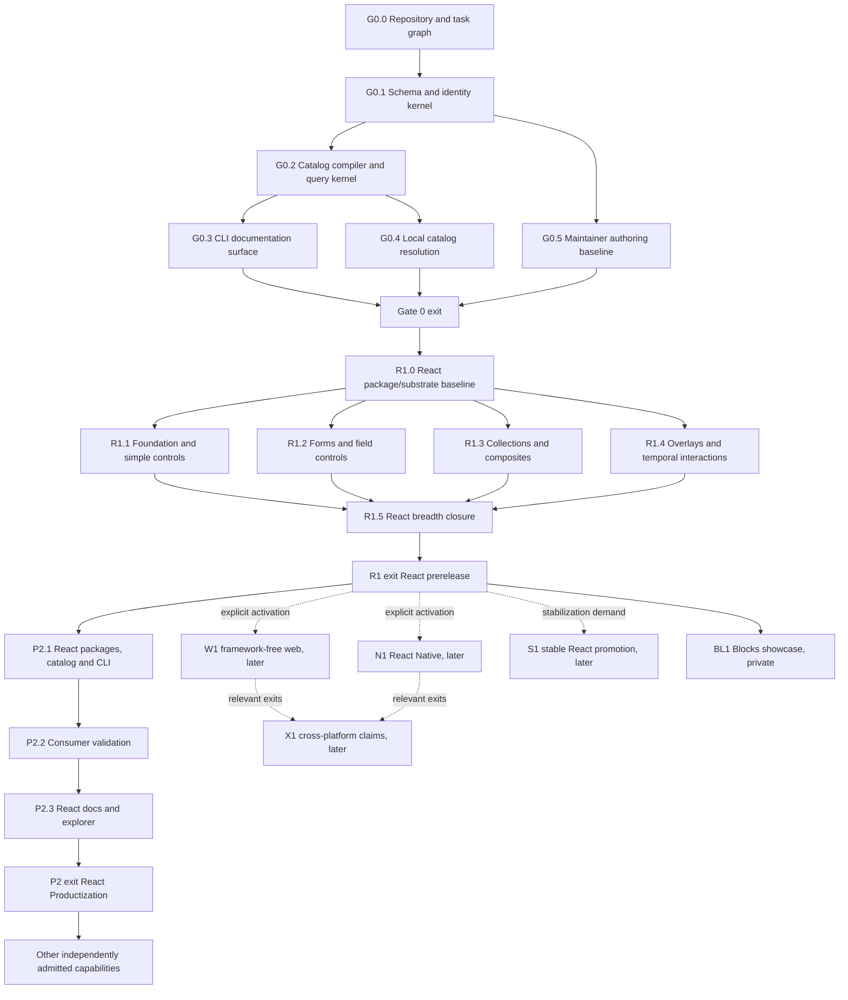

# Mux UI milestone roadmap

- Status: Execution baseline
- Product: Mux UI
- Architecture authority: [`monorepo-architecture.md`](./monorepo-architecture.md)
- Scope: implementation milestones, entry conditions, deliverables, acceptance
  evidence, dependencies, and scope controls

## Purpose and authority

This roadmap turns the Mux UI architecture into evidence-bearing delivery
milestones. It does not replace or reinterpret the architecture. If this
roadmap conflicts with the architecture, the architecture wins and the roadmap
must be corrected before work continues.

The roadmap is dependency-based, not calendar-based. A milestone completes
only when its retained acceptance evidence proves the exit condition. Code
completion, a demonstration, elapsed time, or agreement that a milestone is
“close enough” is not completion.

The governing delivery rule is:

> Build the smallest operability spine that a real renderer slice needs, prove
> the primary React slice against its exact `web.react` contract, and admit
> broader tooling or a secondary renderer only when an observed workflow and
> the applicable R1/P2/W1/N1 entry authority justify it.

Decision 0016 removes legacy compatibility implementation from the current
pre-release product. No consumer requires superseded Mux-owned aliases, query
versions, source migrations, or notice releases. Current checks prove current
contracts and reject unsupported input. Historical negotiation and migration
deliverables below apply only when a supported published contract establishes an
actual consumer need.

## How to use this roadmap

### Status vocabulary

Every milestone uses one of these states:

| State | Meaning |
| --- | --- |
| `not-ready` | One or more entry conditions are unproved. Work may explore, but it may not publish or become a dependency. |
| `ready` | Every entry condition is proved and the milestone scope is locked. |
| `active` | Work is underway within the locked scope. |
| `evidence-review` | Deliverables are complete and the retained evidence packet is under review. |
| `complete` | Every exit assertion passes with no expired or disallowed exception. |
| `blocked` | A canonical-source, safety, compatibility, integrity, or required-proof failure prevents progress. |

Ordinary scheduling conflicts, missing later-gate infrastructure, optional
dashboard work, and unproved product ideas are not architectural blockers.

### Milestone completion rule

A milestone is complete only when all of the following are true:

1. Every entry condition is true at evidence capture.
2. Every required deliverable exists under its named owner.
3. Every required assertion has retained evidence tied to exact source,
   artifact, binding, package, catalog, and environment revisions as
   applicable.
4. All negative-path fixtures pass; success-path demonstrations alone are
   insufficient.
5. Generated output has been reproduced from canonical input and was not
   patched.
6. Scope remained within the milestone, or a separately approved roadmap
   change re-established entry and exit conditions.
7. Active operational exceptions, if permitted, only narrow support and are
   visible in diagnostics and release metadata.

### Evidence packet contract

Each milestone produces one immutable evidence index. Individual evidence
records follow the architecture’s proof schema and identify:

- milestone and assertion ID;
- source revision and catalog version/digest;
- artifact, binding, binding-spec revision, renderer package, and runtime
  profile where applicable;
- evidence kind, tool version, environment, input and canonical example IDs;
- outcome, retained artifact URI or digest, disclosure class, owner, timestamp,
  and retention/expiry policy;
- active exception or advisory references; and
- the exact command or reproducible procedure used to produce the result.

Public evidence exposes only sanitized metadata and digests. Restricted or
internal payloads remain access-controlled. A transient log cannot satisfy an
exit condition.

Evidence used for a current milestone entry or exit assertion must follow that
assertion's existing proof owner and exact source, executed, and proof-tool
identity relationship. Historical evidence and internal
applicability-maintenance roots remain retrievable audit records but cannot
substitute for current proof. R1 entry uses only an explicit reusable-proof
binding or bounded reproof.

### Acceptance cadence

| Cadence | Minimum evidence |
| --- | --- |
| Pull request | Schema and relation validity, generation identity, field ownership, affected types and units, changed examples, focused package fixture, and basic accessibility checks. |
| Scheduled | Full browser/device matrices, visual permutations, performance, broad consumer fixtures, and repeated agent evaluations. |
| Gate exit | Every milestone assertion for that gate, cross-cutting fixtures enabled by the gate, exact release-manifest correlation, and no expired exception. |
| Stable release | All deterministic gates, supported-profile smoke tests, digest parity, required manual accessibility evidence, compatibility review, and support-lifetime evidence retention. |

## Execution guardrails

### Renderer-first priority

- R1 React renderer tranches are the critical path after Gate 0.
- An enabling-system milestone must name the renderer or acceptance fixture it
  unblocks. Unattached infrastructure returns to `not-ready`.
- A later capability cannot block an earlier renderer milestone unless the
  renderer would violate a canonical-source, safety, compatibility, integrity,
  or required-proof rule without it.
- Shared foundation code is added only after a real slice demonstrates the
  repeated semantic, logic, or interaction shape.
- Experimental React breadth proceeds under the standing development rule
  (Decision 0028) against the shared baseline. Framework-free/native breadth
  and broad tooling wait for their own activation and entry evidence.

### Milestones gate claims, not work

Entry conditions and exit assertions gate public enablement (a capability or
surface appears in a manifest), a milestone's `ready` and `complete` status, and
support, stable, and assistive-technology claims. They do not stop experimental
development (Decision 0028). Work may proceed while a milestone is `not-ready`,
provided it publishes nothing, advertises nothing, and is not a dependency of
something that claims support. A capability cannot be enabled, and a milestone
cannot complete, until its entry conditions hold and its evidence passes. The
activation packet below records readiness; it is not permission to start.

### Scope admission

A proposal for a new artifact kind, durable relation, revision axis, package,
manifest, command, integration, or public capability must include:

1. an observed workflow that existing records and relations cannot express;
2. one authoritative owner and at least one named consumer;
3. its query or operation shape;
4. validation, proof, compatibility, and migration effects;
5. scaffold, semantic diff, diagnostics, and affected-closure support; and
6. a removal or deprecation path.

Admission preference is: derive a projection, add a typed relation, add a
bounded field to an existing kind, and only then introduce a new kind. Missing
admission evidence means defer, not “implement experimentally in stable
output.”

### Scope lock and change control

At `ready`, the milestone’s deliverables and exit assertions are locked. New
work is classified as one of:

- **Required correction:** necessary to satisfy an existing assertion. It stays
  in the milestone.
- **Adjacent improvement:** useful but unnecessary for exit. It becomes a
  separately tracked follow-up.
- **New capability or ontology:** requires scope admission and a roadmap
  amendment.
- **Later-gate dependency:** remains unavailable and must not be simulated by
  an undocumented shortcut.

No milestone may silently broaden its target matrix, supported runtime profile,
public API, or evidence claim. Narrowing support requires an explicit canonical
disposition or permitted operational exception.

The separately admitted `ChangeIntentEnvelope` capability may
provide an optional read-only preview for its named authoring workflows. It is
not a repository-wide merge prerequisite and is not an R1 component-delivery
prerequisite. A later write-capable protocol, if admitted, must establish its
own approval, journal, and stale-preview rules.

### Repository delivery boundary

Repository delivery controls are implementation policy, not roadmap milestones
or renderer entry conditions. Ordinary R1 component work uses canonical owners,
proportional deterministic and risk-selected proof, protected CI, and protected
pull-request review. No private delivery profile, operation descriptor,
tranche-lock digest, or separate evidence-acceptance gate is required for an R1
component or routine protected-PR operation.

### Non-waivable rules

No operational exception or milestone decision may:

- patch a generated projection;
- create a second authoring owner;
- broaden support or compatibility;
- bypass package, catalog, signature, provenance, or lockfile integrity;
- turn missing evidence into a passed result;
- promote a stable binding without mandatory accessibility and safety proof;
- let hosted/latest guidance masquerade as installed-local truth;
- execute an unconfirmed mutation; or
- use a stochastic model result to override deterministic failure.

## Dependency map

```mermaid
flowchart TD
  g00["G0.0 Repository and task graph"]
  g01["G0.1 Schema and identity kernel"]
  g02["G0.2 Catalog compiler and query kernel"]
  g03["G0.3 CLI documentation surface"]
  g04["G0.4 Local catalog resolution"]
  g05["G0.5 Maintainer authoring baseline"]
  gate0["Gate 0 exit"]

  r10["R1.0 React package/substrate baseline"]
  r11["R1.1 Foundation and simple controls"]
  r12["R1.2 Forms and field controls"]
  r13["R1.3 Collections and composites"]
  r14["R1.4 Overlays and temporal interactions"]
  r15["R1.5 React breadth closure"]
  r1exit["R1 exit React prerelease"]

  p21["P2.1 React packages, catalog and CLI"]
  p22["P2.2 Consumer validation"]
  p23["P2.3 React docs and explorer"]
  p2exit["P2 exit React Productization"]

  w1["W1 framework-free web, later"]
  n1["N1 React Native, later"]
  x1["X1 cross-platform claims, later"]
  s1["S1 stable React promotion, later"]
  bl1["BL1 Blocks showcase, private"]
  optional["Other independently admitted capabilities"]

  g00 --> g01 --> g02 --> g03
  g02 --> g04
  g01 --> g05
  g03 --> gate0
  g04 --> gate0
  g05 --> gate0

  gate0 --> r10
  r10 --> r11
  r10 --> r12
  r10 --> r13
  r10 --> r14
  r11 --> r15
  r12 --> r15
  r13 --> r15
  r14 --> r15
  r15 --> r1exit

  r1exit --> p21 --> p22 --> p23 --> p2exit
  r1exit -. explicit activation .-> w1
  r1exit -. explicit activation .-> n1
  w1 -. relevant exits .-> x1
  n1 -. relevant exits .-> x1
  r1exit -. stabilization demand .-> s1
  r1exit --> bl1
  p2exit --> optional
```

A historical result satisfies a new entry only when the new milestone explicitly
binds the exact reusable fact and its applicability.

## Roadmap overview

| Gate | Outcome | Release boundary | Gate must not include |
| --- | --- | --- | --- |
| Gate 0 | One canonical artifact compiles and is retrieved locally through deterministic API, human, JSON, and dense CLI surfaces. | Internal foundation; no public product claim. | Broad catalog, public MCP, docs application, planner, project mutation, migration, semantic search. |
| R1 | A standalone React package delivers accepted component tranches and disposition-complete coverage of the applicable pinned React Aria surface. | Package-only `@muxui/react` prereleases under `next`; no stable or secondary-renderer claim. | Framework-free/native counterparts, public CLI/catalog product, stable lifecycle, cross-platform equivalence. |
| P2 | Compatible catalog/tooling, exact installed-local guidance, consumer validation, React docs/explorer/local MCP, and enabled safe operations are productized. | React Productization release candidate; stable only through S1. | Secondary renderer completion, hosted write access, arbitrary agent patches, unproved extensions. |
| Gate 3 | Operational scale and independently justified integrations are enabled without changing kernel authority. | Capability-specific releases. | Any capability lacking observed demand, owner, bounded protocol, proof, and lifecycle. |

## Gate 0 — schema and query kernel (complete)

| ID | Milestone | Assertions | Evidence |
| --- | --- | --- | --- |
| G0.0 | Repository, ownership, task graph | `E-G0.0-01`–`04` | `tests/evidence/archive/g0.0` |
| G0.1 | Schema, identity, revision kernel | `E-G0.1-01`–`05` | `tests/evidence/archive/g0.1` |
| G0.2 | Catalog compiler, pure query kernel | `E-G0.2-01`–`05` | `tests/evidence/archive/g0.2` |
| G0.3 | CLI documentation baseline | `E-G0.3-01`–`06` | `tests/evidence/archive/g0.3` |
| G0.4 | Project-local catalog and resolver | `E-G0.4-01`–`05` | `tests/evidence/archive/g0.4` |
| G0.5 | Maintainer authoring baseline | `E-G0.5-01`–`04` | `tests/evidence/archive/g0.5` |
| Gate 0 exit | Scaffold to repair, one path | `E-GATE0-01` | `tests/evidence/archive/gate-0` |

Behavior is owned by Architecture and the package tests. The assertion IDs name
the standing fixtures in "Mandatory fixture ledger". Gate 0 still means
deterministic schema, catalog, query, CLI and authoring proof; bounded and
complete token retrieval; generated surfaces as projections; migration stays
G3.2.

## R1 — React-primary component delivery

R1 is the current first public component-library sequence. Every milestone is
React-only unless it explicitly says otherwise. Framework-free web, React
Native, React Native Web, cross-platform comparison, and stable promotion are
separate later tracks and cannot block or inherit R1 proof.

### R1 shared tranche contract

Every R1 tranche uses the internal React Aria Components substrate, the
standalone package graph, the reusable proof baseline, canonical
component/binding/example revisions, deterministic closure, and risk-selected
review appropriate to the exported behavior. The fixed React registry in
Product Scope is the common lock for R1.1 through R1.4. No tranche-lock
decision or per-component authorization is required for those families or for
experimental additions (Decision 0028). Components may run in parallel while
consuming the same baseline and creating no decision-bearing exception.

The internal runtime dependencies of `@muxui/react` are allowed by purpose
(Architecture, `@muxui/react`), with versions only in the manifest and the
lockfile. Proof for a dependency retains its integrity, licence and notice,
peer compatibility, lockfile pin, module isolation, tree-shaking, SSR/hydration,
and packed-consumer resolution, plus a focused security review of Markdown
input (typed AST, escaping, and source bounds) where a parser is used. A new or
changed icon reruns the affected visual, accessibility, SSR/hydration,
tree-shaking, and packed-consumer proof. Component motion adds proof of refs,
interruption, cleanup, focus and dismissal ownership, SSR/hydration, and both
the system and explicit reduced-mode paths as applicable; CSS remains a valid
implementation. No Lucide export, public Icon API, icon catalog, or icon
package is admitted, and no upstream implementation type or object is public.

Each bounded change updates the earliest canonical owner, regenerates
projections, keeps React Aria internal, and runs focused checks proportional to
the exported behavior. Protected CI, ordinary review, accessibility/privacy
proof, and the publication/final-merge boundaries remain required.

### R1.0 to R1.5 (complete)

| ID | Milestone | State and evidence |
| --- | --- | --- |
| R1.0 | Package and substrate baseline | Complete. The Stage 1 snapshot and baseline in `catalog/react-r1-0/` record the upstream evaluation of the committed registry. They are a historical record, not a gate. `E-R1.0-01` through `E-R1.0-05` were removed in c7e3fe71 and live in git history. |
| R1.1 | Foundation and simple controls | Complete for the rc prerelease boundary. `E-R1.1-01` through `E-R1.1-04`: `tests/evidence/r1.1`. The `DisclosureGroup` manual half of `E-R1.1-04` is deferred to `S1.0` (Decision 0022). Review is author-reported only (Decision 0022 amendment 01). |
| R1.2 | Forms and field controls | Complete for the rc prerelease boundary. `E-R1.2-01` through `E-R1.2-04`: `tests/evidence/r1.2` and `tests/evidence/r1-retro-review`. The manual and assistive-technology half of `E-R1.2-03` is deferred to `S1.0`. |
| R1.3 | Collections and composites | Complete for the rc prerelease boundary. `E-R1.3-01` through `E-R1.3-05`: `tests/evidence/r1.3` and `tests/evidence/r1-retro-review`. The manual and assistive-technology half of `E-R1.3-04` is deferred to `S1.0`. |
| R1.4 | Overlays and temporal interactions | Complete for the rc prerelease boundary. `E-R1.4-01` through `E-R1.4-06`: `tests/evidence/r1.4` and `tests/evidence/r1-retro-review`. `E-R1.4-04` is deferred to `S1.0`. |
| R1.5 | React breadth closure | Complete for the rc prerelease boundary. The closure of the fixed registry is `catalog/react-r1-5/closure.json`, with `E-R1.5-01` through `E-R1.5-06` in `tests/evidence/r1.5`. The risk-profile half of `E-R1.5-03` is deferred to `S1.0`. Review is author-reported only. |
| R1.6 | Parity and private theme authoring | Complete. `E-R1.6-01` through `E-R1.6-07` below stay the standing assertions for supplemental additions. |

### R1.6 React parity and private Mux theme authoring

Complete (Decision 0013). R1.6 delivered the Mux UI-owned token and theme
contract, applicable React Aria parity, and the private `apps/scale` authoring
path. `catalog/tokens/` owns token and theme facts, `@muxui/tokens` owns
transforms, `@muxui/react` owns React CSS and behavior, and `apps/scale` owns
only the private editor and projection.
`catalog/react-r1-6/supplemental-components.json` owns the supplemental family
list. R1 exit publication eligibility still requires its exact tarball, release,
registry, rollback, and human authorization conditions.

**Acceptance evidence**

Acceptance uses representative visual states, meaningful interactions, and
ordinary Mux checks. It does not require ongoing equality with an external
implementation or a continuing external comparison record.

| ID | Required assertion | Retained evidence |
| --- | --- | --- |
| `E-R1.6-01` | The current style inventory is complete, every applicable React Aria-backed root/support style maps to a Mux UI-owned binding identity through the explicit supplemental list where needed, unrelated marketing/layout roots have explicit exclusion reasons, and missing state/fixture coverage fails. | Complete style inventory, supplemental mapping, and negative coverage report. |
| `E-R1.6-02` | All admitted token values, modes, palette families, font families, typography roles, and standard/mono presets are represented in the Mux UI namespace with canonical ownership, applicable third-party font notices, and no external runtime/build/dev/peer/generated-source edge. | Token/theme/font/typography transfer and dependency-closure report. |
| `E-R1.6-03` | Matched light/dark fixtures compare CSS, anatomy, interaction, variants, and states; all differences are reported and only explicit Mux UI safety adaptations are permitted. | Visual and interaction parity matrix plus failed-state fixture corpus. |
| `E-R1.6-04` | Current Storybook examples use canonical Mux UI tokens/themes and remain projections rather than a second owner. | Storybook example ownership and generation report. |
| `E-R1.6-05` | Private Scale loads, edits, previews, imports, exports, persists, and round-trips themes with canonical types, aliases, modes, override safety, and visible loss/rejection diagnostics. | Scale authoring and round-trip fixture matrix. |
| `E-R1.6-06` | The optional Tailwind adapter compiles a clean consumer while Tailwind remains outside Mux runtime, peer, generated-source, and styling-engine closure. | Consumer compilation and dependency-closure report. |
| `E-R1.6-07` | Shared token/theme sources remain renderer-neutral; React Native and framework-free web remain deferred; no publication, stable support, hosted Scale, or external design-tool interchange claim is inferred. | Platform, release, and negative-boundary audit. |

**Scope controls:** The fixed React registry and the experimental families are
separate lists. The supplemental mapping lists the experimental families, never
a count shortcut. General external design-tool interchange remains G3.5. Scale
is private and may be disabled without changing canonical truth. Safety,
accessibility, runtime ownership, and platform differences are recorded
explicitly and cannot be hidden to claim 100% parity.

### Post-R1.6 React additions

An experimental React family, prop, variant, example, or token is ordinary
protected-PR delivery under `SCOPE-REACT-DONOR-SUPPLEMENTAL-001` and needs no
decision (Decision 0028). The family list is owned by
`catalog/react-r1-6/supplemental-components.json`. Each addition carries the
focused proof its risk names, routed by `E-R1.6-01`, `-03`, `-04` and `-07`. None
claims milestone completion, support, publication or G3 activation.

### Post-R1.6 Figma token export addition

Decision 0020 names Figma and pulls the export-only slice of G3.5 forward.
Private `@muxui/tokens` owns a deterministic transform from the canonical
token source to Figma variables, text styles, and effect styles, a
lossy/unsupported report, an idempotent Plugin API applier that never
deletes, and a package-local CLI. Figma content remains a disposable
projection; nothing generated is committed.

| ID | Required assertion | Retained evidence |
| --- | --- | --- |
| `E-FIGMA-EXPORT-01` | Repeated export of the same canonical source yields an identical document with token contract version and source digest provenance. | Package determinism test. |
| `E-FIGMA-EXPORT-02` | Every token is exported or listed in the unsupported report with a reason; lossy mappings are reported. | Package coverage test. |
| `E-FIGMA-EXPORT-03` | Every exported variable's web code syntax names the exact CSS custom property emitted by the web compiler. | Package parity test. |
| `E-FIGMA-EXPORT-04` | A second applier run over unchanged export reports no creates or updates, changed values update in place, and removed tokens are reported as orphans without deletion. | Applier test against an in-memory Plugin API fake. |

Import, round-trip, proposals, components, Code Connect, additional themes,
and pruning remain G3.5 or later. This addition establishes no milestone
completion, public package, support, or release claim.

### Post-R1.6 Figma component export addition

Decision 0020 amendment 01 extends the export-only Figma slice to components
that meet its eligibility criteria: a supported anatomy, finite variants,
mode-aware tokens, and passing export audits. No list of names is kept. Each
batch first moves its components' dark overrides into mode-aware tokens. The
private, never published `@muxui/figma` package in `tooling/generators/figma`
owns only anatomy mappings and transport: it measures each family's winning
CSS declarations in a browser across Light/Dark and Comfortable/Compact,
audits mode consistency, compiles a component spec bound by token ID, and
applies it through an idempotent Plugin API applier that changes only nodes
it tagged and deletes only the glyph vectors it replaces.
Figma content remains a disposable projection; nothing generated is
committed.

| ID | Required assertion | Retained evidence |
| --- | --- | --- |
| `E-FIGMA-COMPONENTS-01` | Compiling the same anatomies, measurements, and token source yields an identical component spec with token export and source digest provenance. | Package determinism test. |
| `E-FIGMA-COMPONENTS-02` | Every measured part property resolves to the same token or literal in every exported mode; a mode-specific override fails with its family, part, property, and winning rule per mode. | Package mode-audit test and local measurement report. |
| `E-FIGMA-COMPONENTS-03` | Every painted colour binds to a variable or style; literal, derived, and lossy fields appear in the coverage report with a reason. | Package coverage test and local coverage report. |
| `E-FIGMA-COMPONENTS-04` | A second applier run over an unchanged spec reports no creates or updates, a changed binding updates in place, and a removed variant is reported as an orphan without deletion. | Applier test against an in-memory Plugin API fake. |

Import, round-trip, proposals, Code Connect, motion, additional themes, and
pruning remain G3.5 or later, and complex families stay outside until the
anatomy mappings support them. Writing to any Figma file needs Andrew's
explicit authorization for that file. His direction covers writing the six
pilot families' components to file `Z1rFgLTe3lBr0nwm8UvFEx`; removing the pilot
page, later batches' writes, and any other Figma file need his separate,
explicit direction. This addition establishes no milestone
completion, public package, support, or release claim.

### R1 exit — React prerelease publication

**Entry:** R1.5 complete, with the retained R1.1–R1.5 check evidence
(`tests/evidence/r1.1` through `r1.5`) and the R1.2–R1.4 retroactive review
(`tests/evidence/r1-retro-review`) that release preparation reads for every rc;
R1.1 and R1.5 review is author-reported only, which is not proof (Decision 0022
amendment 01). Also required: exact tarball, release manifest, provenance,
registry control, checks, rollback plan, and human publish authorization.

**Evidence:** `E-R1-EXIT-01` exact tarball/export/install tuple;
`E-R1-EXIT-02` registry/provenance/integrity; `E-R1-EXIT-03` published clean-
consumer verification; `E-R1-EXIT-04` dist-tag verification with rollback
prepared, not exercised: `next` points at the current verified rc, nothing
claims or promotes `latest`, and the Decision 0023 deprecate and fix-forward
plan is prepared in the release manifest, with no prior `next` pointer
assumed.

**Exit:** only exact release candidates `@muxui/react@0.1.0-rc.N` are
published, in sequence and with no limit on N, each with `--tag next` and each
the next number after the rc `next` points at (Decision 0023 amendment 01). A
new rc does not require the previous rc to be bad or deprecated. If rc.1 is the
first publish, the registry also points `latest` at it
(Decision 0023). Apart from a separately authorized re-point of `latest` to
the fix-forward rc during a rollback, nothing claims or promotes `latest`, a
sequence rc published without a rollback leaves `latest` where it is, no
stable release is promoted, and install guidance uses `@muxui/react@next`
until a stable release moves `latest`. No `latest`, stable, framework-free,
native, React Native Web, parity, or equivalence claim is made. A bad rc is
deprecated with a message and fixed forward; deprecating a superseded rc that
is not bad is not required and needs its own authorization. Every rc is a new
exact candidate with its own release preparation, `E-R1-EXIT-01` through
`E-R1-EXIT-03` evidence, and publish authorization; this exit and
`E-R1-EXIT-04` then apply to the current verified rc. Mux UI unpublishes only
for a security or legal problem, with explicit authorization, inside npm's
72-hour no-dependents window. Under Decision 0022, rc.1 also makes no
assistive-technology support claim; its compatibility profile and release
manifest say so. Existing automated accessibility, keyboard, and focus proof
stays required. Assistive-technology evidence is required before any such
claim and before `S1.0` stable promotion.

The R1 exit package graph carries the same internal, replaceable icon
dependency and its ISC plus Feather-derived MIT notices. Exit proof must retain
the Mux UI-only public surface and verify exact SSR/hydration, tree-shaking,
packed-consumer resolution, accessible labels and decorative semantics, and
visual contract invalidation. This does not add a publication authorization or
change the final R1-exit merge stop.

### Later tracks and Productization

- `P2.1` publishes compatible catalog/tooling packages, supported-contract negotiation,
  public release descriptors, and CLI-as-documentation for the React tuple
  after R1 exit. Evidence: `E-P2.1-01…06`.
- `P2.2` proves packed React installation, offline installed-local authority,
  and bounded validation. Evidence: `E-P2.2-01…05`.
- `P2.3` proves React docs, explorer, bootstrap, and public local MCP against
  installed-local authority. The private R1 playground may supply generated
  adapters and fixtures but never satisfies this public surface. Evidence:
  `E-P2.3-01…05`.
- `P2 exit` completes React Productization without claiming another renderer.
  Evidence: `E-P2-EXIT-01…05`.
- `BL1` delivers the private Blocks showcase after R1 exit, independently of
  P2.1 through P2.3 and without satisfying any of their evidence (Decision
  0026). Evidence: `E-BL1-01…11`.
- `W1.0` activates framework-free web only after R1 exit, observed demand, an
  accepted exact lock, and explicit human activation. `W1.1…W1 exit` own its
  independent component/release proof.
- `N1.0` activates native only after R1 exit, observed demand, an accepted
  platform/profile/component lock, and explicit human activation. `N1.1…N1
  exit` own independent per-profile proof and native dependency decisions.
- `X1.0` owns any cross-platform semantic-comparison or feature-equivalence
  claim after the relevant renderer exits.
- `S1.0` owns stable React promotion after a published R1 prerelease, observed
  stabilization demand, and an accepted lifecycle/compatibility lock. Before
  promotion, the deferred `E-R1.1-04` (`DisclosureGroup` manual half),
  `E-R1.2-03` and `E-R1.3-04` (manual and assistive-technology half),
  `E-R1.4-04`, and `E-R1.5-03` (risk-profile half) are required entry
  conditions (Decision 0022). Because Architecture's risk-class table (see
  "Evidence requirements are derived from a declared interaction risk class")
  makes the declared class the basis of promotion evidence, every exported
  component also declares its risk class and passes the manual and
  assistive-technology evidence that class requires.

### BL1 Blocks showcase

[Decision 0026](../decisions/0026-blocks-showcase-admission.md) admits this
slice under `SCOPE-CAP-BLOCKS-SHOWCASE-PRIVATE`. It is a separately named
slice, not a P2.x milestone. It may start once Decision 0026 merges, and it
satisfies and claims none of P2.3 exit, G2.4, or `SCOPE-CMD-PLAN`.

**Objective:** Deliver the first `pattern` records and a private Blocks
showcase, so a bounded composition of admitted components, application or
marketing, can be browsed, previewed in isolation, and copied from its exact
executable source, without a second registry or any public claim. The slice
serves the React renderer: each variant example is an acceptance fixture that
exercises admitted components in composition, and the poster grid is the
fixture for GridList grid layout and Virtualizer grid mode.

**Entry conditions**

- R1 exit is complete, with `E-R1-EXIT-01` through `E-R1-EXIT-04` retained.
- Decision 0026 and Product Scope `15.0.0` are accepted and merged.
- The activation packet is recorded per "Milestone activation and review
  packet".
- The poster grid waits for GridList grid layout and Virtualizer grid mode to
  merge. No other seed block waits for it.

**Primary ownership**

- `@muxui/schema`: the pattern schema, its category list and groups, field
  ownership, and the relation registry (`example-of` target `pattern`, owned by
  `pattern.variants`).
- `@muxui/catalog`: compiler support, pure `list`, `search`, and `get` over
  patterns, and the derived participant and "used in" views.
- `@muxui/tooling`: the CLI adapter and pattern authoring support.
- `catalog/patterns/<slug>/`: pattern records, variant example records, example
  sources, and the license and disclosure record for any asset that is not
  Mux-authored.
- `apps/docs` (Blocks section) and `apps/react-storybook` (generated variant
  stories): projections that own no fact.
- `@muxui/react`: owns the components a block uses. A block's pull request may
  change it under Decisions 0028 and 0029.

**Deliverables**

- The `pattern` schema with the staged v1 fields (Architecture, "Patterns are
  bounded composition specifications"), a category in one of two groups
  (Application: Collections, Forms, Feedback, Conversation, Navigation;
  Marketing: Hero, Features, Pricing, Call to action, Testimonials, FAQ, Stats,
  Logo cloud, Newsletter, Footer), added by an ordinary pull request
  ([Decision 0029](../decisions/0029-blocks-growth-rules.md)), the `catalog/patterns/` source convention,
  and catalog compiler support for the four negative paths: an unknown
  participant, a variant example importing a Mux component that is not a
  declared participant, a missing or duplicate variant example, and a pattern
  with no variants. The capability manifest reports `pattern` as an enabled
  kind only with this support.
- Pattern authoring support: a scaffold that creates only canonical inputs,
  semantic diff, revision explainer, affected closure, and source-linked
  diagnostics that cover patterns and their variant examples.
- `list`, `search`, and `get` accept `pattern` through the API and CLI human,
  JSON, and dense output, including a component participant filter. A pattern
  `get` returns its participants, its variants, and the same example source the
  site shows. A component `get` returns the derived "used in" view.
- The existing example typecheck, packed render and hydration, and generated
  Storybook stories enumerate variant examples.
- The content-rules check over variant example sources and assets.
- The Blocks section in `apps/docs`, with its own full-width master-detail
  layout as Andrew picked: a left rail with category, block, and variant,
  search, and a "uses component" filter, and one large isolated preview with
  width presets, a drag handle, a theme switch, and Preview, Code, and Split
  views. The Code view shows the exact example source with copy. The preview
  loads the canonical example. Component pages keep only component-bound
  examples and gain "Used in blocks".
- Seed blocks: the poster grid (CSS-grid and virtualized variants), a marketing
  hero, and a marketing pricing section, plus optionally one application block
  named in the activation packet. Each uses only admitted components.
- The catalog regression baseline recorded with the seed set.
- The BL1 evidence index.

**Block growth.** After the seed set, a further block inside the Decision 0026
boundary is ordinary protected-PR delivery under BL1 ([Decision 0029](../decisions/0029-blocks-growth-rules.md)),
including a new category and the component work the block needs, which ships in
the same pull request or before it under the proof its own risk calls for. It
carries `E-BL1-03` through `E-BL1-08` for its variants, `E-BL1-10` for its
content, and `E-BL1-11`, and it needs no further decision. A boundary change
(see the scope controls below) still needs a decision.

**Acceptance evidence**

| ID | Required assertion | Retained evidence |
| --- | --- | --- |
| `E-BL1-01` | The pattern schema is closed and a valid record compiles. Each negative fixture fails with a diagnostic that names the earliest owner: an unknown field, a category the schema does not list, an unknown participant, a variant example importing an undeclared Mux component, a missing variant example, a duplicate variant example, and a pattern with no variants. | Schema and compiler positive and negative fixtures. |
| `E-BL1-02` | The pattern kind has authoring support: a scaffold round-trips through validation and compilation, and semantic diff, revision explainer, affected closure, and source-linked diagnostics cover patterns and variant examples. | Authoring fixtures. |
| `E-BL1-03` | Every variant example typechecks against the packed `@muxui/react` declarations and passes packed SSR and hydration. | Packed-consumer proof per variant. |
| `E-BL1-04` | Every variant example passes light and dark axe and colour audits through generated Storybook stories, and every interactive block passes keyboard, focus, and state browser checks. | Storybook audit reports and browser tests. |
| `E-BL1-05` | Every enabled pattern appears in the Blocks rail and opens its block, each preview loads its canonical example, and the Code view equals the example source bytes. | Docs check report. |
| `E-BL1-06` | Each variant is captured at every width preset in light and dark. Each marketing variant is also captured at every page-width preset, narrowest to widest, in light and dark, with no horizontal overflow at any preset. The presets are the `toolbarPresets` and `pageWidths` lists in `apps/docs/src/lib/block-presets.ts`, and no other document lists them. | Retained visual captures and overflow report. |
| `E-BL1-07` | The API, CLI JSON, human, and dense output, and the site loader return the same normalized response for pattern `list`, `search`, and `get`, for the participant filter, and for the derived "used in" view, and component pages list only component-bound examples. | Surface-parity matrix. |
| `E-BL1-08` | Repeated generation leaves the worktree unchanged, two compiles are byte-identical, and the pattern entries add only their own artifacts to the catalog. The catalog digest before and after each commit that adds or changes a block is recorded as an observation and claims nothing, because such a commit may change other catalog sources under its own proof. | Generation identity digest. |
| `E-BL1-09` | At the BL1 close-out, `@muxui/react` has no API, export, or version change. For every block, nothing is published, retagged, or deployed; no growth commit bumps a package version or changes a workflow, hosting, or deployment file; every package stays private; every pattern targets `web.react` only; no assistive-technology support claim is made (Decision 0022); and `plan`, install, registry, and consumer scaffold are absent or explicitly unavailable. The audit lists what a block added later changed in `@muxui/react`, dependencies, and component records and claims nothing about it ([Decision 0029](../decisions/0029-blocks-growth-rules.md)). | Platform, release, and negative-boundary audit. |
| `E-BL1-10` | Variant example sources and assets contain no external URL or remote asset and no literal colour value, and every asset that is not Mux-authored has a recorded license and disclosure. An independent review of each block's content finds no third-party brand logo or mark, no real person's name or likeness, and only generic Mux-authored copy. A retained review covers each block whose `catalog/patterns/<slug>` tree it read, so new or changed copy needs a new review and unchanged copy does not. | Content scan report and content review record. |
| `E-BL1-11` | A catalog regression report is recorded for the seed set as the baseline. Each block added later keeps discovery precision, search results, and dense budgets within the thresholds in `tests/evidence/bl1/regression-thresholds.json`, and states its workflow value in its pattern record. A pull request may change a threshold, the variant source size limit included, when it states the change and its reason before measuring and logs it in the file's `provenance.revisions`; no expectation is removed, a threshold is never changed to fit a failure, and an expectation changed after its result was seen is listed in `provenance.revisedAfterFirstMeasurement` ([Decision 0029](../decisions/0029-blocks-growth-rules.md)). The capture lists every change since the close-out. | Catalog regression report. |

**Scope controls**

- React only: no `web.html`, native, or other-framework blocks.
- Copy and paste only: no install command, registry, consumer scaffold, or
  project write. Those stay with G3.11 and G2.5.
- Bounded compositions only. A block covers one page region, has no routing, no
  business state, and no data fetching, and is composed only of admitted Mux
  components plus plain layout markup. Page templates, journeys, flows, and
  application-owned content stay excluded under Architecture's v1 boundaries
  and G3.8.
- Block placeholder copy and imagery are demonstration material, not product
  truth, and follow the content rules in Decision 0026.
- A block may ship with the component, family, token, or dependency it needs,
  in the same pull request or before it, under the proof that change's own risk
  calls for (Decision 0028). The pull request names it, and a block never adds
  one implicitly.
- Blocks inside the Decision 0026 boundary are delivered under BL1, outside
  G3.1. All other component and pattern breadth stays with G3.1.
  `SCOPE-NONGOAL-012` still bars block count as a goal.
- `muxui plan` stays unavailable. A pattern that omits relations, invariants,
  or the parameter schema is never selected by the G2.4 planner, and BL1
  patterns neither satisfy nor lower G2.4's entry conditions.
- The docs site stays private and unpublished. Public deployment, hosting, and
  any claim on `SCOPE-PRODUCT-003` or `SCOPE-SURFACE-EXPLORER-WEB` are
  separate decisions, and BL1 evidence never satisfies `E-P2.3-01…05`.
- The Blocks section owns no block, pattern, example, search, or prose fact and
  is not a second registry (`SCOPE-NONGOAL-003`).
- Disabling the Blocks section or the pattern kind leaves every component
  record, example, and guide unchanged.

**Exit condition:** The pattern kind compiles and is retrievable through the
API, CLI, and private Blocks section with surface parity, and the poster grid,
the marketing hero, and the marketing pricing section pass `E-BL1-01` through
`E-BL1-11` with every claim above left unmade.

## Retired Gate 1 and Gate 2

Gate 1 (cross-platform) and the old Gate 2 are retired. A reference to Gate 1
means R1.0–R1.6. A reference to Gate 2 means P2.1–P2 exit (old G2.1–G2.3 and
G2.7), with R1.3/R1.4 for the React Tabs and Toast outcomes of G2.0.
Framework-free and native portions wait for W1/N1. G2.4–G2.6 below remain the
entry, evidence and scope controls of the admitted optional capabilities; an
incomplete one stays disabled without lowering the P2 exit standard.

### G2.4 Grounded composition planning

**Objective:** Enable `muxui plan` only when the pattern catalog can return
deterministic, non-invented composition plans.

**Entry conditions**

These gate enabling `muxui plan`. Planner development may proceed before they
hold, unreleased and unadvertised.

- Pattern records with participant roles, relations, invariants, and a closed
  parameter schema compile as one closed graph with their canonical examples,
  and an internal deterministic planning fixture selects a known pattern and
  binds only declared parameters. BL1 patterns that omit relations, invariants,
  or the parameter schema do not satisfy this.
- More than one observed composition request is covered by bounded patterns and
  canonical examples.
- Unsupported requests and missing requirements have typed response schemas.

**Primary ownership**

- `@muxui/catalog` pure `planComposition`
- `@muxui/tooling` CLI adapter

**Deliverables**

- Public `muxui plan` over known `PatternRecord` data.
- Parameter binding limited to the pattern’s closed schema.
- Returned components, examples, constraints, alternatives, preconditions,
  unsupported cases, and match reasons.
- Deterministic pattern and example selection under the installed-local tuple.
- Manifest/API/CLI and applicable MCP schema support.

**Acceptance evidence**

| ID | Required assertion | Retained evidence |
| --- | --- | --- |
| `E-G2.4-01` | Supported requests select a known compatible pattern and only declared parameters, components, examples, and steps. | Plan golden corpus. |
| `E-G2.4-02` | Unsupported, ambiguous, incompatible, or under-specified requests return typed missing requirements rather than plausible prose. | Negative plan corpus. |
| `E-G2.4-03` | API, CLI JSON/human/dense, site, and enabled MCP normalize to the same plan response. | Plan surface-parity matrix. |
| `E-G2.4-04` | Planner output changes only when normative pattern/example inputs or compatibility context changes. | Revision sensitivity fixture. |

**Scope controls**

- `muxui plan` is read-only and is not a change-intent or repository-mutation
  command.
- It cannot invent product architecture, business flows, components, props, or
  unrecorded implementation steps.
- Consumer templates/scaffolds and general tree validation require separate
  capability proof.

**Exit condition:** Composition planning is deterministic, installed-context
correct, bounded by canonical patterns, and honest about unsupported requests.

### G2.5 Project health and initialization

**Objective:** Introduce safe consumer-project writes only after project
detection, preview, confinement, atomicity, and recovery are proved.

**Entry conditions**

- P2.2 project detection and diagnostics are complete.
- Change-intent envelopes and semantic diffs are stable for consumer-project
  effects.
- A journal/recovery format and confirmation policy are versioned.

**Primary ownership**

- `@muxui/tooling` local project operations

**Deliverables**

- Read-only `muxui doctor` before any mutating command.
- `muxui init` only after doctor’s project model, dry-run, merge, and recovery
  paths pass.
- Exact `ChangeIntentEnvelope` with project/lockfile/worktree preconditions,
  proposed writes, effects, affected closure, checks, and confirmation.
- Project-root confinement, explicit approval, atomic writes where possible,
  operation journal, idempotency, interruption recovery, and response-loss
  recovery.
- Typed outcomes for applied, no-op, stale preview, conflict, interrupted,
  rolled back, and recoverable operations.

**Acceptance evidence**

| ID | Required assertion | Retained evidence |
| --- | --- | --- |
| `E-G2.5-01` | Doctor detects supported projects, reports installed authority/drift, and performs no writes. | Project-detection matrix and write audit. |
| `E-G2.5-02` | Init dry-run and apply have the same bounded write set; confirmation is required for project/dependency effects. | Preview/apply equivalence fixture. |
| `E-G2.5-03` | Base drift, path escape, unexpected symlink, concurrent modification, and undeclared file fail before mutation. | Adversarial confinement corpus. |
| `E-G2.5-04` | Interruption at every journalled stage recovers, rolls back, or reports one exact recovery command without corrupting the project. | Fault-injection matrix. |
| `E-G2.5-05` | Repeating a completed operation is a deterministic no-op and lost response recovery does not duplicate changes. | Idempotency/replay fixture. |

**Scope controls**

- Hosted MCP never exposes init or any mutation.
- Init cannot become a general project generator or rewrite unrelated files.
- No action follows a `nextCommand` merely because tooling suggested it;
  confirmation policy remains authoritative.

**Exit condition:** Enabled project setup operations are previewed, confined,
confirmed, journalled, idempotent, and recoverable.

### G2.6 Allowlisted agent-safe canonical proposals

**Objective:** Support a small set of useful maintainer proposals without
creating an arbitrary model-driven patch path.

**Entry conditions**

- R1.5 change-intent closure passes for concepts, bindings, examples, tokens,
  and renderers.
- P2.1 version effects and G2.5 journal/confirmation primitives are available.
- Each proposed operation has one owner, closed input schema, deterministic
  preview, proof policy, and rejection boundary.

**Primary ownership**

- Maintainer-only `@muxui/tooling` proposal engine
- Existing canonical owners; the proposal engine owns no product decisions

**Initial allowlist**

| Operation | Authoritative owner | Minimum required review packet |
| --- | --- | --- |
| `example.create` | Example record plus one executable source file and binding relation | Purpose/profile/prerequisites, normative impact, selected owner paths, compile/behavior/selection proof. |
| `binding.variant.add` | Binding spec | Intent and allowed values/defaults, renderer/example/token changes, compatibility/version effect, affected profiles and proof. |
| `binding.prop.deprecate` | Binding lifecycle/migration data | Replacement or no-replacement reason, notice window, version effect, examples, diagnostics, migration artifact. |
| `token.alias.propose` | Canonical token source | Alias direction/type/meaning, cycle check, deprecation purpose, affected requirement sets/themes/renderers, migration effect. |

**Deliverables**

- Closed request and response schemas for each allowlisted operation.
- Deterministic, read-only proposal generation before approval.
- Review packet containing objective, base revisions, exact owning writes,
  semantic diff, affected/stale closure, version/migration effect, required
  evidence, risks, and rollback/recovery policy.
- Explicit user approval bound to the proposal digest.
- Apply path that rechecks preconditions and rejects any expanded write set.
- Typed unsupported result for requests outside the allowlist or requiring an
  unresolved product decision.

**Acceptance evidence**

| ID | Required assertion | Retained evidence |
| --- | --- | --- |
| `E-G2.6-01` | Each allowlisted operation produces the complete expected packet and only owner-approved canonical paths. | Per-operation golden corpus. |
| `E-G2.6-02` | Base drift, ambiguous intent, missing owner, incompatible version effect, unproved fallback, or write-set expansion rejects before apply. | Negative proposal corpus. |
| `E-G2.6-03` | Applying an approved proposal regenerates projections from source and never edits generated output directly. | End-to-end proposal fixture. |
| `E-G2.6-04` | Approval for one digest cannot authorize a changed proposal, additional path, dependency install, or different effect class. | Approval-binding security test. |
| `E-G2.6-05` | Free-form “patch this” and unsupported operation requests return a typed boundary response rather than an inferred diff. | Allowlist-boundary fixture. |

**Scope controls**

- No arbitrary repository patch, open-ended refactor, model-authored product
  decision, automatic stable promotion, or automatic exception creation.
- Renderer implementation changes may be listed as required work, but the
  canonical proposal engine cannot claim their behavior proved before their
  separate evidence passes.
- New operation kinds require observed repeated demand and full scope admission.

**Exit condition:** Four bounded proposal types produce reviewable, digest-bound
changes and deterministically reject all unowned or open-ended mutations.

## Gate 3 — operational scale, breadth, and integrations

Gate 3 is a portfolio of independently admitted capabilities, not one global
phase. Completing one Gate 3 milestone does not authorize another. Each remains
absent from manifests and product claims until its own exit evidence passes.

### G3.1 Deliberate component and pattern breadth

**Objective:** Expand the supported catalog, with stable or cross-platform
claims, only after the committed slices and Tabs/Toast have proved the reusable
authoring, renderer, and evidence paths. Experimental React additions are
ordinary work under the standing development rule (Decision 0028) and do not use
this milestone.

**Entry conditions**

These gate claims and enablement, not development.

- P2 exit is complete for package/catalog/consumer authority.
- R1.3 and R1.4 are complete before adding broad component families with comparable
  keyboard, overlay, or temporal risks.
- Each candidate that claims stable or cross-platform support has observed
  demand, platform disposition, owner, risk class, and a named pattern or
  consumer need.

**Deliverables**

- A prioritized component/pattern queue grouped by user intent and missing
  capability rather than arbitrary inventory count.
- End-to-end additions using canonical scaffolds, examples, renderers,
  descriptors, docs projections, and evidence.
- Lifecycle criteria for experimental-to-stable promotion and explicit
  unsupported/native-alternative records where implementation is irresponsible.
- Coverage reports based on supported workflows and risk classes, not raw
  component totals.

**Acceptance evidence**

| ID | Required assertion | Retained evidence |
| --- | --- | --- |
| `E-G3.1-01` | Every added component follows the one-owner addition workflow and passes its risk/profile evidence without manual projection edits. | Per-component release packet. |
| `E-G3.1-02` | New shared foundation/runtime abstractions cite at least two materially distinct real consumers and preserve dependency boundaries. | Abstraction-admission report. |
| `E-G3.1-03` | Breadth changes do not regress discovery precision, dense budgets, package size policy, or agent invalid-generation metrics. | Catalog-scale regression report. |

**Scope controls**

- No component-count target can waive usefulness, platform honesty, or proof.
- Unsupported target cells remain explicit; breadth cannot be manufactured by
  wrappers or aliases.
- Product-specific workflows stay in applications unless a bounded reusable
  pattern satisfies ontology admission.
- Blocks inside the Decision 0026 boundary are delivered under BL1 as ordinary
  protected-PR work and are outside this milestone's queue. Other breadth that
  claims stable or cross-platform support stays here.

**Exit condition:** Catalog breadth grows through proved user workflows without
weakening ownership, renderer priority, retrieval quality, or evidence.

### G3.2 Declarative migrations and reviewed codemods

**Objective:** Enable `muxui migrate` only for version-bounded changes that can
be transformed deterministically and recovered safely.

**Entry conditions**

- P2 release history contains at least one real supported migration need.
- Old and new binding specs/catalogs remain retrievable.
- G2.5 mutation safety and G2.6 review-packet primitives are complete.
- A migration is either declarative or has a reviewed, maintained parser and
  codemod boundary.

**Primary ownership**

- `MigrationRecord` canonical sources
- `@muxui/tooling` local migration engine

**Deliverables**

- Version-bounded migration records with prerequisites, replacements or
  no-replacement reasons, transformations, unsupported cases, and validation.
- `muxui migrate` dry-run, change-intent envelope, semantic diff, journal,
  confirmation, atomic apply, idempotency, rollback, and recovery.
- Declarative transforms first; reviewed codemods only when syntax/version
  support and safety can be bounded.
- Historical guidance and deprecation-window retrieval.

**Acceptance evidence**

| ID | Required assertion | Retained evidence |
| --- | --- | --- |
| `E-G3.2-01` | Each migration transforms only the declared version range and refuses unknown, ambiguous, or already-migrated inputs safely. | Version-range corpus. |
| `E-G3.2-02` | Dry-run/apply parity, base-drift rejection, idempotency, interruption recovery, and rollback pass across supported project shapes. | Mutation fault-injection matrix. |
| `E-G3.2-03` | Migrated consumers compile, validate, and pass affected behavior/accessibility/package fixtures. | Before/after consumer evidence. |
| `E-G3.2-04` | Unsupported code receives an exact manual path; no model-generated patch is substituted. | Unsupported-syntax fixture. |

**Scope controls**

- No unconstrained LLM-generated migration patch.
- A codemod cannot silently rewrite unrelated formatting, files, or semantics.
- Migration does not run through hosted MCP.

**Exit condition:** Enabled migrations are version-exact, deterministic,
reviewable, bounded, and recoverable, with honest manual fallback.

### G3.3 Read-only hosted MCP

**Objective:** Offer remote discovery without letting hosted recency or service
state impersonate installed-local implementation authority.

**Entry conditions**

- P2.1 query schemas and catalog compatibility policy are stable.
- Local MCP parity has passed across released records.
- Hosted storage, authentication where applicable, rate limits, privacy,
  revocation, and availability policies are defined.

**Deliverables**

- Small read-only `search`, `get`, and—only if G2.4 is complete—`plan` tool
  surface.
- Explicit target-tuple input for implementation-applicable results; otherwise
  advisory labelling.
- The same query request/response schemas and compatibility metadata as local
  surfaces.
- Content-addressed catalogs, provenance verification, cache isolation, and
  sanitized diagnostics.
- Operational metrics and degradation behavior that never change canonical
  ranking or local correctness.

**Acceptance evidence**

| ID | Required assertion | Retained evidence |
| --- | --- | --- |
| `E-G3.3-01` | Identical hosted/local requests over the same digest normalize to the same record/plan response. | Hosted parity matrix. |
| `E-G3.3-02` | Missing or incompatible target tuples suppress project-applicable imports/props/examples and return advisory context. | Compatibility negative corpus. |
| `E-G3.3-03` | Hosted tools perform no project write, consumer-code execution, extension execution, or local-filesystem diagnosis. | Capability and security audit. |
| `E-G3.3-04` | Service outage, stale cache, or rate limit cannot affect local CLI correctness or installed authority. | Failure-isolation exercise. |
| `E-G3.3-05` | Public responses expose no restricted evidence, secret, absolute path, credential, personal identifier, or access-bearing URL. | Disclosure/privacy scan. |

**Scope controls**

- No hosted `validate`, `doctor`, `init`, `migrate`, proposal apply, or arbitrary
  extension execution.
- Semantic search may be additive but cannot replace deterministic local
  search or reproducible tests.

**Exit condition:** Hosted MCP is a thin, read-only, compatibility-honest
adapter whose failure cannot alter local truth.

### G3.4 Agent-evaluation promotion

**Objective:** Promote selected model-based evaluations from informational
signals to release gates only after repeatable baselines and clear ownership
exist.

**Entry conditions**

- R1.5 and P2 have accumulated repeated cold-start and generation runs.
- Prompt sets reference canonical artifact/example IDs and contain no copied
  implementation source.
- Model/version variance, retry policy, threshold calculation, and failure owner
  are defined before thresholds are examined for promotion.

**Deliverables**

- Versioned cold-start, artifact-selection, code-generation, validation-repair,
  and composition prompt suites.
- Metrics for manifest discovery, selection precision/recall, invented/wrong
  props, invalid composition, compile/validation, accessibility obligations,
  one-diagnostic repair, context tokens, and repeated/model-family stability.
- Predeclared baselines, confidence/variance treatment, threshold policy, and
  triage ownership.
- Failure classification across code/API, relationship, search, guidance,
  example, or stochastic causes.

**Acceptance evidence**

| ID | Required assertion | Retained evidence |
| --- | --- | --- |
| `E-G3.4-01` | Repeated runs establish stable enough distributions for each promoted metric under declared models and settings. | Baseline/variance report. |
| `E-G3.4-02` | Thresholds are fixed before release-candidate evaluation and cannot be waived by relabelling deterministic failures as model variance. | Gate-policy audit. |
| `E-G3.4-03` | Failures trace to canonical IDs, inputs, tool/model versions, and an accountable owner without collecting consumer data by default. | Evaluation provenance/privacy report. |
| `E-G3.4-04` | A documentation patch is not automatically proposed when the actual owner is implementation, API, relation, search, or example metadata. | Failure-routing corpus. |

**Scope controls**

- Model evaluation never replaces schema, type, behavior, accessibility,
  visual, package, or generation-identity proof.
- A single stochastic miss does not override deterministic evidence; repeated
  failure is handled through the declared threshold policy.
- Prompt/model changes create new comparable evidence, not rewritten history.

**Exit condition:** Selected agent metrics are reproducible enough to gate a
release, have fixed ownership, and remain subordinate to deterministic proof.

### G3.5 Additional themes and design-tool interchange

**Objective:** Add design-tool operation and round-tripping as a bounded
projection/import-proposal workflow over stable canonical token and artifact
identities.

**Early export slice:** Decision 0020 landed a Figma token export ahead of
these entry conditions (see "Post-R1.6 Figma token export addition"), and its
amendment 01 adds a Figma component export for eligible components through
the private `@muxui/figma` adapter (see "Post-R1.6 Figma component
export addition"). The remaining deliverables and entry conditions below
still apply to import, round-trip, and every other G3.5 capability.

**Entry conditions**

- P2.1 package, token-contract, artifact, binding, and release identities are
  stable across at least one real release change.
- At least one named design-tool workflow and adapter version is selected from
  observed maintainer use.
- Export-only value is demonstrated before import/write work begins.
- G2.6 proposal/review packets can represent token, example, and binding
  changes without direct projection edits.

**Primary ownership**

- Canonical token/artifact owners remain authoritative.
- A capability-gated design-tool adapter owns only interchange mappings and
  transport.

**Deliverables**

- Versioned interchange profile mapping design-tool variables/styles/nodes to
  stable Mux UI token IDs, `ArtifactRef` values, binding/part IDs, modes, and
  adapter versions.
- Deterministic export with provenance, catalog/token digests, mapping coverage,
  and unsupported/lossy-field report.
- Import as a read-only proposal first: identity matching, semantic diff,
  change-intent envelope, affected proof, version effects, and review packet.
- Explicit conflict, ambiguity, deleted identity, stale-base, and lossy
  round-trip handling.
- Additional theme validation under token types, modes, override policy,
  fallbacks, forced-colors/high-contrast, and native adaptation.
- Synthetic round-trip fixtures; no collection of real product files by
  default.

**Acceptance evidence**

| ID | Required assertion | Retained evidence |
| --- | --- | --- |
| `E-G3.5-01` | Export preserves stable IDs, token types/modes/aliases, component-part identity, provenance, and adapter/catalog versions. | Export mapping fixture. |
| `E-G3.5-02` | Export→tool→import with no semantic edit produces an empty canonical write set or an explicit documented lossy delta. | No-op round-trip fixture. |
| `E-G3.5-03` | A supported design edit produces a bounded proposal against the correct owners and cannot write before digest-bound approval. | Supported import-proposal fixture. |
| `E-G3.5-04` | Ambiguous mappings, stale bases, unknown IDs, incompatible types, unsupported semantics, and lossy changes fail visibly without guessing. | Negative interchange corpus. |
| `E-G3.5-05` | Design-tool artifacts remain projections/import candidates and never outrank canonical source, package, or release authority. | Authority and drift audit. |
| `E-G3.5-06` | Additional themes satisfy required token/profile coverage and cannot disable mandatory platform adaptations. | Theme compatibility matrix. |

**Scope controls**

- No design-tool file becomes a canonical component, token, example, or layout
  source.
- No direct round-trip write, positional node heuristic as identity, or silent
  best-effort mapping.
- Layout/page/flow authoring is outside this milestone unless separately
  admitted under G3.8.
- A second design tool does not trigger a universal interchange abstraction
  until two real adapters prove repeated shape.

**Exit condition:** The selected design-tool workflow round-trips supported
semantics through deterministic, provenance-rich proposals while canonical
owners remain authoritative.

### G3.6 Promptable-semantics discovery and bounded activation

**Objective:** Determine whether recurring synthesis and transformation tasks
need additional typed semantics without pre-committing a parallel ontology.

**Entry conditions**

- R1 has real component/pattern examples and recorded agent tasks.
- A representative, privacy-safe corpus of synthesis, transformation,
  explanation, and design-to-code requests exists.
- Current behavior over tokens, variants, patterns, decision context, and
  example curriculum is baselined first.

**Primary ownership**

- Evaluation/research workstream initially
- Existing record owners for any accepted bounded fields or relations

**Deliverables**

- Task corpus and failure taxonomy for candidate concepts such as density,
  emphasis, hierarchy, feedback strength, interaction certainty, and data
  density.
- Ownership analysis mapping each candidate to an existing token mode,
  component variant, pattern parameter/relation, decision context, product
  context, or unsupported ambiguity.
- Deterministic vocabulary candidates only where meaning is stable across
  multiple artifacts/workflows and has a named owner/consumer/proof path.
- Predeclared evaluation comparing the baseline with any candidate typed
  representation.
- An admission RFC—or an explicit no-new-ontology conclusion—for each candidate
  family.

**Acceptance evidence**

| ID | Required assertion | Retained evidence |
| --- | --- | --- |
| `E-G3.6-01` | Candidate terms are derived from observed tasks and classified by owner rather than assumed to form one universal semantic layer. | Task/ownership analysis. |
| `E-G3.6-02` | Existing fields/relations are preferred when they express the task without ambiguity or duplicated ownership. | Representation comparison. |
| `E-G3.6-03` | Any activated term has a closed schema, deterministic query/plan behavior, authoring support, migration, proof, and measurable improvement over baseline. | Admission packet and evaluation. |
| `E-G3.6-04` | Ambiguous, product-specific, or weakly evidenced terms remain unsupported or editorial and cannot influence stable generation. | Negative candidate corpus. |

**Scope controls**

- Discovery completion does not require adding vocabulary.
- No free-standing interpretation graph, prompt-only truth, model-generated
  ranking, or universal “design intent” object.
- Product-specific business priority and navigation remain application-owned.
- This read-only discovery cannot block P2 or retroactively change R1
  acceptance.

**Exit condition:** Observed workflows either justify narrowly owned typed
semantics with proof or produce an explicit decision that the existing model is
sufficient.

### G3.7 Optional extension and overlay trust model

**Objective:** Enable narrowly scoped extensions only if real demand justifies
moving beyond v1’s closed first-party catalog.

**Entry conditions**

- P2 is complete and an observed workflow cannot be satisfied by first-party
  records, normal project code, or an inert namespace.
- Threat model, integrity/provenance, permissions, revocation, confinement,
  timeout, and compatibility policies are approved.
- Extension discovery remains non-executing.

**Deliverables**

- Namespaced extension schema/capability registry and explicit trust levels.
- Inert-data preservation and capability-specific query projection.
- Explicit local installation and scoped authorization for executable
  validators, codemods, or adapters.
- Overlay identity/collision policy if consumer catalog overlays are separately
  admitted; `muxui:*` IDs cannot be shadowed.
- Promotion path from first-party experimental extension to stable schema field
  through ADR, migrator, fixtures, and query/compiler support.

**Acceptance evidence**

| ID | Required assertion | Retained evidence |
| --- | --- | --- |
| `E-G3.7-01` | Inert extension changes update content/catalog provenance but not spec revision, descriptor, search, stable get/dense/bootstrap behavior. | Inert extension isolation fixture. |
| `E-G3.7-02` | Unsupported tooling preserves inert data without interpreting or projecting it. | Cross-version preservation fixture. |
| `E-G3.7-03` | Executable extensions require compatible explicit installation, integrity verification, least privilege, confinement, timeout, and revocation. | Security/adversarial matrix. |
| `E-G3.7-04` | Hosted services never execute extensions and namespace collisions fail closed. | Hosted capability audit. |

**Scope controls**

- Extensions are deny-by-default and cannot affect stable behavior without an
  owned schema/capability.
- No in-process arbitrary plugin execution during discovery.
- Consumer overlays and executable extensions are separate admissions; proving
  one does not enable the other.

**Exit condition:** Any enabled extension remains bounded, versioned,
revocable, non-authoritative outside its scope, and isolated from stable truth.

### G3.8 Optional higher-order product artifacts

**Objective:** Add a page, flow, journey, or other higher-order kind only when
patterns plus guides demonstrably cannot serve repeated agent workflows.

**Entry conditions**

- G3.6 or equivalent observed-task evidence identifies repeated unsupported
  requests.
- At least two real workflows share a stable ownership and query shape.
- The proposal passes the full ontology-growth admission rule.

**Deliverables**

- Accepted RFC identifying why `PatternRecord`, `GuideRecord`, relations, and
  application-owned data are insufficient.
- Closed schema, one owner, typed relations, lifecycle, compatibility/revision
  semantics, query and dense projections, authoring/scaffold/diff support,
  executable examples, proof, and deprecation path.
- Explicit boundary between reusable design-system knowledge and
  application-owned business/navigation logic.

**Acceptance evidence**

| ID | Required assertion | Retained evidence |
| --- | --- | --- |
| `E-G3.8-01` | The new kind improves the predeclared unsupported workflows without duplicating existing facts. | Baseline comparison and ownership audit. |
| `E-G3.8-02` | Human/JSON/dense/API/MCP/site projections agree and unsupported requests fail deterministically. | Surface and negative-query corpus. |
| `E-G3.8-03` | Authoring, migration, revision closure, and proof exist before stable activation. | Ontology admission packet. |

**Scope controls**

- No kind is required merely because a reviewer can name a plausible category.
- Product-specific screens, routes, analytics, content, and business state stay
  outside Mux UI.
- If patterns/guides meet the observed need, this milestone closes with no new
  kind.

**Exit condition:** A higher-order kind exists only if real tasks prove unique,
bounded design-system ownership and measurable value.

### G3.9 Additional framework binding

**Objective:** Add a real second web framework binding before extracting any
general multi-framework abstraction.

**Entry conditions**

- W1 framework-free `web.html` binding, CSS/controller, and compatibility
  contracts are stable, and the applicable Productization surfaces are
  enabled.
- Demonstrated consumer demand selects one framework.
- The framework can bind to `web.html` and `@muxui/web` without forking
  component identity, guidance, or styles.

**Deliverables**

- New platform binding records on existing component IDs.
- Framework package, canonical examples, host-type refinements, packed
  descriptors, consumer fixtures, and applicable accessibility evidence.
- Runtime ownership rules for the framework’s lifecycle and any web controller
  adapters.
- Comparison of repeated shape against React to inform—but not automatically
  create—a future shared adapter abstraction.

**Acceptance evidence**

| ID | Required assertion | Retained evidence |
| --- | --- | --- |
| `E-G3.9-01` | The framework preserves web semantics/styles/hooks and does not create a parallel registry or documentation path. | Binding/surface parity report. |
| `E-G3.9-02` | Packed consumers prove exports, types, runtime ownership, SSR/hydration where applicable, and canonical examples. | Framework consumer matrix. |
| `E-G3.9-03` | Any proposed shared abstraction is supported by two real bindings and has no React-specific or framework-specific ownership leak. | Abstraction review. |

**Scope controls**

- One framework milestone adds one framework, not an “all frameworks” layer.
- Web Components, Vue, Svelte, or another target is chosen by demand, not by
  speculative symmetry.

**Exit condition:** One demanded framework conforms to the existing web product
without copied truth; generalization remains evidence-led.

### G3.10 Optional agent-to-UI protocol binding

**Objective:** Add an agent-to-UI protocol only as another bounded binding or
integration, never as the definition of AI-first or a kernel dependency.

**Entry conditions**

- P2 canonical query, compatibility, validation, and proof surfaces are
  stable.
- A named protocol and observed workflow justify a renderer/integration.
- Protocol input cannot bypass pattern/component constraints or installed
  compatibility.

**Deliverables**

- Explicit protocol-to-`ArtifactRef`/binding/pattern mapping.
- Compatibility-aware renderer or adapter with typed unsupported results.
- Validation, examples, package boundaries, provenance, and security policy.
- Clear authority boundary: protocol payload is a request/projection, not
  canonical product truth.

**Acceptance evidence**

| ID | Required assertion | Retained evidence |
| --- | --- | --- |
| `E-G3.10-01` | Protocol inputs resolve only supported installed artifacts/patterns and cannot invent public API or bypass constraints. | Protocol conformance corpus. |
| `E-G3.10-02` | Invalid, ambiguous, incompatible, or unsupported payloads fail with typed diagnostics. | Negative protocol corpus. |
| `E-G3.10-03` | Removing or disabling the protocol capability leaves the canonical catalog, renderers, and CLI documentation unchanged. | Kernel-independence fixture. |

**Scope controls**

- No protocol-specific component registry or canonical IDs.
- No claim that protocol support is required for Mux UI to be AI-first.
- Mutation and external-action authority require separate explicit protocols.

**Exit condition:** The selected protocol is an optional, compatibility-aware
adapter over Mux UI rather than a new source or kernel.

### G3.11 Optional consumer pattern validation and scaffolds

**Objective:** Extend proved pattern rules into supported consumer source only
when maintained parsers and acceptable diagnostic precision make that claim
responsible.

**Entry conditions**

- G2.4 has stable patterns, parameters, examples, and plan responses.
- Repeated consumer workflows demonstrate value beyond catalog/example
  validation.
- Supported languages, frameworks, syntax versions, parser ownership, escape
  hatches, and a predeclared false-positive budget are available.

**Deliverables**

- Manifest-declared consumer pattern validation for explicitly supported source
  shapes.
- Typed rule IDs, locations, pattern/artifact references, confidence boundary,
  suppressions/escape hatches, and exact repair guidance.
- Optional templates/scaffolds derived from canonical pattern plans and examples
  with change-intent preview for writes.
- Unsupported-syntax behavior that declines analysis rather than guessing.

**Acceptance evidence**

| ID | Required assertion | Retained evidence |
| --- | --- | --- |
| `E-G3.11-01` | Supported valid/invalid consumer trees meet the declared precision and recall budget under maintained parser versions. | Consumer pattern corpus. |
| `E-G3.11-02` | Unsupported or ambiguous source receives a typed unsupported result and no inferred structural claim. | Syntax-boundary corpus. |
| `E-G3.11-03` | Scaffolds reproduce a canonical plan/example, preview exact writes, and do not invent product workflows or hidden runtime abstractions. | Scaffold golden and mutation-safety fixture. |

**Scope controls**

- No claim to validate arbitrary JSX, HTML, React Native, or generated code.
- A scaffold is a projection of a known pattern, not a general application
  generator.
- Consumer suppressions cannot weaken canonical source validation or release
  proof.

**Exit condition:** Enabled consumer analysis and scaffolds remain syntax-
bounded, pattern-derived, deterministic, and honest about unsupported code.

### Gate 3 portfolio rule

Gate 3 has no single “everything complete” exit. Each enabled capability ships
with its own manifest declaration, version policy, evidence packet, support
matrix, and rollback/disable path. Unstarted or rejected Gate 3 milestones are
valid outcomes and do not make the core product incomplete.

## Current milestone register

| ID | Milestone | Hard dependencies | Blocks |
| --- | --- | --- | --- |
| R1.0–R1.6 | React package baseline, tranches R1.1–R1.5, parity and private theme authoring | Complete: Gate 0, then R1.0, R1.1–R1.4, R1.5 closure, R1.6 | R1 exit |
| R1 exit | React prerelease publication | R1.5, R1.6, and exact publish authorization | P2.1; BL1; optional W1/N1/S1 activation reviews |
| P2.1 | React packages, catalog, CLI, compatibility | R1 exit and accepted public package graph | P2.2, P2.3, P2 exit |
| P2.2 | React consumer validation/local authority | P2.1 | P2.3, P2 exit |
| P2.3 | React docs, explorer, bootstrap, local MCP | P2.2 | P2 exit |
| P2 exit | React Productization | P2.1–P2.3 plus each enabled optional P2 capability | Later capabilities |
| BL1 | Blocks showcase (private) | R1 exit; Decision 0026 and Product Scope 15.0.0 merged | Nothing; not an entry or exit condition of P2.1 through P2 exit |
| W1.0 | Framework-free web activation | R1 exit, demand, accepted lock, explicit activation | W1 tranches |
| N1.0 | React Native activation | R1 exit, demand, accepted platform/profile lock, explicit activation | N1 tranches |
| X1.0 | Cross-platform comparison/equivalence | Relevant R1/W1/N1 exits | Exact claimed matrix only |
| S1.0 | Stable React promotion | Published R1 prerelease, demand, accepted stable lock, a declared risk class for every exported component, and the deferred R1 manual/AT evidence (Decision 0022) | Stable React release only |

### Optional capability register

These rows remain the current register for the optional G2.4–G2.6 and G3.x
capabilities, as Product Scope treats them, and keep their original dependency
wording.

| ID | Milestone | Hard dependencies | Blocks |
| --- | --- | --- | --- |
| G2.4 | Grounded composition planning | Closed pattern graph, R1 | Public `plan`, G3.11 |
| G2.5 | Doctor and init | P2.2, R1.5 change intent | Enabled project writes |
| G2.6 | Allowlisted canonical proposals | R1.5, P2.1, G2.5 primitives | Enabled maintainer proposals |
| G3.1 | Component and pattern breadth | P2 exit; R1.3/R1.4 for comparable risks | Only its admitted families |
| G3.2 | Migrations and codemods | P2 history, G2.5/G2.6 safety | Public `migrate` |
| G3.3 | Hosted MCP | P2 query stability | Hosted read-only capability |
| G3.4 | Agent-evaluation promotion | Repeated R1/P2 baselines | Only promoted eval gates |
| G3.5 | Themes and design-tool interchange | Stable P2 identities, G2.6 | Selected interchange capability |
| G3.6 | Promptable-semantics discovery | R1 task evidence | Only separately admitted semantics |
| G3.7 | Extension and overlay trust | P2 plus observed demand | Only enabled extension scope |
| G3.8 | Higher-order artifacts | G3.6/equivalent demand evidence | Only accepted new kind |
| G3.9 | Additional framework | Stable P2 web, demand | Selected framework binding |
| G3.10 | Agent-to-UI protocol | Stable P2, named protocol demand | Selected protocol adapter |
| G3.11 | Consumer pattern validation/scaffolds | G2.4, parser evidence, demand | Supported consumer analysis only |

## Mandatory fixture ledger

| Architecture fixture | First release-blocking milestone | Evidence IDs |
| --- | --- | --- |
| Standalone React package/substrate baseline | R1.0 | `E-R1.0-01` through `E-R1.0-05` |
| Foundation/simple-control tranche | R1.1 | `E-R1.1-01` through `E-R1.1-04`; `DisclosureGroup` manual half of `E-R1.1-04` unmet (provisional) and deferred to `S1.0` (Decision 0022) |
| Forms/field-control tranche | R1.2 | `E-R1.2-01` through `E-R1.2-04`; manual and assistive-technology half of `E-R1.2-03` unmet and deferred to `S1.0` (Decision 0022) |
| Collection/composite tranche | R1.3 | `E-R1.3-01` through `E-R1.3-05`; manual and assistive-technology half of `E-R1.3-04` unmet and deferred to `S1.0` (Decision 0022) |
| Overlay/temporal tranche | R1.4 | `E-R1.4-01` through `E-R1.4-06`; `E-R1.4-04` unmet and deferred to `S1.0` (Decision 0022) |
| Pinned-upstream disposition and React breadth closure | R1.5 | `E-R1.5-01` through `E-R1.5-06`; risk-profile half of `E-R1.5-03` unmet and deferred to `S1.0` (Decision 0022) |
| React prerelease publication/rollback | R1 exit | `E-R1-EXIT-01` through `E-R1-EXIT-04` |
| React style inventory, visual/interaction parity, and private theme authoring | R1.6 | `E-R1.6-01` through `E-R1.6-07` |
| Authoring round trip | G0.5 | `E-G0.5-01` through `E-G0.5-04` |
| Workspace catalog resolution | G0.4 | `E-G0.4-01` through `E-G0.4-05` |
| Normative example closure | Every R1 component tranche; integrated at R1.5 and R1.6 | Applicable `E-R1.1-*` through `E-R1.6-*` |
| Example curriculum selection | Every R1 component tranche; integrated at R1.5 | Applicable `E-R1.1-*` through `E-R1.5-*` |
| Change-intent closure | R1.5, then enabled Productization operations | `E-R1.5-04`; later operation evidence |
| Packed descriptor derivation | R1.0 baseline, every tranche, R1 exit, then P2.1 | `E-R1.0-05`, tranche packed proof, `E-R1-EXIT-01`, P2.1 release proof |
| Token fallback denial | R1.0 | `E-R1.0-01` (fixture `E-G1.0-03` in `packages/tokens/test/token-contract.test.mjs`) |
| Token/theme ownership and override safety | R1.0 and R1.6 | `E-R1.0-01` through `E-R1.6-07` |
| Platform theme safety and accessibility | R1.0 React baseline; each tranche's exact binding/profile risk proof; R1.5 correlation; R1.6 parity/theme closure; later W1/N1 profiles independently | Applicable `E-R1.0-*` through `E-R1.6-*` |
| Evidence advisory propagation | R1.5 and every publication candidate | `E-R1.5-05`; `E-R1-EXIT-01` |
| Operational exception enforcement | Every R1 tranche and publication candidate | Tranche exception ledger; `E-R1-EXIT-01` |
| Inert extension isolation | G3.7 or earlier extension enablement | `E-G3.7-01`, `E-G3.7-02` |

The listed IDs are minimum coverage. A milestone may add evidence but cannot
remove or weaken these assertions without changing the architecture.

## Architecture traceability

| Architecture target | Roadmap realization |
| --- | --- |
| AI-first system/tooling properties | G0.2–G0.5 establish deterministic manifest/query/CLI/authoring; R1.5 runs informational React agent evidence; G3.4 promotes stable evals. |
| AI-operable component/API rules | R1.0–R1.6 apply naming, defaults, composition, styling, accessibility, and bounded escape hatches to real React components. |
| Canonical artifact graph and one owner per fact | G0.1 schemas/ownership, G0.2 graph/compiler, G0.5 authoring, all slice deliverables. |
| Content versus binding-spec revision | G0.1 closure proof, G0.5 explainers, R1 tranche examples, P2.1 release/version effects. |
| Deterministic example curriculum | R1 tranche examples and preferences, R1.5 enabled-surface parity, G2.4 planning. |
| Bounded patterns and portable guides | R1.2 Form pattern, BL1 pattern kind and private Blocks projection, G2.4 planner, P2.3 guide/site projection, G3.8 admission boundary. |
| Ontology growth budget | Global scope admission, G3.6 discovery, G3.7–G3.11 per-capability entry controls. |
| CLI as documentation | G0.3 private baseline, P2.1/P2.2 public installed-local guidance, P2.3 site/bootstrap projection. R1 tarball guidance is narrower and generated. |
| One query engine and thin adapters | G0.2 kernel, G0.3 private CLI, P2.1/P2.2 public query/CLI, P2.3 site/MCP, G3.3 hosted MCP. |
| React binding conformance and later cross-platform comparison | R1 proves `web.react`; W1/N1 prove their own bindings/profiles; X1 alone may compare or claim equivalence. |
| Foundation/React/later web/native ownership | R1.0 binds renderer-neutral foundation to standalone React; W1/N1 activate separate binding and renderer owners later. |
| Public package graph and compatibility descriptors | G0.0 boundaries, R1.0 standalone React graph, every R1 tranche packed derivation, R1 exit publication, P2.1 portfolio release. |
| Project-local catalog resolution and typed taxonomy | G0.4 synthetic proof, P2.2 production packed proof. |
| Predictable repository navigation/orchestration | G0.0 task graph/routes and G0.5 source-linked authoring. |
| Maintainer ergonomics and change-intent protocol | G0.5 baseline, R1.5 React read-only closure, G2.5 project writes, G2.6 canonical proposals. |
| Generation hygiene | G0.0 path policy, G0.2 deterministic compiler, every milestone’s no-projection-patch rule. |
| Proof/evidence/disclosure/advisories | R1 risk-proportionate tranche proof and release manifests, P2 portfolio release manifests, G3.4 eval promotion. |
| Lifecycle, SemVer, historical retrieval, trust | G0.1 schema rules, R1 experimental prerelease lifecycle/history, P2.1 portfolio version/release, P2.2 installed authority, G3.2 migrations. |
| Token/theme/fallback/override policy | G0.1–G0.5 establish the canonical contract; R1.0 and R1.6 prove React use and private authoring; later W1/N1 profile proof and G3.5 external design-tool interchange remain separately gated. |
| React-primary product boundaries | Global guardrails, R1 package-only React prereleases, P2 capability/productization enablement, separately activated W1/N1/X1/S1, independent Gate 3 admission. |
| Design-tool interoperability | Decision 0020 Figma token export and amendment 01 component export (export only); G3.5 import-proposal and round-trip proof. |
| Promptable semantics | G3.6 observed-task discovery and bounded activation only. |
| Agent-safe write paths | R1.5 previews, G2.5 safe consumer operations, G2.6 allowlisted canonical proposals, G3.2 migrations. |
| Deferred extensions, frameworks, higher-order artifacts, and protocols | G3.7–G3.11 independent milestones. |

## Deferred-capability registry

This table prevents “later” from meaning either “implicitly available” or
“forgotten indefinitely.” A deferred capability has a named activation trigger
and stays absent until that trigger is proved.

| Capability | Earliest activation | Required trigger |
| --- | --- | --- |
| Public local MCP | P2.3 | R1.5 enabled-surface parity plus stable P2 schemas/query responses and product support/readiness evidence; otherwise internal only. |
| Read-only hosted MCP | G3.3 | Stable target-tuple compatibility, hosted privacy/security/availability, and failure isolation. |
| Consumer-project validation | P2.2 | Packed fixtures, maintained parsers, bounded syntax/version support, false-positive policy. |
| Public composition planning | G2.4 | Stable bounded patterns with deterministic unsupported behavior. |
| Consumer templates/scaffolds and pattern validation | G3.11 | Stable planner, observed demand, parser precision/recall evidence, safe write preview. |
| Doctor and init | G2.5 | Project detection, dry-run/apply parity, confinement, journaling, confirmation, recovery. |
| Canonical proposal writes | G2.6 | Closed operation schema, complete review packet, owner, proof, digest-bound approval. |
| Migration | G3.2 | A real version-bounded need and a deterministic transform or maintained reviewed codemod. |
| Private additional themes and local consumer theme editing | R1.6 | Stable canonical token/theme types, complete Mux UI namespace mapping, profile/fallback/accessibility validation, and private authoring round-trip proof. |
| Design-tool interchange | G3.5 | Stable IDs, observed named workflow, export proof, loss policy, import as proposal. The Figma token and component exports under Decision 0020 and its amendment 01 are available early and do not satisfy this trigger. |
| Promptable semantic fields/relations | After G3.6 admission | Repeated task evidence, stable owner/meaning, deterministic consumer, measurable improvement. |
| Model evaluations as release gates | G3.4 | Repeated baseline, predeclared threshold, variance policy, failure owner. |
| Executable extensions or consumer overlays | G3.7 separately | Threat model, demand, namespace/integrity/permission/revocation proof. |
| Higher-order artifact kind | G3.8 | Patterns/guides proven insufficient for repeated design-system-owned workflows. |
| Additional framework | G3.9 | Demonstrated demand and conformance to an activated, stable W1 `web.html` binding/CSS runtime. |
| Agent-to-UI protocol | G3.10 | Named protocol/workflow and proof it remains an optional compatible binding. |

## Risk and enforcement register

| Pressure point | Leading signal | Enforced response |
| --- | --- | --- |
| Infrastructure overtakes renderer work | Enabling work cannot name the active React slice/fixture it unblocks. | Return it to `not-ready`; protect the R1 critical path. |
| Ontology inflation | New kind/revision/package appears before observed workflow and authoring/proof support. | Fail scope admission; use an existing projection/relation/field or defer. |
| Canonical/projection drift | Generated diff is fixed directly or site/MCP output diverges. | Reject change; repair canonical input/compiler; rerun parity and generation identity. |
| False cross-platform parity | Shared props/structure are treated as proof of native conformance. | Require explicit strategy, profile, binding deviations, and platform evidence. |
| Hosted/latest truth leak | Project guidance lacks exact installed tuple or is sourced from newer remote data. | Suppress applicable guidance; emit advisory or compatibility error. |
| Mutation scope expansion | Apply writes paths/effects absent from approved preview. | Abort before write; invalidate digest; regenerate intent and request approval. |
| Exception becomes bypass | Exception broadens support, patches output, hides integrity, or expires. | CI/release failure; narrow support, disable capability, fix, or roll back. |
| Evidence privacy leak | Public result exposes raw consumer data, credentials, paths, or restricted artifacts. | Block publication; sanitize/attest under disclosure policy; rotate/revoke as needed. |
| Model metric gaming | Threshold changes after results or model miss overrides deterministic proof. | Invalidate evaluation packet; restore predeclared policy and deterministic precedence. |
| Design-tool authority inversion | Tool nodes/variables become canonical or lossy import writes silently. | Reject import; report mapping/loss; produce proposal only against canonical owners. |
| Promptable semantics becomes vague layer | Terms lack stable owner, meaning, query behavior, or measurable benefit. | Keep editorial/unsupported; close discovery without new ontology. |
| Component-count pressure | Breadth rises while proof, retrieval quality, or maintainer throughput degrades. | Stop admissions; repair the addition path and metrics before resuming breadth. |

## Milestone activation and review packet

Before a milestone moves from `not-ready` to `ready`, its owner records:

- milestone ID and responsible product, renderer, schema/catalog, proof, and
  release roles;
- evidence that every entry condition is true;
- the locked deliverable list and explicit non-goals;
- dependency revisions and supported target/profile matrix;
- acceptance commands, fixtures, environments, disclosure/retention policy,
  and evidence owner;
- predeclared agent-evaluation model/settings/threshold policy where applicable;
- expected version/release effect;
- rollback or disable path; and
- any active allowed exception and its hard expiry.

The evidence reviewer must be independent of the result-producing automation
for manual accessibility, security, release integrity, and operational
exception approval. Specific people and mutable schedules belong in project
tracking, not this long-lived roadmap.

## Roadmap completion checklist

This roadmap is being followed only while all answers remain “yes”:

- Is the active milestone’s entry evidence complete?
- Does every enabling deliverable name the renderer slice or acceptance fixture
  it unblocks?
- Are canonical owners and generated projections still distinct?
- Does every supported target have an explicit lifecycle/strategy and current
  risk-proportionate evidence?
- Do local queries resolve against the exact installed tuple?
- Are CLI, API, dense, MCP, site, and explorer surfaces using the same enabled
  query/record sources?
- Are change previews complete, digest-bound, confirmed, and rejected on base
  drift or scope expansion?
- Are exceptions narrowing, visible, non-expired, and non-waivable rules intact?
- Are agent evaluations subordinate to deterministic proof?
- Is every new ontology/capability justified by observed workflows and equipped
  with authoring, migration, proof, and removal paths?
- Can later-gate work be disabled without changing canonical truth or blocking
  an earlier renderer milestone?

If any answer is “no,” stop the affected capability at its current gate, retain
the failure evidence, and repair the earliest authoritative owner. Do not patch
a projection, lower the evidence claim, or expand the milestone to hide the
failure.

## R1 tranche allocation and proof

The Product Scope fixed registry names each committed family and its tranche
(R1.1 through R1.4). R1.5 adds no family implementation. It closes the committed
family reconciliation, public export manifest, Mux UI contract and lifecycle
ledger, styling disposition, evidence and support matrix, packed prerelease
graph, generated guidance, and React `0.1` release candidate.

After the common R1.0 baseline, R1.1 through R1.4 may proceed independently in
Roadmap order; none may change another tranche or the registry. Each tranche
freezes its Mux UI-owned public contracts and uses shared proof from the common
baseline. Each retains focused deterministic proof, risk-selected review,
applicable manual browser/AT proof before export, packed-consumer validation,
and failure evidence. The `DisclosureGroup` manual half of `E-R1.1-04`, the
manual and assistive-technology half of `E-R1.2-03` and `E-R1.3-04`, and
`E-R1.4-04` are unmet and deferred to `S1.0` under Decision 0022. R1.5 begins
only after R1.1 through R1.4 are complete for the rc prerelease boundary.

No per-family implementation loop may replace tranche proof with a broad
untested assertion. Conversely, unchanged shared baseline facts need not be
reproved per family. A failed family blocks only its tranche until a shared
baseline failure is established; a shared baseline failure invalidates every
affected tranche.

R1 exit remains an exact prerelease of only `@muxui/react` under `next`, with
the already-authorized React/React DOM peer boundary and the internal runtime
dependencies that Architecture lists by purpose (`@muxui/react`). All are
internal, replaceable, module-isolated implementation edges; no upstream public
type, Tiptap editor object, or parser object crosses the Mux UI public
boundary. Dependency proof retains package licences and notices, npm integrity,
React peer compatibility, lockfile pins, focused Markdown security review (typed
AST, escaping, and source bounds), component-local import isolation,
tree-shaking, SSR/hydration, and exact packed-consumer resolution. Every
registry mutation requires a separate exact publication authorization and a
final registry/version/dist-tag collision and authorization-drift check. This
authority publishes nothing.
