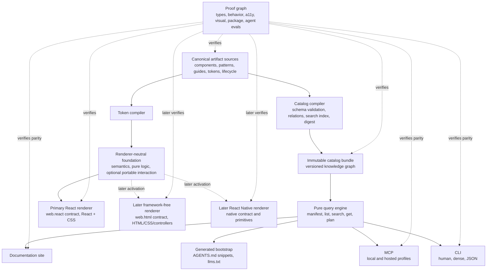
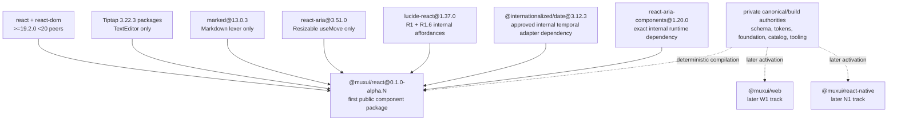

# Mux UI monorepo architecture

- Status: Final architecture
- Product: Mux UI
- Scope: monorepo, public packages, documentation, CLI, MCP, and agent workflows

## Executive decision

Decision 0012 resets the current pre-publication product identity to Mux UI,
with machine identity `muxui`, package scope `@muxui/*`, active artifact and
schema namespace `muxui:`, CLI `muxui`, and public styling hooks rooted in
`.muxui-*`, `--muxui-*`, and `data-muxui-*`. No compatibility alias is required
because no public npm release exists. Historical records retain their original
predecessor identities and bytes.

Mux UI is built as:

> Mux UI is a versioned design-system knowledge graph whose primary component
> product is React. Framework-free web and React Native are separately
> activated secondary renderers. Package guidance, and later the CLI, MCP,
> docs site, and agent context, are projections of the same canonical sources.

The architecture has one central rule:

> Author a public fact once, expose it everywhere, and prove every renderer
> still agrees with it.

At the first public component boundary, the published `@muxui/react`
prerelease contains deterministic, version-bound package guidance generated
from canonical component records and `web.react` binding specs. The CLI becomes
the primary exact-version documentation and discovery interface at the later
Productization boundary. It is never a second authoring system: it reads an
immutable catalog compiled from canonical artifact sources, and the docs site
and MCP server use the same query library and responses.

Mux UI delivers React first:

- **Primary React track:** typed React bindings, DOM/CSS behavior, styling
  hooks, SSR/hydration, and accessibility fulfillment owned by `web.react`
  binding specs and `@muxui/react` source.
- **Later framework-free web track:** separately activated `web.html` binding
  specs and `@muxui/web` HTML/CSS/controller implementation.
- **Later native track:** separately activated `native.react-native` binding
  specs and `@muxui/react-native` implementations built from native
  primitives and renderer-neutral component records, never from React source,
  React Aria, DOM behavior, or React types.

React Aria Components is the default internal substrate for the React track.
It does not own Mux UI identity, inventory, semantics, API, types, lifecycle,
accessibility requirements, styling hooks, compatibility, support, guidance,
or platform claims. Other renderers and frameworks remain deferred until their
own activation and proof boundaries pass.

Mux UI is a product system first. The catalog and tooling exist to make the
renderer system understandable, operable, and provable; they do not compete
with it for product priority. Canonical schema and discovery primitives precede
component breadth so that operability is structural rather than retrofitted.
Later operational capabilities cannot block renderer progress unless a
published compatibility commitment, safety boundary, or deterministic proof
is at risk.

## Controlled vocabulary

Architecture, schemas, filenames, CLI output, and new ADRs use these terms
consistently:

| Term | Exact meaning |
| --- | --- |
| `ArtifactRef` | Immutable logical identity in the form `muxui:<kind>:<slug>`; it is neither a version nor a content digest. |
| Concept record | Canonical shared semantics, lifecycle, guidance, relations, and platform dispositions for a component or pattern. |
| Binding spec | Platform-specific Mux UI API, behavior, accessibility obligations, strategy, examples, and proof requirements. |
| Decision context | Bounded rationale attached to an existing concept, pattern, or guide: the problem, constraints, preferred approach, alternatives, and trade-offs. It explains owned facts but is not a second source of product behavior. |
| Guidance impact | `normative` content enters a binding-spec compatibility closure; `editorial` content may explain an already-owned fact but cannot define implementation behavior. |
| Content revision | Digest of the complete canonical record, including editorial fields and inert extensions. It proves source identity, not renderer compatibility. |
| Binding-spec revision | Digest of the normalized implementation-facing closure: relevant concept semantics, binding API/behavior, examples, token requirements, platform-safety declarations, and accessibility obligations. |
| Schema | Versioned validation grammar for canonical sources or machine responses; it does not own product meaning. |
| Schema version | SemVer interpretation of one schema family; it governs readable data shape, not product/package availability. |
| Query envelope | Versioned CLI/API/MCP response shape, including data, diagnostics, provenance, authority, and compatibility metadata. |
| Compatibility descriptor | Generated package metadata identifying the exact binding spec plus its declared token and platform-safety requirement closures. Fulfillment/support remains tied to separate current evidence. |
| Token requirement set | The binding-specific semantic/component token IDs, requirement levels, fallbacks, types, modes, and recipe revision needed for rendering. |
| Platform safety contract | The closed architecture-defined safety-requirement registry plus each binding/profile's complete required/not-applicable declaration. It is separate from token identity and owns no renderer behavior result. |
| Platform safety requirement set | A derived per-binding/profile projection of the platform safety contract, bound to the registry and declaration revisions and consumed by renderer evidence and compatibility descriptors. |
| Token contract version | SemVer for public token identity, type, layer, and semantic meaning. |
| Evidence record | Produced proof metadata and references for one artifact, binding, revision, environment, and result. |
| Catalog release | One immutable `@muxui/catalog` package version and digest containing a compatible compiled knowledge/query projection. |
| Release manifest | Immutable aggregate of package versions, catalog/schema/token versions, binding-spec revisions, evidence and active-exception digests, and provenance. |
| Runtime profile | A concrete environment inside a binding, such as iOS, Android, or React Native Web, with inherited or overridden lifecycle/strategy and evidence. |
| Lifecycle | Maturity axis: `experimental`, `stable`, `deprecated`, or `removed`. |
| Strategy | Realization axis: `direct`, `adapted`, `native-alternative`, or `unsupported`. |
| Capability | Manifest-declared operation or projection with explicit availability and policy on a particular surface. |
| Runtime protocol | Ownership and lifecycle rules for controllers, adapters, global effects, providers, and renderer integration. |
| Change intent envelope | Versioned, derived preview of a proposed write: objective, authority, effect, affected closure, invalidated proof, required checks, and confirmation policy. It neither owns product truth nor grants authority to mutate. |
| Operational exception | Explicit, scoped, expiring permission to narrow support or defer a waivable obligation. It cannot alter canonical truth, manufacture proof, broaden compatibility, or authorize a generated-file patch. |

Use **public contract** only as an explicitly qualified collective phrase, such
as “public CSS contract” or “CLI compatibility contract”; it is not the name of
a source file or schema kind. Normative sections and implementation names use
the terms above.

## What “AI-first” means

AI-first is an architectural property, not a documentation label. Mux UI is
AI-operable only when all of the following are true.

### At the system and tooling level

- An agent can discover the entire supported surface from one versioned JSON
  manifest without scraping help text or crawling the repository.
- Every search, retrieval, planning, validation, setup, or migration capability
  is non-interactive and has a stable machine interface when it becomes
  available. The manifest represents unavailable capabilities honestly.
- Human, dense, JSON, MCP, and website responses originate from the same query
  and formatting pipeline.
- Every result carries stable IDs, platform scope, lifecycle, source revision,
  package versions, and exact follow-up commands.
- Errors have stable codes, concise explanations, repair suggestions, and
  meaningful exit statuses.
- Generated output is deterministic. The same source revision produces the
  same bytes, ordering, IDs, and digest.
- The repository has one obvious navigation path and marks generated outputs
  so agents do not edit projections.
- Agent quality is measured with cold-start and generation evaluations after
  deterministic correctness gates pass.

### At the code and API level

- Components use consistent names, parts, states, defaults, event semantics,
  and controlled/uncontrolled conventions.
- Mux UI-owned props are finite and explicit. Aliases, polymorphic overloads,
  implicit modes, and stringly typed escape hatches are exceptional.
- Composition is visible in the API. Required parents, children, labels, and
  providers are machine-readable.
- Web components expose stable markup, roles, classes, slots, data attributes,
  events, and progressive-enhancement behavior.
- React bindings preserve the applicable web semantics, styling, and
  externally observable DOM surface instead of inventing a second visual or
  semantic model.
- React Native shares intent, state, tokens, and accessibility obligations but
  is free to use an appropriately native API and interaction pattern.
- Defaults are deterministic. An underspecified request produces the canonical
  default rather than an invented variant or layout.
- Every escape hatch is named, typed, bounded, and documented with its cost.
- Deprecations point to a replacement and a machine-readable migration.

An agent should be able to move through this loop without guessing:

```text
discover capabilities
  -> search by intent
  -> retrieve exact binding spec and examples
  -> compose or plan
  -> implement
  -> validate
  -> repair from structured diagnostics
```

## The architecture in one picture



Think of this as four cooperating systems:

1. **The canonical-source system** owns stable product knowledge.
2. **The renderer system** turns that knowledge into web, React, and native UI.
3. **The knowledge system** compiles and queries the artifact graph.
4. **The proof system** prevents any public projection from drifting.

## Canonical knowledge model

### The artifact is the unit of knowledge

Every public concept is addressable through a stable `ArtifactRef`. That
universal envelope contains identity, kind, lifecycle, relationships, and
provenance; it does not force unlike concepts into one authoring schema.

Initial addressable kinds are:

- `component`
- `pattern`
- `token`
- `foundation`
- `guide`
- `example`
- `pitfall`
- `migration`
- `capability`

Each kind uses a dedicated schema or a deliberately shared schema family:

- `ComponentRecord` for concept records and binding specs;
- `PatternRecord` for compositional guidance;
- `GuideRecord` for narrative sources;
- `ExampleRecord` for executable fixtures;
- `PitfallRecord` for structured failure and repair guidance;
- `MigrationRecord` for version-bounded changes;
- `CapabilityRecord` for tooling availability; and
- token source documents whose sets and named values are addressable through
  catalog references without turning every token leaf into a component-like
  document.

This preserves one graph for discovery and relations without flattening design
data, prose, executable fixtures, and tooling metadata into false sameness.

IDs use `muxui:<kind>:<slug>`, for example `muxui:component:button`. IDs are
immutable once released. Display names, package paths, and URLs may change
without destroying history.

Artifacts can relate to other artifacts through typed edges such as:

- `uses`
- `composes`
- `alternative-to`
- `replaces`
- `example-of`
- `pitfall-for`
- `implemented-by`
- `available-on`

Search returns IDs and summaries. Retrieval resolves the complete record and
selected related records. This prevents a search response from becoming an
accidental copy of the whole catalog.

### Component records are concept-first

A component record owns shared intent before renderer details:

- purpose and when-to-use guidance;
- optional bounded decision context and rejected alternatives;
- anatomy and named parts;
- semantic states and only those state transitions that are genuinely
  portable;
- accessibility intent and obligations;
- semantic tokens and customization points;
- relationships, alternatives, and composition rules;
- lifecycle and ownership; and
- a binding record for every declared platform.

Each platform binding spec owns its exact Mux UI API, lifecycle, strategy,
deviations, validation profile, and relations to compatible examples. The
compiler derives source locations, package exports, and package versions from
the repository and package manifests.

An abbreviated source record looks like this:

```jsonc
{
  "$schema": "../../../packages/schema/schemas/component.schema.json",
  "schemaVersion": "1.0.0",
  "id": "muxui:component:button",
  "kind": "component",
  "name": "Button",
  "summary": "Triggers an immediate action.",
  "lifecycle": "stable",
  "intent": {
    "useWhen": ["Submitting a form", "Confirming a user action"],
    "avoidWhen": ["Navigating to another location"]
  },
  "anatomy": ["root", "label", "leading", "trailing", "progress"],
  "states": ["idle", "disabled", "pending"],
  "accessibility": {
    "nameRequired": true,
    "obligations": ["Expose disabled and busy state"]
  },
  "bindings": {
    "web.html": {
      "lifecycle": "stable",
      "strategy": "direct",
      "spec": "bindings/web.json",
      "examples": [
        {
          "id": "muxui:example:button-basic-html",
          "guidanceImpact": "normative"
        }
      ]
    },
    "web.react": {
      "lifecycle": "stable",
      "strategy": "direct",
      "spec": "bindings/react.json",
      "examples": [
        {
          "id": "muxui:example:button-basic-react",
          "guidanceImpact": "normative"
        }
      ]
    },
    "native.react-native": {
      "lifecycle": "stable",
      "strategy": "adapted",
      "spec": "bindings/react-native.json",
      "examples": [
        {
          "id": "muxui:example:button-basic-react-native",
          "guidanceImpact": "normative"
        }
      ],
      "runtimeProfiles": {
        "ios": {
          "lifecycle": "stable",
          "validationProfile": "native.ios"
        },
        "android": {
          "lifecycle": "stable",
          "validationProfile": "native.android"
        },
        "native.react-native-web": {
          "strategy": "unsupported",
          "reason": "No responsible implementation in the initial slice."
        }
      }
    }
  },
  "pitfalls": ["muxui:pitfall:button-is-not-navigation"]
}
```

The record is strict JSON validated by JSON Schema. It does not execute code.
Executable examples are separate source files referenced by ID; they are never
copied into Markdown, registries, stories, or golden records.

Each binding-to-example relation declares `guidanceImpact` as `normative` or
`editorial`. A normative example's revision enters the binding-spec closure.
An editorial example may demonstrate an already-owned fact, but it cannot be
the sole source or proof of an import, default, constraint, accessibility
obligation, composition rule, migration, or planned recipe. Any example used by
a canonical default, validation rule, golden expectation, migration, or pattern
plan is normative by rule; the compiler rejects an authored `editorial`
label in those relationships rather than trusting prose classification.

### Examples form a deterministic curriculum

An `ExampleRecord` owns bounded selection metadata and references exactly one
executable source file, which remains the sole owner of its code. This lets an
agent choose the right example, not merely a valid one. The record includes:

- exact binding and runtime-profile applicability;
- a closed `purpose` set: `generation`, `explanation`, `validation`, or
  `migration`;
- `complexity`: `minimal`, `representative`, `advanced`, or `edge-case`;
- explicit prerequisites and supported states or pattern parameters;
- validated risk and rule coverage derived from referenced obligations.

The binding-to-example relation owns preference for each supported purpose
where more than one example is applicable; the example does not declare itself
preferred independently of the binding that uses it.

The example's `contentRevision` covers its normalized record and executable
source bytes. A normative relation therefore changes the applicable revision
closure when either the selection metadata or code changes.

All published examples are canonical sources, so “canonicality” is not a
ranking score. Selection first filters by the resolved package tuple, exact
binding/profile, purpose, and prerequisites; it then uses authored preference
and complexity, with stable ID only as a final deterministic tie-breaker. A
missing or contradictory preference fails validation instead of allowing a
model, search score, filename, or filesystem order to choose.

Selection metadata that can change generated code, validation, migration, or a
pattern plan is normative and enters the applicable binding-spec or pattern
revision closure. Editorial teaching order may change only content/catalog
identity. Risk class remains owned by the concept or binding; examples declare
coverage and cannot downgrade it.

### One owner per fact

The source hierarchy is explicit:

1. Concept records own product semantics, artifact lifecycle, guidance,
   relations, renderer-neutral risk, and renderer-neutral alternatives.
2. Platform binding specs own Mux UI-defined API fields, binding and
   supported-profile lifecycle, strategy, deviations, validation profiles,
   platform dispositions, and canonical-example relations.
3. Token sources own design values and semantic aliases.
4. Renderer source owns implementation, effects, runtime/effect lifecycle,
   host-language refinements, and platform-native passthrough types.
5. Executable example files own example code.
6. Tests encode expected behavior.
7. The proof system produces and retains evidence against those expectations.
8. Compiled catalogs, search indices, HTML pages, dense text, JSON responses,
   MCP definitions, Storybook adapters, and static agent files are projections.

Every canonical field is classified as **authored**, **derived**, or
**proved**. There is no unclassified metadata and no silently co-authored
fact.

| Field class | Examples | Owner | Treatment |
| --- | --- | --- | --- |
| Product semantics | Intent, use/avoid guidance, decision context, artifact lifecycle | Artifact source | Author once. |
| Portable semantics | Semantic parts, conceptual states, accessibility obligations | Concept record or foundation semantic source | Author once. |
| Binding API | Mux UI-owned props, attributes, events, slots, defaults, deviations | Binding spec | Author the stable semantic surface; generate serializable types and reference output. |
| Host type ergonomics | Passthrough props, generic constraints, refs, narrowed platform events, JSX inference | Renderer TypeScript | Hand-author and validate; never introduce undocumented Mux UI semantics. |
| Runtime implementation | CSS, DOM controller, React code, React Native code | Renderer package | Author and prove against the binding spec. |
| Mechanical metadata | Package version, export/source path, source/content/spec revision | Package and build graph | Derive by convention, canonical serialization, or compiler inspection. |
| Executable guidance | Examples and fixtures | Example source file | Author once; reference by stable ID. |
| Evidence | Results, screenshots, manual audits, environment data | Proof system | Produce; never hand-copy into canonical sources. |

In particular, a variant list, slot list, event list, default, import path, or
example body must not be independently authored in artifact JSON, TypeScript,
CSS, Markdown, stories, and golden records. One source owns the fact; other
surfaces derive it or fail when they disagree. Mechanical package and source
locations shown by the CLI are derived from the binding ID, package manifests,
and enforced slug conventions rather than repeated in `artifact.json`.

Every canonical record has a `contentRevision` over its normalized complete
authored content, including editorial fields and inert extensions but excluding
insignificant serialization whitespace or key order. A binding additionally
has a generated `specRevision` over the normalized implementation-facing
closure: applicable concept semantics, public API/defaults/constraints,
observable behavior and accessibility, normative canonical-example revisions,
token requirements, and supported-profile rules. Changing any member of that
closure changes `specRevision` and triggers the binding/package compatibility
classification. Search keywords or editorial prose can change
`contentRevision` and the catalog patch without changing `specRevision`.

Query envelopes report concept and binding content revisions plus the resolved
binding-spec revision. Each returned section is classified by its schema as
`guidanceImpact: normative | editorial`; a full response may contain both.
Editorial changes cannot alter defaults, constraints, imports, example
applicability, or repair instructions. Renderer descriptors contain
`specRevision`, not the full binding content revision: tying a renderer package
to independently evolving editorial content would recreate whole-catalog
coupling. The catalog and query provenance still identify the exact content
returned.

Binding specs describe only the stable Mux UI surface: component-owned
props, variants, defaults, parts, events, conceptual controlled/uncontrolled
modes, and accessibility or composition obligations. They do not attempt to
encode all of TypeScript, JSX, DOM, or React Native's host type systems.

Serializable Mux UI types may be generated from the binding spec.
Hand-authored renderer TypeScript owns host-element passthrough, generic
constraints, ref precision, event narrowing, platform-owned props, overloads,
and framework inference. Spec-to-code checks verify that these refinements
satisfy the Mux UI surface without adding undocumented Mux UI variants,
defaults, events, or behavior. Standard passthrough surfaces are named profiles
such as `html.button` or `react-native.pressable`; they are not duplicated as
thousands of catalog properties.

If a projection is wrong, fix its earliest canonical input or compiler. Never
patch the projection.

### Patterns are bounded composition specifications

A v1 `PatternRecord` is more than prose but less than a generator language. It
owns:

- intent, use/avoid guidance, and platform applicability;
- optional bounded decision context: problem, applicable constraints,
  trade-offs, and rejected `ArtifactRef` alternatives with reason codes and
  conditions;
- named participant roles and required or optional component references;
- machine-checkable composition relations and invariants;
- a closed parameter schema where the pattern genuinely has choices;
- executable example, pitfall, alternative, and accessibility references; and
- explicit preconditions and unsupported cases.

Decision context stays on the record that owns the decision. Machine-enforced
constraints, applicability, and alternatives remain in their typed pattern
fields; explanatory prose cannot smuggle in an unvalidated requirement. This
adds addressable reasoning without creating a parallel interpretation graph.
Decision context is editorial by default and changes `contentRevision`; any
statement that changes generation, validation, behavior, compatibility, or
migration must also be represented by its normative owning field and then
enters the applicable revision closure.

Its structural constraints describe the catalog recipe—for example, that a
field role requires a label relation and a message role—but do not form a
general UI tree language, consumer-code linter, runtime abstraction, or test
generator.

`plan` is deterministic over these records. It may select a known pattern,
bind declared parameters, return referenced components and examples, and
explain which constraints and alternatives caused the result. It may not
invent components, product architecture, or unrecorded steps. When no pattern
supports the request, it returns a typed unsupported result with missing
requirements rather than plausible prose. Consumer templates and scaffolds
remain a later, separately gated capability.

V1 enforcement is confined to Mux UI-owned sources. The compiler validates a
pattern's references and constraints against the artifact graph and binding
specs, verifies that every canonical example declares the applicable
pattern revision, and may run narrow structural AST checks over those
system-owned examples where a maintained parser exists. It does not claim to
validate arbitrary consumer JSX, HTML, or React Native trees. Consumer-project
pattern validation is a later static-analysis capability with its own manifest,
version support, diagnostics, escape hatches, and false-positive budget; it is
not implied by `PatternRecord` validation.

### Narrative guides remain portable

Not every useful explanation belongs in JSON. Cross-cutting material such as
theming, accessibility, layout, migration strategy, and architectural
decisions can be Markdown, but each guide has strict frontmatter with a stable
artifact ID, summary, keywords, platforms, lifecycle, relationships, and an
optional bounded decision context when the guide records a cross-cutting
choice.

The CLI returns the same guide source that the site renders. There is no
separate web-only guide and no manually summarized agent-only guide.

### Ontology growth has a budget

A new artifact kind, revision axis, package, manifest, or durable relation is
allowed only when an observed workflow cannot be expressed by an existing
record plus typed relations. Its proposal must name one owner, at least one
consumer, the query shape, validation and proof policy, compatibility and
migration effects, authoring workflow, and removal or deprecation path.

Prefer, in order: a projection of existing facts, a typed relation, a bounded
field on an existing kind, and only then a new kind. A schema cannot become
stable before its scaffold, semantic diff, diagnostics, and affected-closure
explanation exist. This makes ontology cost visible and prevents the knowledge
system from growing independently of renderer or maintainer needs.

## CLI is the Productization documentation interface

The first React package-only prerelease is documented by generated,
version-bound README, API, export/component, styling, and compatibility files
inside its tarball. Those package files are projections, not canonical facts,
a query API, or a second registry.

At Productization, the CLI becomes the primary documentation interface for
people and agents. The site consumes the same documentation, every command
supports JSON, a capability manifest describes the command surface, and
`--dense` reduces token cost.

Mux UI enforces this through a strict internal separation:

```text
artifact sources -> catalog compiler -> query engine -> output renderer
```

The CLI is the supported documentation API. The catalog remains the
authoring-level source so command parsing, output formatting, and content
cannot become tangled.

### Command surface

Keep the ontology small and stable:

```text
muxui manifest
muxui list [kind]
muxui search <query>
muxui get <id-or-alias>
muxui plan <request>
muxui validate <path... | --stdin>
muxui doctor
muxui init
muxui migrate
```

This is the stable namespace, not a promise that every command ships in the
first release. Capability gates sequence it as follows:

| Tier | Commands | Availability rule |
| --- | --- | --- |
| Discovery baseline | `manifest`, `list`, `search`, `get` | Ships with the first catalog and is the documentation contract. |
| Validation | `validate` | Starts with catalog/examples; consumer-project analysis follows packed fixtures and bounded execution. |
| Composition | `plan` | Enables only after the pattern catalog and relation data can produce non-invented plans. |
| Project health | `doctor`, then `init` | Enables after project detection, change-intent preview, dry-run, merge, and recovery protocols pass. |
| Migration | `migrate` | Last; requires version-range compatibility, declarative migrations or reviewed codemods, change-intent confirmation, journaling, and rollback evidence. |

Read-only discovery and high-risk project mutation use different internal
modules and release gates even though one CLI exposes them. Mutation cannot
shape or delay the catalog query API.

`list`, `search`, `get`, and `plan` query the same mixed artifact graph. Human
aliases such as `muxui component Button` may exist, but they resolve to the same
`get` operation and response type rather than creating another component data
path.

Queries accept the common selectors that apply to their response:

```text
--platform <web.html|web.react|native.react-native|native.react-native-web>
--detail <brief|compact|full>
--section <api|examples|guidance|decision-context|accessibility|styling|source>
--purpose <generation|explanation|validation|migration>
--json
--dense
--limit <n>
--cursor <token>
```

`--json` and `--dense` are output renderers, not alternate data sources.
Section, detail, and applicable example-purpose selection happen before
rendering so the token savings are real. `--purpose` filters example relations
and invokes the deterministic curriculum rules; it does not rerank unrelated
artifacts. Dense mode ships with the discovery baseline because token-efficient
retrieval is a primary product contract, not later optimization.

### Query envelopes

JSON writes exactly one value to stdout. Progress and diagnostics go to
stderr. A success response has this shape:

```json
{
  "apiVersion": "1.0.0",
  "type": "artifact.detail",
  "data": {},
  "meta": {
    "muxuiVersion": "1.0.0",
    "catalogVersion": "1.0.0",
    "catalogDigest": "sha256:...",
    "resolution": {
      "authority": "installed-local",
      "compatibility": "exact",
      "catalogSource": "project",
      "revisions": {
        "conceptContent": "sha256:...",
        "bindingContent": "sha256:...",
        "bindingSpec": "sha256:..."
      },
      "targetPackages": {
        "@muxui/react": "1.0.0",
        "@muxui/web": "1.0.0"
      }
    },
    "platform": "web.react",
    "detail": "full",
    "truncated": false,
    "nextCursor": null
  },
  "warnings": []
}
```

Errors use append-only codes:

```json
{
  "apiVersion": "1.0.0",
  "type": "error",
  "error": {
    "code": "MUXUI_ARTIFACT_NOT_FOUND",
    "ruleId": "artifact.resolve.exists",
    "message": "No artifact matched 'Buttn'.",
    "retryable": true,
    "details": {
      "query": "Buttn"
    },
    "nextCommand": {
      "command": "muxui search button --json",
      "effect": "read-only",
      "requiresConfirmation": false
    },
    "suggestions": [
      {
        "id": "muxui:component:button",
        "command": "muxui get muxui:component:button --platform web.react --dense"
      }
    ]
  }
}
```

Consumers branch on `type` and `error.code`, never on prose. Response schemas
ship with the tooling package and are addressable from the manifest. Every
error code discriminates the schema of `details`. `nextCommand` is the exact
safe diagnostic or corrective step for the reported state; its `effect` and
`requiresConfirmation` fields prevent agents from treating a suggested
project mutation or dependency install as an implicitly authorised action.
`suggestions` name alternative targets, not commands that may be executed
without applying those rules. Every response containing implementation
guidance includes a resolution authority,
compatibility state, catalog source, and target package tuple. A hosted
advisory response therefore cannot be mistaken for installed-local truth by a
human or agent.

### Dense output

Dense mode is a designed format, not minified prose. It must be:

- deterministic and line-oriented;
- explicit about IDs, platform, defaults, allowed values, and omissions;
- free of introductory prose, duplicated headings, and decorative tables;
- section-selectable;
- measured against per-command token budgets; and
- round-trippable to the same underlying response object used by JSON.

An illustrative response might be:

```text
component muxui:component:button@1 platform=web.react lifecycle=stable strategy=direct
import=@muxui/react/button export=Button
intent=action; not-navigation
props variant=primary|neutral|danger default:primary; size=sm|md|lg default:md
states=disabled,pending,pressed,focus-visible
a11y=name-required; exposes:disabled,busy; pending-retains-focus
examples=muxui:example:button-basic-react
pitfalls=muxui:pitfall:button-is-not-navigation
source=packages/react/src/components/button
```

Dense formatting has golden snapshots and token-count budgets. A change that
silently doubles common retrieval cost fails CI.

### Self-describing manifest

`muxui manifest --json` is the agent's cold-start entry point. It describes:

- CLI name and version;
- command and subcommand grammar;
- arguments, options, types, choices, defaults, and conflicts;
- supported output modes;
- emitted response type discriminators and schema locations;
- capability availability by surface;
- artifact kinds and platform IDs;
- package and catalog version correlation; and
- example invocations.

The manifest, parser, `--help`, completion data, JSON types, and MCP tool input
schemas are generated from one declarative command registry. Adding a command
without response types, schemas, examples, and capability policy fails CI.

Bare `muxui --json` may embed the manifest for recovery when an agent does not
yet know the `manifest` command.

## One query engine, several surfaces

`@muxui/catalog` exposes pure, side-effect-free operations:

```ts
getManifest()
listArtifacts(request)
searchArtifacts(request)
getArtifact(request)
planComposition(request)
```

Search is deterministic and explainable by default. Names, aliases, keywords,
intent, relationships, and documented synonyms contribute to ranking. Results
include match reasons. Semantic or hosted search can be additive later, but it
must not be required for local correctness or reproducible tests.

The adapters are thin:

- The CLI parses arguments and renders query responses.
- MCP converts tool inputs to the same request types and returns the same data.
- The docs application renders the same records and guide sources.
- The playground loads the same executable examples.
- Static context generation emits only a bootstrap and routing index.

Parity tests send identical requests through the programmatic API, CLI JSON,
MCP, and website loader and compare normalized responses.

### MCP profiles

MCP should have a small tool surface so agents choose tools reliably.

A minimal local adapter is built during the vertical-slice phase as a parity
probe for the query engine, not as a separately mature product. It remains
internal until discovery responses and schemas are stable. Hosted MCP is an
operational-scale capability and ships later.

The hosted, read-only profile exposes:

- `search`
- `get`
- `plan`, only when the composition capability is available

The installed local profile may additionally expose:

- `validate`
- `doctor`

Mutation remains local CLI/API work. Setup and migrations require an exact
change-intent preview, explicit user intent, dry-run support, project-root
confinement, atomic writes, an operation journal, base-drift rejection, and
recovery. Hosted MCP never executes consumer code or changes a project.

Capability policy determines which adapters expose an operation. It does not
fork the operation's implementation.

### Website and static agent context

The website is a catalog client, not a documentation authority. A component
page is a rendering of `artifact.detail`; it does not maintain a second prop
table, example, or pitfall list.

`AGENTS.md`, `CLAUDE.md`, editor rules, and `llms.txt` are small generated
bootstrap files. They teach the discovery loop and record the installed Mux UI
UI version. They do not contain the complete component catalog.

`llms-full.txt` may be offered as a versioned offline export for environments
that cannot run tools, but it is never the default agent path, never an
authoring source, and never required for repository navigation.

## Multi-platform renderer architecture

### Share meaning, not implementation accidents

The platform-neutral concept record includes:

- component intent;
- anatomy and semantic parts;
- state vocabulary and deterministic transitions only where portability is
  demonstrated;
- value normalization and selection rules where portable;
- semantic tokens and theme recipes;
- accessibility obligations; and
- portable composition relationships.

It excludes:

- DOM nodes and selectors;
- React hooks and context;
- React Native views and responders;
- portal mechanics;
- browser media queries;
- native gesture implementations; and
- assumptions that every platform needs the same prop names or structure.

Every platform binding declaration uses two orthogonal concepts:

- `lifecycle`: `experimental`, `stable`, `deprecated`, or `removed`; required
  for an implemented binding or profile; and
- `strategy`: the semantic realization described below; always required.

The available strategies are:

- `direct`: the concept maps closely to the platform;
- `adapted`: the intent is shared but anatomy or interaction differs;
- `native-alternative`: use a platform-owned control or pattern;
- `unsupported`: no responsible implementation exists.

`unsupported` is a strategy, not a maturity level. An unsupported binding or
runtime profile omits lifecycle and evidence requirements but must give a
reason or alternative. Runtime profiles inherit the binding lifecycle and
strategy unless they explicitly override one; supported profiles name a
validation profile and retained evidence. The generic word `status` is reserved
for command or service availability, so agents cannot confuse maturity with
support disposition.

Parity means the disposition is explicit and verified. It does not mean every
component has byte-for-byte equivalent APIs on every platform.

The concept record defines **semantic parity**: shared intent, obligations, and
named concepts. A binding spec defines **binding
conformance**: the exact API, behavior, accessibility obligations, ergonomics,
and evidence promised on one target. **Feature equivalence** is optional and
exists only when a capability relation explicitly claims it. A
`native-alternative` can therefore conform fully without copying a web feature
set.

### `@muxui/foundation` internal boundaries

The foundation is one package only while that remains the smallest coherent
distribution unit, but its source has three enforced sub-boundaries:

- `semantic/`: serializable intent, state vocabulary, token recipes, and
  portable composition rules;
- `logic/`: pure algorithms such as selection normalization, range
  constraints, parsing, and form-state utilities; and
- `interaction/`: optional renderer-neutral state machines only where the
  transition model survives translation across actual renderers.

`semantic` cannot depend on `logic` or `interaction`; `logic` cannot depend on
`interaction`. A binding may share semantic state while implementing all
transitions itself. No component is required to adopt a portable interaction
machine merely because one can be abstracted.

Every portable interaction machine declares the exact binding/runtime profiles
on which its transitions have been proved and links to that evidence. Import
purity alone does not establish portability, and a renderer outside the proved
set does not inherit the claim. Promotion to a broadly shared machine requires
evidence from materially different renderer mechanisms, not multiple wrappers
over the same implementation.

### `@muxui/web`

The web package is the later, separately activated framework-free web product.
It does not block React admission, implementation, merge, prerelease
publication, or React breadth closure. When its `W1` track activates, it owns:

- compiled token and theme CSS;
- cascade-layer, customization-hook, DOM, role, class, slot, and state-
  attribute implementation conforming to the `web.html` binding spec;
- per-component CSS entry points;
- semantic HTML rendering for canonical examples whose code remains owned by
  the canonical example source; and
- optional per-component vanilla JavaScript controllers.

Vanilla controllers are imported explicitly and have bounded lifecycle:

```ts
const controller = connectDialog(root, options);
controller.destroy();
```

They are idempotent, SSR-safe, and do not scan or mutate an entire document by
default. Public events are typed and named by intent. Progressive enhancement
is preferred whenever native HTML can carry the base behavior.

The documented CSS surface is a public API. Component roots use a predictable
class such as `.muxui-button`; named descendants use stable slots such as
`[data-muxui-slot="label"]`; interaction state uses documented data attributes.
Raw palette values are not consumed directly by component CSS: components use
semantic or component tokens that can be compiled for both web and native.

That promise is deliberately narrow and machine-enumerated in each web binding
spec:

| CSS/DOM surface | Compatibility policy |
| --- | --- |
| Root class, documented semantic slot attributes, documented state attributes, public custom properties, cascade-layer names, and exported style entry points | Stable throughout a major. Removal or incompatible meaning/anatomy change requires deprecation and a major with migration guidance. |
| Element semantics, roles, and relationships required for behavior or accessibility | Binding spec; may change only with equivalent evidence and the version effect appropriate to consumer observability. |
| Wrapper/utility classes, exact nesting and child position, selector chains, implementation-only attributes, generated identifiers, animation/keyframe names | Internal unless explicitly promoted into the binding spec. No customization may rely on them. |

A named slot promises a semantic customization target, not an exact tag,
depth, sibling order, or complete DOM snapshot. The catalog and CSS audit expose
only registered hooks, flag examples that rely on internal selectors, and keep
deprecated hooks as aliases for their declared notice window. This preserves a
useful framework-free API without making every refactor a compatibility
commitment.

### `@muxui/react`

React is the primary component implementation and first public component
package. Each `web.react` binding spec owns the Mux UI React DOM, public API and
types, observable behavior, accessibility fulfillment and deviations, events,
slots, styling hooks, defaults, lifecycle, strategy, validation profile,
canonical-example relations, platform-safety declarations, and compatibility
promises. `@muxui/react` source owns React rendering, controlled and
uncontrolled state, runtime and effect lifecycle, portals, refs, host
passthrough refinements, DOM implementation, compiled CSS implementation,
SSR, hydration, and cleanup.

`@muxui/react` does not consume `@muxui/web` at runtime. Canonical tokens,
component records, binding specs, compatibility data, descriptors, and package
guidance may be deterministically compiled into its tarball by private build
authorities without becoming runtime workspace dependencies or duplicate
owners.

For Mux UI value adapters, `@muxui/react` is approved to directly use
`@internationalized/date@3.12.3` as an internal runtime dependency only for
`DateField`, `DatePicker`, `DateRangePicker`, `TimeField`, `Calendar`, and
`RangeCalendar`. It is the single resolved `3.12.3` instance already present
in the pinned `react-aria-components@1.20.0` closure, so the direct declaration
adds no installed package or version. Mux UI public values remain ISO dates
`YYYY-MM-DD`, local times `HH:mm[:ss[.fraction]]`, and Mux UI-owned `{start,end}`
ranges. No `@internationalized/date` or React Aria public type, value, import
path, export, lifecycle, or ownership path may leak through the package; this
is an internal, replaceable adapter dependency only.

For existing R1 control affordances, `@muxui/react` is also approved to
directly use `lucide-react@1.37.0` as an exact internal, replaceable runtime
dependency. Its npm integrity is
`sha512-LPsB4rD1TD6wZu1djKOf9vUnS1jTNaHbolXebXDgiTdb6jeA1agIJhJsIybCmjKmQClcOaal1o1OaiYahEftyQ==`;
its package license is ISC, its included Feather-derived artwork carries the
MIT notice, and it is React peer-compatible with the existing React and React
DOM peer boundary. Use is limited to `DatePicker`/`DateRangePicker` calendar
triggers; `Calendar`/`RangeCalendar` previous/next controls;
`ComboBox`/`Select` and `Tree` chevrons; `SearchField` clear;
`NumberField` plus/minus; `Checkbox` check/indeterminate; `TagGroup` remove;
and `Dialog`/`Toast` close. R1.6 also permits the same pinned internal Lucide
edge for the donor affordances in `AlertDialog`, `CommandPalette`, `HeaderNav`,
`Lightbox`, `MultiSelect`, `PaymentInput`, `Sidebar`, `TagSelect`, and
`TextEditor`. Mux UI owns all labels and public contracts. No Lucide export,
type, name, prop, or import path, and no public Icon API, catalog, or package,
may cross the package boundary. Breadcrumb separators are text and no Search
icon is added.

R1.6 additionally admits exact, internal, replaceable runtime dependencies
needed by the applicable donor implementations: `react-aria@3.51.0` only for
`Resizable`'s `useMove` behavior. It is the already-resolved React Aria
closure of the pinned `react-aria-components@1.20.0` baseline, so the direct
declaration must not introduce a second version. `marked@13.0.3` only for the `Markdown`
lexer behind a Mux UI-owned typed parser/AST boundary; and
`@tiptap/core@3.22.3`, `@tiptap/pm@3.22.3`, `@tiptap/react@3.22.3`,
`@tiptap/starter-kit@3.22.3`, `@tiptap/extension-image@3.22.3`,
`@tiptap/extension-placeholder@3.22.3`,
`@tiptap/extension-text-align@3.22.3`, and
`@tiptap/extension-text-style@3.22.3` only for `TextEditor`. These are direct
Mux package implementation edges, never Tale packages or runtime/build/dev/
peer/generated-source dependencies. Their package licenses, notices, npm
integrity, React peer compatibility, and exact lockfile pins are proof
obligations, not completed evidence. Imports stay isolated to the owning
component modules; tree-shaking and packed-consumer proof must show that
ordinary Button consumers do not load the editor or Markdown parser. Tiptap
types and editor objects never enter the Mux UI public API, and Markdown input
retains typed AST, escaping, source-size bounds, and focused security proof.

#### Tale styling donor boundary

The initial React visual implementation uses the matching component styling
from Tale UI commit `94bf62a26c02605c8928dfeb24f0ddc4be1c92fd` as a pinned,
one-time donor whenever an admitted Mux UI React component has an applicable Tale
counterpart. The donor snapshot includes `packages/styles/src` tree
`aea4eadffe226656ef0ab012409ed39070975a76`, the related React source tree
`d93f7c0a555066d8abbaff75cb8bd216938bcb2f`, and the CSS foundation tree
`aa2a2d95214918794e9f463e063ceee0df3b4b1e`.

Tale supplies visual and structural input only. It is not a runtime, build,
development, generated-source, or synchronization dependency; Tale package
names, `.tale-*` selectors, custom-property names, component APIs, registry
records, and story files do not become Mux UI public contracts by copying. The
fixed 53-family table maps applicable donor CSS and shared primitive rules to
the Mux UI-owned `web.react` styling-hook contract and token requirements, then
records `adopt`, `adapt`, or `no-applicable-donor` with a reason for each
committed family. `defer` and `reject` apply only to documented upstream
material outside that committed family table. The resulting CSS is owned
solely by `@muxui/react` source.

For an applicable donor in the fixed 53 table, delivered/exportable closure is
limited to `adopt` or `adapt`; `no-applicable-donor` is valid only when the
pinned snapshot has no applicable counterpart. A `defer` or `reject` outside
the committed family table remains a fail-closed upstream disposition and
does not remove or postpone a committed family.

Every consumed donor custom property resolves through an exact crosswalk to an
existing Mux UI token, a separately admitted Mux UI semantic/component token, or a
reasoned non-token adaptation. A permanent Tale compatibility-token layer,
ambient donor checkout, or second style registry is forbidden. Visual donor
comparison proves the intended starting point; the Mux UI binding contract,
accessibility obligations, platform-safety rules, and responsible fixes take
precedence when exact copying would violate Mux UI authority.

A private R1 React playground may render generated adapters over canonical
Mux UI examples for component development, state/theme/mode coverage, automated
accessibility checks, and visual donor comparison. It owns no example,
component, token, styling-hook, lifecycle, support, or release fact and is not a
public documentation surface. Public React documentation and explorer delivery
remain P2.3. The former deferral of Tale's Scale application is superseded by
Decision 0013: its bounded Mux-owned port is the private `apps/scale`
theme-authoring projection for R1.6. It may edit and preview canonical Mux UI
themes, but it does not own token/theme facts, publish a package, or become a
Tale dependency.

R1.0 also owns a license and attribution audit for every copied or adapted
donor input. Any distributed substantial portion must preserve the applicable
Tale MIT notice, including its stated third-party portions, in the exact
`@muxui/react` package and release artifacts. Provenance and notice files are
Mux UI-owned release inputs; they do not create a Tale dependency or live owner.

Exactly one integration owns a mounted component root at runtime. A React
binding does not attach the lifecycle-bearing vanilla controller to DOM it
owns unless that controller exposes an explicitly React-safe adapter with one
listener, focus, and teardown owner. React may reuse foundation algorithms or
pure controller logic, but React owns effects, hydration, and cleanup for its
tree. Conversely, the HTML controller cannot assume a React lifecycle, and a
host cannot mount both paths on the same root. Development builds detect
duplicate ownership where practical. Both paths still emit the public events
and state attributes promised by the web binding spec.

Ownership also covers effects outside the component root. For a mounted
instance, exactly one integration owns focus restoration, Escape handling,
outside-pointer dismissal, portal lifecycle, and any inert/background policy.
A shared web service may coordinate document listeners or reference-counted
scroll-lock leases across multiple instances, but it is the sole global owner;
React and vanilla integrations acquire and release leases through their own
lifecycle rather than attaching competing effects. A React-safe adapter is
therefore either pure, or explicitly constructed and disposed by React—it does
not start autonomous global lifecycle work on import.

React Aria Components is the default internal React substrate and is pinned as
an exact runtime dependency for each accepted baseline. Mux UI owns its public
contract. React Aria types and exports are not re-exported as Mux UI API, and
an upstream export does not become a Mux UI component without a canonical
component mapping. `defer`, `exclude`, or `not-a-component` dispositions are
for documented upstream material outside the fixed 53 committed families.

React must not become the source for:

- the component inventory;
- shared intent and lifecycle;
- another renderer's API or implementation;
- React Native parity; or
- documentation content.

### `@muxui/react-native`

React Native is a later, separately activated secondary product. It implements
or adapts renderer-neutral component contracts through each component's
`native.react-native` binding spec and depends on renderer-neutral foundation
and token outputs, never on `@muxui/web`, `@muxui/react`, React Aria,
React DOM, CSS, browser globals, Expo, or Storybook.

It owns:

- native primitive composition;
- implementation of binding-owned native roles, state, values, actions,
  announcements, and focus behavior;
- gesture, responder, effects, and runtime/effect lifecycle implementation;
  and
- explicit iOS, Android, and React Native Web implementation files when
  needed.

The binding spec, rather than React source, owns the native Mux UI API,
observable platform behavior, accessibility fulfillment and deviations,
binding and supported-profile lifecycle, strategy, validation profiles,
canonical-example relations, platform-safety declarations, and compatibility
promises. The renderer source owns primitive/runtime implementation,
host-language refinements, effects, and runtime/effect lifecycle. Native may
contain fewer components than React and may use `direct`, `adapted`,
`native-alternative`, or `unsupported` dispositions per binding/profile.

Expo and native Storybook belong to a host application. They are not runtime
dependencies of the package.

React Native Web is a named runtime profile, `native.react-native-web`, not an
implicit claim of `web.react` parity. Every React Native binding declares that
profile's strategy; a supported profile also declares or inherits lifecycle,
names a validation profile, and has profile-specific evidence. It remains a
runtime profile of the React Native binding while it shares the same package
and public API; it should be promoted to a separate binding only if sustained
API or ownership divergence makes that distinction real.

### Later framework bindings

A future Vue, Svelte, Web Components, or other framework package binds to the
existing `web.html` binding spec and `@muxui/web` styles/controllers. It adds a
new platform binding record and framework examples to existing component IDs.
It does not fork shared guidance or create a parallel component registry.

No generic “all frameworks” abstraction should be introduced until two real
framework bindings demonstrate the repeated shape.

## Public package graph



The React-primary prerelease publishes exactly `@muxui/react`. It has no
runtime dependency on another Mux UI workspace package or `@muxui/web`.
React and React DOM are peers at `>=19.2.0 <20`; React Aria Components is the
exact `1.20.0` runtime dependency for the accepted baseline, and
`@internationalized/date@3.12.3` is the approved direct internal runtime
dependency for
Mux UI value adapters in exactly `DateField`, `DatePicker`, `DateRangePicker`,
`TimeField`, `Calendar`, and `RangeCalendar`. The latter is already the single
resolved `3.12.3` instance in the React Aria closure, so direct declaration
adds no installed package or version. Mux UI public values remain ISO dates
`YYYY-MM-DD`, local times `HH:mm[:ss[.fraction]]`, and Mux UI-owned `{start,end}`
ranges; neither `@internationalized/date` nor React Aria public type, value,
import path, export, lifecycle, or ownership may leak. The packed tarball must
contain no unresolved `workspace:` dependency, repository-only or source-tree
import, undeclared file dependency, or `@muxui/web` import.

The same graph includes the exact direct internal runtime dependency
`lucide-react@1.37.0` for the existing R1 control affordances and the nine
approved R1.6 donor affordance roots: `AlertDialog`, `CommandPalette`,
`HeaderNav`, `Lightbox`, `MultiSelect`, `PaymentInput`, `Sidebar`, `TagSelect`,
and `TextEditor`. Its npm integrity is
`sha512-LPsB4rD1TD6wZu1djKOf9vUnS1jTNaHbolXebXDgiTdb6jeA1agIJhJsIybCmjKmQClcOaal1o1OaiYahEftyQ==`;
the package is ISC with the Feather-derived MIT notice, and React
peer-compatible. No Lucide export, type, name, prop, import path, or public
Icon API/catalog/package is part of the Mux UI surface. R1.6 also admits
`react-aria@3.51.0` for `Resizable`/`useMove`, `marked@13.0.3` for the typed
`Markdown` parser boundary, and the exact eight `@tiptap/*@3.22.3` packages
for `TextEditor`. These module-local edges remain internal and replaceable; no
upstream runtime types or editor/parser objects are public.

| Package | Responsibility | Must not own |
| --- | --- | --- |
| `@muxui/schema` | Versioned source and response schemas, generated types, platform IDs, and authoring helpers. A later admitted capability may add a `ChangeIntentEnvelope` grammar. | Product semantics, components, renderers, or site code. |
| `@muxui/tokens` | Canonical tokens and deterministic web/native/design-tool transforms. | Component behavior or docs rendering. |
| `@muxui/foundation` | Enforced `semantic`, pure `logic`, and optional portable `interaction` sub-boundaries. | Selectors, React hooks, browser globals, native views, or mandatory cross-platform transitions. |
| `@muxui/web` | Later W1 HTML/CSS/controller implementation for `web.html` binding specs. | React or native implementation; a React prerequisite, shared React runtime, or shared React CSS owner. |
| `@muxui/react` | React rendering, CSS, SSR/hydration, effects, host refinements, package guidance, and exports for `web.react` contracts. | Canonical component metadata, React Aria public API, or another renderer's contract. |
| `@muxui/react-native` | Later N1 native primitive/runtime implementation and explicit platform files for native binding specs. | React/React Aria authority, CSS parsing, DOM, Expo, or Storybook hosts. |
| `@muxui/catalog` | Compiled catalog assets and pure discovery/query/planning API. | CLI parsing, MCP transport, project mutation. |
| `@muxui/tooling` | Self-describing CLI, MCP adapters, local validation, maintainer scaffolds, semantic diffs, and (when separately admitted) safe project operations. | A second artifact index, product decisions, or renderer implementation. |

At the React package-only boundary, schema, tokens, foundation, catalog, and
tooling remain private authoring/build/proof authorities. Productization later
publishes the compatible catalog/tooling portfolio and CLI-as-documentation.
Their versions may move independently from renderer packages, but every
enabled response and release manifest correlates all relevant versions and the
catalog digest.

### Catalog distribution and resolution

`@muxui/catalog` is a published, versioned data/query package. It contains the
immutable compiled catalog, search index, and pure query engine; it consumes
the schemas owned by `@muxui/schema` rather than copying them. Renderer
packages do not carry the catalog and do not depend on it at runtime. Renderer
consumers install it as a development dependency, while tooling and the docs
application consume its query API. Official installation profiles add
compatible renderer packages plus project-local `@muxui/tooling` and
`@muxui/catalog`, so discovery remains offline, deterministic, and
project-correct.

The published package version equals `catalogVersion`, and its manifest records
the catalog digest, query API version, schema range, and source revision. A
repacked byte stream with the same version but a different digest is invalid;
content or query changes require the appropriate package/catalog SemVer bump.

Every renderer package contains only a compact compatibility descriptor:

- renderer package name and version;
- stable binding and package-export identities;
- a generated per-binding index with implemented binding-spec revisions,
  lifecycle, strategy, and export identities;
- supported binding-schema and token-contract ranges; and
- release provenance.

For example:

```json
{
  "descriptorVersion": "1.0.0",
  "package": "@muxui/react",
  "version": "1.4.0",
  "bindingSchemaRange": "^1.0.0",
  "tokenContractRange": "^1.2.0",
  "bindings": {
    "muxui:component:button#web.react": {
      "specRevision": "sha256:...",
      "export": "@muxui/react/button",
      "lifecycle": "stable",
      "strategy": "direct",
      "tokenRequirementsDigest": "sha256:..."
    }
  }
}
```

This index is generated during packing from binding specs, canonical token
requirements, and the actual package export map; it is never a second authored
inventory. Packed-consumer checks verify every indexed export and revision
against the tarball. A package-wide range is only an initial filter—the resolver
uses the indexed artifact/binding key to prove that the requested component is
implemented by that exact package version.

It deliberately does not declare a whole-catalog revision range. A catalog
contains unrelated artifacts that can change without changing that renderer;
coupling packages to the catalog as a monolith would create false
incompatibility.

The local resolver follows one deterministic algorithm:

1. Locate the project/workspace root and read the installed Mux UI package
   graph; lockfile declarations alone are not proof that a package is usable.
2. Resolve the directly declared project-local `@muxui/catalog` from that
   exact workspace using the active package manager's resolution semantics. Do
   not scan sibling workspaces or ancestors for a higher version.
3. Read renderer compatibility descriptors and compare the resolved catalog
   version/integrity with the project manifest and lockfile. The installed graph
   proves executability; the manifest/lockfile detects declaration drift.
4. Reject the candidate outside the tooling's readable schema range, then match
   its binding revisions, package ranges, export identities, and token range
   against the installed renderers.
5. Require an exact release-manifest match or one unambiguous compatible
   revision for each requested binding. Project-wide discovery filters out
   bindings the installed graph cannot implement rather than advertising them
   as available.
6. If there is no unique compatible result, return a typed compatibility or
   catalog-missing error with an exact inspection/install command. Never fall
   through silently to latest or hosted data.

The chosen package and manifest create the installed-local authority recorded
in query metadata. Explicit hosted access may discover newer components or
migrations, but it requires a target tuple and remains advisory when that tuple
does not match. Explicitly downloaded catalogs are content-addressed, signature
or provenance verified, and cache-isolated by digest; cache recency never
outranks compatibility. A global CLI is a bootstrap convenience, not an
authority over a project-local tool and catalog.

The `package.json` range is the authored dependency request; the package-manager
lockfile is its generated exact version/integrity resolution. Together they are
the sole project dependency authority. A separate `muxui.lock` would
duplicate that authority and create a new drift source, so Mux UI does not
invent one. Manifest and doctor output report the resolved workspace root,
catalog version/digest, package path relative to that root, and declaration
drift. An explicitly cached catalog is eligible only when the invocation names
its version and digest; it never wins through hoisting or “highest compatible”
selection.

#### Resolver error taxonomy

Local catalog resolution uses cause-specific, append-only error codes. When
several checks fail, the resolver emits the first applicable primary code in
the order below and includes every confirmed secondary failure in structured
details; filesystem traversal order never chooses the code.

| Precedence | Code | Exact condition |
| --- | --- | --- |
| 1 | `MUXUI_PROJECT_NOT_FOUND` | The selected `--project` or current directory does not resolve to a supported project/workspace manifest. |
| 2 | `MUXUI_CATALOG_NOT_DECLARED` | The selected workspace does not directly declare `@muxui/catalog`. |
| 3 | `MUXUI_CATALOG_NOT_INSTALLED` | A declaration exists, but the package manager cannot resolve an installed catalog from that workspace. |
| 4 | `MUXUI_CATALOG_DECLARATION_DRIFT` | Manifest range, lockfile resolution, and installed version do not describe the same dependency state. |
| 5 | `MUXUI_CATALOG_INTEGRITY_MISMATCH` | Package integrity, catalog digest, signature/provenance, or release manifest does not match the resolved bytes. |
| 6 | `MUXUI_CATALOG_RESOLUTION_AMBIGUOUS` | The selected project/package-manager context yields more than one valid resolution and cannot choose by declared semantics. |
| 7 | `MUXUI_CATALOG_INCOMPATIBLE` | One catalog resolves uniquely, but schema, tooling API, binding-spec, renderer-package, export, or token requirements do not match. |

The error schema includes, where applicable:

- stable `code` and `ruleId`;
- workspace package name and path relative to the selected workspace root;
- detected package manager and declared catalog range;
- lockfile, installed, and catalog versions/digests;
- candidates with relative paths and rejection reasons;
- compatibility failures as `{ dimension, required, actual }`; and
- one `nextCommand` object with the exact command, effect class
  (`read-only`, `project-write`, or `dependency-install`), and whether explicit
  confirmation is required.

JSON does not expose an absolute workspace root, secrets, registry credentials,
or unrestricted storage URLs. If a corrective mutation cannot be proposed
safely, `nextCommand` is an exact read-only diagnostic; tooling never fabricates
an automatic repair merely to populate the field. Consumers branch on the code
and structured dimensions, not the message. Hosted surfaces do not emit these
local filesystem diagnostics.

## Repository layout

```text
muxui/
├── AGENTS.md                         # short route map and agent workflow
├── README.md                         # product entry point
├── monorepo-architecture.md          # this architecture
├── catalog/                          # canonical public knowledge
│   ├── components/
│   │   └── button/
│   │       ├── artifact.json
│   │       ├── bindings/
│   │       │   ├── web.json
│   │       │   ├── react.json
│   │       │   └── react-native.json
│   │       └── examples/
│   │           ├── html/basic.example.json
│   │           ├── html/basic.html
│   │           ├── react/basic.example.json
│   │           ├── react/basic.tsx
│   │           ├── react-native/basic.example.json
│   │           └── react-native/basic.tsx
│   ├── patterns/
│   ├── foundations/
│   ├── guides/
│   ├── pitfalls/
│   └── migrations/
├── packages/
│   ├── schema/
│   ├── tokens/
│   ├── foundation/src/
│   │   ├── semantic/
│   │   ├── logic/
│   │   └── interaction/
│   ├── web/src/components/button/
│   ├── react/src/components/button/
│   ├── react-native/src/components/button/
│   ├── catalog/
│   └── tooling/
├── apps/
│   ├── docs/                         # catalog client
│   ├── react-playground/             # private R1 generated example/donor-comparison host
│   ├── scale/                         # private R1.6 Mux theme-authoring projection/editor
│   ├── explorer-web/                 # later P2.3 React, then W1 HTML examples
│   └── explorer-native/              # Expo/native example host
├── tooling/
│   ├── catalog/                      # compiler and query build
│   ├── generators/                   # bounded deterministic projections
│   ├── audits/                       # cross-surface conformance checks
│   └── evals/                        # cold-start and codegen evaluations
├── tests/
│   ├── consumers/                    # packed HTML, React, and native fixtures
│   ├── browser/
│   ├── native/
│   ├── accessibility/
│   ├── visual/
│   ├── conformance/
│   └── agent/
└── decisions/                        # ADRs and accepted RFCs
```

The repeated slug is intentional. For a component named `button`, an agent can
predict every relevant location without repository-wide search.

### Navigation rules

- The root `AGENTS.md` contains only the repository map, the discovery loop,
  source-of-truth rules, and the small root command surface.
- Each major directory may have one local `AGENTS.md` that adds only
  directory-specific boundaries and verification commands.
- No tool-specific instruction file contains a separate component inventory.
- Canonical sources and generated outputs live in visibly different trees.
- Generated files contain a source pointer and are never mixed beside hand-
  authored files unless packaging requires it.
- Public artifact records contain exact source, test, and example pointers so
  `muxui get ... --section source` is the authoritative locator.
- Package and catalog slugs use the same spelling. Exceptions require an alias
  in the artifact record and a deterministic audit.

### Workspace orchestration

Use pnpm workspaces and one task graph. The exact orchestrator is secondary;
the important part is a small, memorable root interface:

```text
pnpm check                 # deterministic affected checks
pnpm check:all             # full deterministic proof graph
pnpm generate              # all bounded projections in dependency order
pnpm generate:check        # clean regeneration identity
pnpm test:agent            # model-based evaluations, opt-in or scheduled
pnpm release:prepare       # build and verify release candidates
```

Package-specific work uses filtered commands. Root `package.json` should not
become a flat catalog of every internal script. Detailed tasks belong to the
package that owns them or to a declarative task graph.

## API design rules for agent operability

### Naming and defaults

- One concept has one preferred public name.
- The same variant or state uses the same semantic name wherever it has the
  same meaning.
- Defaults are present in the binding spec, query schema, and executable examples.
- Avoid convenience aliases such as both `pending` and `isPending`; aliases
  increase the agent's choice space and the migration surface.
- Boolean names express state; event names express what happened or what is
  requested.

### Composition

- Prefer explicit named parts for genuinely compound components.
- Record allowed parent/child relations, required labels, and mutually
  exclusive parts.
- Avoid magical child inspection and prop meaning that changes by nesting.
- Provide one canonical minimal composition before advanced examples.
- Patterns compose components; components should not absorb product workflows
  merely to make one example shorter.

### Styling

- Components consume semantic and component tokens, not raw palette values.
- Stable web classes, slots, states, and cascade layers are public contracts.
- `@muxui/react` owns its component CSS implementation, compiled from the
  canonical `web.react` styling-hook contract and token requirements. It does
  not duplicate or become the owner of framework-free or native styles.
- The pinned Tale styling snapshot is a donor input with an exact per-component
  disposition and token/style crosswalk; Mux UI selectors, tokens, CSS, and
  compatibility remain Mux UI-owned outputs with no Tale dependency or live
  synchronization.
- Native resolves the same semantic recipe to native values at build or
  runtime without parsing CSS.
- Arbitrary styling is an explicit escape hatch, not the primary component API.

### Accessibility

- Accessibility obligations are part of the shared component artifact.
- Each binding documents how it fulfills them and where platform behavior
  differs.
- Required accessible names and relationships are representable in validation
  rules.
- Stable promotion requires automated and retained manual evidence appropriate
  to the interaction complexity.

### Errors and diagnostics

Every public diagnostic answers:

1. What happened?
2. Why is it invalid or risky?
3. What exact change or command is likely to fix it?

Diagnostics include an artifact ID, platform, rule ID, source location when
known, and related documentation command. Agents should never need to search
an error string on the web to discover the repair path.

## Authoring and change operations

Maintainers and repository-working agents are primary users of the system, not
an afterthought behind downstream consumers. Rigor is acceptable only when the
common authoring path makes the correct owner and affected proof cheaper to
find than an informal shortcut.

### Maintainer authoring workflow

The schema and tooling packages provide:

- schema-aware editor metadata, completion, and source-linked diagnostics;
- scaffolds that create only canonical authored inputs and never copy a
  generated projection back into source;
- an affected-closure view across concepts, bindings, examples, tokens,
  packages, projections, evidence, and evaluations;
- semantic diffs that distinguish editorial, compatible, and incompatible
  effects instead of presenting JSON key churn as product meaning;
- revision explainers that identify every normalized input responsible for a
  `contentRevision`, `specRevision`, token-requirement, or release-digest
  change;
- previewable autofixes only for semantics-preserving mechanical corrections;
  and
- exact affected checks, regeneration steps, version effects, and source
  owners for the proposed change.

A scaffold may request missing product decisions, but it cannot invent a
variant, default, platform strategy, rationale, or exception. An autofix cannot
change intent, lifecycle, accessibility obligations, public API, token meaning,
or migration policy. Those require an authored decision and normal review.

A stable schema addition cannot merge until these authoring surfaces understand
it. Scaffolded fixtures must round-trip through validation and compilation,
and diagnostics must lead back to the earliest editable owner. This couples
governance growth to usable maintainer workflows.

### Change intent protocol (later capability)

`ChangeIntentEnvelope` is a later, separately admitted read-only authoring
capability. It is not materialized as an active repository-wide delivery gate
or R1 ingress. `muxui plan` remains a read-only composition operation over
`PatternRecord`; it does not authorize writes.

The envelope contains:

- a deterministic intent ID and the applicable source, catalog, lockfile, and
  worktree preconditions from which it was derived;
- the user-supplied objective and requested artifact, binding, token, package,
  or project targets;
- the authoritative owners that must change and the exact proposed write set;
- a graph-derived affected closure, including projections to regenerate,
  examples or migrations to update, proof made stale, and agent evaluations to
  rerun;
- required validation rule IDs, compatibility/version effects, and rollback or
  recovery requirements;
- an effect class for each operation: `explanation-only`,
  `canonical-source-write`, `renderer-source-write`, `project-write`,
  `dependency-install`, or the internal evidence-only `evidence-retention-write`
  for an atomic evidence-root addition derived from its proof owner;
- readiness for retrieval, generation, and migration as
  `not-applicable`, `unknown`, `blocked`, or `proved`, with evidence references
  for every `proved` claim; and
- confirmation policy, including which effects require explicit user approval.

Affected and stale sets are derived from the canonical relation and build
graphs, never hand-maintained in the request. The preview is not authority: it
does not execute a command, grant consent, or make an unproved change safe.
After confirmation, the operation rechecks its preconditions, writes through
the applicable atomic/journalled protocol, and binds the envelope digest to the
operation journal and result. Source or dependency drift invalidates the
preview and requires a new envelope rather than silently expanding its scope.

Readiness starts as `unknown` or `blocked`; only completed deterministic checks
and retained evidence can make it `proved`. An explanation-only result has an
empty write set. This makes “what changes, why, and what becomes stale”
machine-readable without creating a second source of product truth.


## Generation and repository hygiene

Generators compile projections; they do not discover product truth through
heuristics.

Permitted generation includes:

- token formats;
- compiled catalog bundles and search indices;
- response and binding-spec types;
- package export maps derived from declared bindings;
- site routes and static pages;
- MCP input schemas and tool metadata;
- small agent bootstrap files;
- visual explorer adapters; and
- release manifests and provenance.

Bulky generated registries, site builds, package builds, and evaluation output
are not committed by default. CI builds twice in clean directories and compares
digests. A small reviewed release manifest may be committed when it improves
traceability, but it contains IDs and digests rather than copied payloads.

Every generator supports `--check`, stable ordering, no wall-clock fields in
the canonical preimage, and actionable drift messages that name the earliest
source to edit.

## Proof architecture

Deterministic proof runs before model-based evaluation.

| Layer | Question answered |
| --- | --- |
| Schema | Is every artifact valid, versioned, uniquely identified, and relationally complete? |
| Spec conformance | Do generated Mux UI types, validated hand-authored type refinements, package exports, CSS hooks, examples, and renderer declarations match the concept records and binding specs? |
| Unit and state | Do declared portable machines and renderer-owned behavior implement their respective transitions? |
| Browser | Does the HTML/React implementation handle layout, focus, events, SSR, hydration, and browser APIs? |
| Native | Do iOS, Android, and declared React Native Web runtime profiles satisfy their binding behavior and accessibility obligations? |
| Accessibility | Are automated rules and required manual evidence present for every stable interaction? |
| Visual | Do canonical examples render acceptably across themes, modes, density, direction, and platforms? |
| Package | Do packed consumer fixtures resolve exports, types, styles, assets, and supported engines? |
| Surface parity | Do API, CLI JSON, MCP, dense rendering, and site loaders resolve the same record revision? |
| Generation identity | Does a clean second build reproduce the same catalog and release digests? |
| Agent cold start | Can an unprimed agent discover the manifest, select the right artifacts, and retrieve bounded context? |
| Agent generation | Does generated code use valid imports, APIs, composition, tokens, and accessible structure? |

These layers do not all run at the same cadence:

| Gate | Required evidence |
| --- | --- |
| Pull request | Schema and relation validity, generation identity, field-ownership checks, affected types and units, changed examples, focused package fixture, and basic accessibility checks. |
| Scheduled | Full browser and device matrices, visual permutations, performance, broad consumer fixtures, and repeated cold-start/code-generation evaluations. |
| Stable release | All deterministic gates, supported-platform smoke tests, digest parity, required manual accessibility evidence, compatibility review, and no expired exceptions. |

### Mandatory cross-cutting fixtures

Architectural rules become acceptance fixtures at the first gate that enables
their capability; a future-capability fixture does not block an earlier gate.

| Fixture | Earliest gate | Required assertion |
| --- | --- | --- |
| Authoring round trip | Gate 0 | A maintainer can scaffold the minimum canonical source, follow source-linked diagnostics, compile it, and explain every resulting revision without editing a projection. |
| Workspace catalog resolution | Gate 0 | Multiple compatible-looking/hoisted catalogs still resolve through the selected workspace's declared dependency, or fail deterministically; fixtures exercise every reachable resolver code, precedence, structured dimension, and safe `nextCommand`; no ancestor or hosted fallback occurs. |
| Normative example closure | Gate 1 | A normative example change changes `specRevision`; an editorial-only change changes content/catalog identity but not renderer compatibility; forbidden downgrades fail compilation. |
| Example curriculum selection | Gate 1 | Purpose/profile filtering and authored preference choose one compatible example deterministically; contradictory preferences, missing prerequisites, or a model/search-score override fail. |
| Change-intent closure | Gate 1 | A representative concept, binding, example, token, and renderer change reports the complete authoritative write set, invalidated proof, version effect, required checks, confirmation policy, and base-drift rejection. |
| Packed descriptor derivation | Gate 1 | The descriptor is generated after packing from the tarball export map, binding specs, and token-requirement digests; a source-only or missing export fails. |
| Token fallback denial | Gate 1 | A missing required token fails for every profile without an exact evidenced fallback; authorized fallback succeeds with a structured diagnostic. |
| Evidence advisory propagation | Gate 1 before stable promotion | Withdrawing required evidence makes the support claim unproved in every enabled catalog/query/release view without exposing restricted payload data; MCP and site adapters inherit the same parity fixture when enabled. |
| Operational exception enforcement | Gate 1 before stable promotion | Expired, support-broadening, proof-manufacturing, integrity-bypassing, or projection-patching exceptions fail; an allowed restriction is visible in diagnostics and release metadata. |
| Inert extension isolation | Gate 3 or earlier capability enablement | Changing inert extension data changes required content/catalog provenance but not `specRevision`, descriptors, search ranking/data, stable `get` payload fields, dense guidance, or agent bootstrap content. Comparisons ignore the provenance fields that must change. |

These fixtures use synthetic data, test both positive and negative paths, and
are release-blocking for the capability they govern. A model evaluation cannot
waive them.

### Operational exception policy

Operational pressure does not create a second edit path. An exception may
narrow a claim, disable a capability, permit a prerelease-only state, or defer
an explicitly waivable non-release-blocking obligation. It may never broaden
support, change a canonical fact, edit a generated projection, suppress a
compatibility or integrity failure, turn absent evidence into proof, or promote
a stable binding without its mandatory accessibility and safety evidence.
The proof or capability policy must enumerate waivable rule IDs explicitly;
rules are non-waivable by default.

Every allowed exception is a structured `OperationalExceptionRecord` with:

- a stable ID, status, creation time, hard expiry, owner, and approver;
- exact artifact, binding, runtime profile, capability, release channel, and
  rule-ID scope;
- a public reason code plus disclosure-controlled rationale;
- the tracked repair issue and measurable exit condition;
- compensating controls and the support or capability restriction it applies;
  and
- links to superseding evidence or the closure record when resolved.

The active record and its digest appear in diagnostics and release metadata;
public views receive the non-sensitive reason, scope, restriction, and expiry.
CI rejects expired records, scope expansion without renewed approval, and a
release channel outside the record's allowance. Exceptions are append-only for
audit: closure or supersession does not rewrite the original record.

The permitted response to a bad projection is to fix its canonical input or
compiler and regenerate, disable the affected capability, or roll back the
release. A renderer-specific quirk is an authored binding deviation with proof,
not a projection exception. Missing proof narrows lifecycle/support or leaves
the claim unproved. These paths preserve operational flexibility without
allowing a temporary output patch to become an undisclosed source of truth.

Agent evaluations begin as focused, informational smoke tests during vertical
slices so the system cannot become “AI-first” only after its APIs harden. They
become release-blocking only after the prompt set, model variance, thresholds,
and failure ownership have stable baselines. A single stochastic miss never
overrides deterministic evidence.

Evidence is structured from the start. Each record identifies:

- artifact and binding ID;
- artifact content revision, binding-spec revision, renderer package
  version, and catalog version/digest;
- platform/runtime and environment profile;
- evidence kind and tool version;
- source revision and input/example IDs;
- result, timestamp, expiry or retention class, and owner; and
- artifact URI or digest for retained output.

Evidence is retained per released binding-spec revision, renderer package
version, and environment profile, then referenced by digest from release
manifests. Timestamps, execution environment, and mutable result metadata live
in the evidence store outside the deterministic catalog preimage; the catalog
contains only stable requirements and references.
Mutable “latest” dashboards are views, not the release record. Manual evidence
uses the same identity model rather than free-form checklist prose.

Evidence requirements are derived from a declared interaction risk class, not
copied uniformly across every artifact:

| Risk class | Minimum stable-promotion evidence |
| --- | --- |
| Static | Schema and binding-spec validity, types, package fixture, visual states, and applicable automated accessibility semantics. |
| Interactive | Static evidence plus state/input/keyboard behavior and manual evidence where assistive-technology coordination is part of the binding spec. |
| Composite or overlay | Interactive evidence plus focus entry/restoration, dismissal, layering/scroll policy, and retained manual accessibility review on every supported binding/runtime profile. |
| Systemic or temporal | Composite evidence plus concurrency, timers, announcements, host/provider lifecycle, interruption, and cleanup behavior as applicable. |

The concept record and binding spec declare the risk class; the proof policy
derives the required evidence kinds. A downgrade requires a reviewed, expiring
exception and cannot be used to promote a binding while mandatory evidence is
missing or stale. Evidence for a released binding-spec revision is immutable
and retained for the release's support lifetime plus its documented
deprecation/migration window. A static Divider therefore does not inherit
Dialog's manual interaction matrix, while a stable Dialog cannot omit
it.

Evidence also carries a disclosure class independent from its proof kind:

| Disclosure class | Payload and retention policy |
| --- | --- |
| Public reproducibility | Synthetic fixtures, sanitized results, digests, tool versions, and public artifacts retained with the supported release. |
| Internal CI | Logs, screenshots, traces, and device artifacts available only to maintainers for a policy-defined period. |
| Restricted audit | Manual audit material or traces with sensitive context stored behind access controls; public releases expose only a sanitized attestation and digest. |
| Transient | Debug output containing no unique release evidence; deleted after the run and never referenced as a promotion requirement. |

Catalog records and public/hosted query envelopes expose only permitted
metadata, outcome, and content digest—not restricted payloads, access-bearing
storage URLs, secrets, local absolute paths, or personal/device identifiers.
Canonical visual and agent fixtures use synthetic data. Consumer code, prompts,
screens, or traces are not collected by default; capture requires explicit
scope, consent, redaction, and a declared retention policy.

The versioned evidence policy defines retention periods and audiences so this
long-lived architecture does not duplicate mutable durations. Evidence needed
to support a release cannot expire before that release's support and migration
window. A restricted audit may satisfy a gate through a verifiable sanitized
attestation, but a transient log cannot.

Historical evidence is immutable but not assumed infallible. Withdrawal or
supersession is represented by a separate, signed, append-only
`EvidenceAdvisory` referencing the evidence digest, affected release/binding,
effective time, public reason code, disclosure class, and optional replacement
digest. It never edits the original evidence record or release manifest.

Before G1.9 enables the signed catalog/query/release `EvidenceAdvisory`
surface, repository proof may use a narrower internal
`EvidenceApplicabilitySupersession` only to close a retained applicability or
recertification chain after a human-accepted authority change. It is not an
`EvidenceAdvisory`, cannot withdraw the historical result, does not enter a
catalog or release manifest, and cannot satisfy current evidence, promotion,
or support. The content-addressed certificate binds the exact historical index
digest, terminal recertification digest when present, superseded and current
applicability manifests, affected assertion IDs, exact source commit/tree, and
an immutable repository decision record containing the provider-supplied
designated owner's stable actor identity, comment identity and timestamp, and
decision-body digest. The grammar is closed and the verifier rejects unknown fields,
malformed identities, forks, cycles, duplicate references, stale current
manifests, and a certificate that does not represent an actual applicability
change.

The certificate closes that historical recertification chain permanently: a
later source-only drift may append one digest-linked supersession certificate,
but no later passing recertification may extend the superseded chain. Compatible
replacement proof starts a new immutable evidence index bound to its new
authority/source profile. The original index, records, artifacts,
recertifications, and certificates remain byte-for-byte historical. Enabling
the public signed advisory surface still requires the complete G1.9 contract;
this internal certificate does not satisfy `SCOPE-TRUST-ADVISORY` by itself.

Current proof and historical audit are separate resolution modes. A current
milestone-readiness, support, promotion, or release evaluation resolves each
repository source input through the exact source, executed, and proof-tool
identity relationship declared by its canonical proof owner. An explicitly
admitted historical resolver may reproduce historical bytes only for audit,
integrity, compatibility, or exact historical reproduction; those bytes and
results do not enter or satisfy current proof. Evidence retention remains
governed by the proof owner and disclosure class. Retained positive,
negative-path, and failure evidence stays immutable, while task working
material classified `Transient` and not admitted by a proof owner need not be
retained in the repository.

Queries resolve evidence with `evidenceStatus: valid | superseded | withdrawn`
and surface the advisory without exposing restricted detail. Supersession keeps
the historical result valid for its original release unless the advisory says
otherwise; withdrawal means it can no longer satisfy a current support or
promotion gate. If required evidence is withdrawn, tooling marks the affected
support claim unproved until compatible replacement evidence exists. Privacy
withdrawal may remove a stored payload while retaining the minimum digest and
sanitized advisory required for auditability.

Golden evaluations reference canonical example IDs instead of embedding copied
reference implementations. A failing evaluation may reveal a code/API problem,
a missing relationship, poor search metadata, or weak guidance. Documentation
is not automatically blamed and model-suggested changes never become canonical
without review.

Track at least these agent metrics:

- manifest discovery success;
- artifact selection precision and recall;
- wrong-prop and invented-prop rate;
- invalid composition rate;
- compile and validation pass rate;
- accessibility obligation pass rate;
- repair success after one structured diagnostic;
- context tokens used per successful task; and
- stability across model families and repeated runs.

## Lifecycle, versions, and trust

Artifact lifecycle and binding lifecycle are distinct. A component concept can
be stable while a new platform binding is experimental. Every implemented
binding has a lifecycle and a strategy. An unsupported declaration has a
strategy, reason, and optional alternative but no lifecycle; it is honest data,
not a missing record or a maturity value.

Stable artifact IDs are never recycled. Deprecation requires:

- a replacement or an explicit no-replacement reason;
- a migration artifact;
- a notice window;
- versioned retrieval of the previous binding spec; and
- retained discoverability after removal.

Each release publishes:

- package versions;
- catalog schema and content versions;
- query API version;
- catalog and asset digests;
- supported platform matrix;
- active operational-exception IDs, digests, restrictions, and expiries; and
- provenance linking artifacts to source revision.

### Version units and compatibility

Mux UI uses a small number of explicit version units rather than independently
SemVer-versioning every component:

- `schemaVersion` versions the shape and interpretation of source and response
  schemas.
- `catalogVersion` SemVer-versions the released catalog as a whole.
- `tokenContractVersion` SemVer-versions public token names, types, layers, and
  semantic meaning independently from renderer implementation releases.
- Artifact records retain immutable IDs plus `introducedIn`, `lastChangedIn`,
  lifecycle, and content revision; they do not have independent package-like
  release trains.
- Each binding records the owning renderer package and compatible package
  version range, derived during release from package metadata.
- The CLI/tooling declares the schema ranges it can read and reports the exact
  catalog and package tuple in every response.

Every implementation query resolves under an explicit compatibility context:

```text
schemaVersion
+ catalogVersion and catalogDigest
+ toolingApiVersion
+ bindingSpecRevision by binding
+ rendererPackageVersion by package
+ tokenContractVersion
```

Each renderer package publishes a lightweight descriptor containing the
binding-spec revisions it implements plus compatible schema and token ranges.
It does not embed or couple itself to an unrelated whole-catalog
digest. The release manifest aggregates package descriptors, the catalog
digest, evidence digests, and active operational-exception digests into one
verifiable release view.

Installed-local queries are the default authority for implementation guidance:
they use the deterministic local resolution algorithm above to select an
installed or explicitly cached catalog. A newer CLI may read an older
installation only when its declared schema and tooling ranges allow it;
otherwise it returns a typed compatibility error. Hosted queries require an
explicit target tuple or are labelled advisory. They must not emit
implementation imports, props, or examples as applicable to a project when the
target package range is unknown or incompatible.

Breaking-change scope is classified before release:

| Change | Required version effect | Required evidence and migration |
| --- | --- | --- |
| Shared intent, required anatomy, or accessibility obligation changes incompatibly | Catalog major; major for every renderer whose binding spec changes. | Cross-binding review, changed examples, behavior/accessibility evidence, and a migration artifact. |
| Remove or rename a prop/event/slot, change a default incompatibly, or change public DOM anatomy/hooks | Catalog major and owning renderer major. Unaffected renderers need not major. | Replacement or explicit no-replacement reason, affected consumer fixtures, and a machine-readable migration; add a declarative transform or reviewed codemod only when it can be safe. |
| Add an optional component, binding, prop, variant, example, relation, or guidance | Catalog minor and affected package minor where its public surface grows. | Contract/schema validation, examples, types, and affected binding evidence. |
| Add a supported runtime profile | Catalog minor and affected package minor. | Profile-specific behavior, package, and accessibility evidence. |
| Change `direct`/`adapted`/`native-alternative` behavior incompatibly | Catalog major and affected renderer major. | Platform review, updated binding evidence, examples, and migration guidance. |
| Change a public token name, type, layer, or semantic meaning incompatibly | Token contract major; catalog and affected renderers major when their public contract changes. | Theme impact analysis across supported profiles and migration guidance. |
| Remove an inline query-response field | Deprecate in an additive query-API minor, retain the field and emit replacement guidance for one complete accepted notice release, then remove in the next query-API major at earliest. | Historical version negotiation, retained prior responses, generated type/help changes, migration guidance, and API/human/JSON/dense parity evidence. |
| Implementation fix with no public contract change | Renderer patch; no catalog content version change unless canonical guidance or compatibility facts change. | Affected regression and package evidence; release manifest points to new evidence digests. |
| Editorial or search metadata correction | Catalog patch; no renderer release. | Schema/search checks; no behavioral migration. |

A release compiler rejects a catalog whose declared binding range does not
contain the package being published. Historical catalogs remain retrievable so
the CLI can answer for the consumer's installed package tuple rather than only
for latest. Every authored source change updates its content revision; only the
version units whose public contracts changed are released. This prevents an
evidence rerun or timestamp from manufacturing a catalog release.

### Schema evolution and extensions

Canonical source schemas are closed by default. Unknown top-level fields fail
compilation rather than being ignored, because an ignored spelling error or
unsupported semantic field would make generated guidance untrustworthy.
Public response envelopes are version-negotiated and append-only within a
major; consumers must ignore unknown optional response members but never infer
meaning from them.

`schemaVersion` follows these compatibility rules:

| Schema change | Version effect | Migration rule |
| --- | --- | --- |
| Clarify descriptions or annotations without changing validation or meaning | Patch | No source rewrite. |
| Add an optional stable field, relax a constraint, or add an independently capability-gated record kind | Minor | Existing sources remain valid; compiler defaults are explicit, never inferred from absence when behavior would change. |
| Add a required field, tighten a constraint so valid sources fail, change field interpretation, or add a closed enum value old consumers cannot safely handle | Major | Provide an explicit source migrator and compatibility diagnostics. |
| Remove a field | Deprecate in a minor, remove in the next major at earliest | Preserve replacement/no-replacement guidance and migrate canonical sources. |

Experiments live only under an explicit `extensions` object with namespaced
keys such as `muxui.experimental.<adr-id>`. The compiler preserves extension
data but stable query behavior ignores it unless a declared capability owns its
schema and semantics. In v1, third-party namespaces are inert data because
consumer catalog overlays remain deferred. A first-party experiment can appear
only on experimental artifacts or bindings and is listed in the manifest; a
stable artifact cannot depend on it.

Promotion requires an accepted ADR, a stable schema field, compiler/query
support, fixtures, and a source migration that moves data out of the
experimental namespace. Canonical-source migrations are explicit,
version-to-version, deterministic, idempotent, and reviewable with `--dry-run`;
tools never rewrite source records silently while reading or querying them.
Deprecated fields remain readable for their declared compatibility window and
cannot be repurposed with new meaning.

Query-response deprecation follows the same rule. `@muxui/schema` owns each
versioned request/response grammar. `@muxui/catalog` owns response-version
negotiation and historical query semantics; adapters cannot reinterpret them.
Query API `1.2.0` is the
required additive notice release for moving large token-source payloads out of
the `artifact.detail` full-response `tokens` member. It retains the complete
query API `1.1.0` inline member, adds the bounded `tokens` and
`source-crosswalk` sections, and emits
`MUXUI_QUERY_INLINE_TOKENS_DEPRECATED` with replacement guidance. Only after
that exact release has complete retained Gate 0 evidence and human acceptance
may query API `2.0.0` remove inline `tokens`. The catalog retains and negotiates
historical v1.1, v1.2, and v2 behavior. Tooling selects a compatible installed
catalog, forwards explicit version intent, renders the returned response, and
rejects unsupported tuples without silently translating response or cursor
meaning. The v1.2 `source-crosswalk` section returns a typed derived `absent`
status for a token-source `2.0.0` record and for a `2.1.0` record that omits the
authored field; clients never infer absence from a missing response member.
Explicitly negotiated v1.1/v1.2 inline responses are retained compatibility
artifacts: they are exempt from the v2 sectional page budget, are never the
current/default response, and do not satisfy proof of the v2 bounded path.

Extension bytes are canonical input, so changing them updates the owning
record's `contentRevision` and, when published, requires at least a catalog
patch plus a new digest. An
inert extension does not enter `specRevision`, renderer compatibility, default
query data, search indexing, dense output, or agent context. It can be returned
only through a manifest-declared, capability-specific request that names the
extension namespace and schema; unsupported tools preserve it during source
migration but do not interpret or project it.

This separates identity from compatibility: an experimental note can honestly
change source/catalog identity without implying a renderer change or leaking
into stable guidance. An extension that affects ranking, defaults, relations,
validation, or rendering is not inert and must first graduate into an owned
schema/capability with the required version and migration effects.

### Theme and token policy

Mux UI is brand-agnostic infrastructure with a first-party default theme, not
a single-product skin. Public tokens use three explicit layers, followed by a
target transform rather than a fourth shared platform-token namespace:

```text
reference values -> semantic roles -> component roles
                           |
                    target compiler
                           |
              web or native runtime values
```

Reference tokens hold raw design values and may not be consumed by components.
Semantic tokens assign product-independent roles; component tokens narrow those
roles only when a component needs a stable customization point. The alias graph
is acyclic and may point from component to semantic to reference, never in the
opposite direction. A same-layer alias is allowed only for documented semantic
equivalence or a deprecation bridge; it cannot conceal a role change.
Components consume semantic or component tokens only.

A closed default-theme exception permits the fixed reference families
`reference.color.error-*`, `reference.color.warning-*`, and
`reference.color.success-*` when an accepted authority decision pins their
exclusive system-status family meaning and exact source values. These remain
reference palette values, not component states or permission to introduce
other role-named reference families. Mux UI components and binding token
recipes never consume them directly; component styling and behavior reach them
only through semantic or component aliases. Target compilers may intentionally
emit their admitted typed public reference values. That emission does not prove
support, accessibility, lifecycle, availability, or parity. Consumer
customization remains limited to permitted semantic/component roles and
private reference values under the existing override policy.

The first-party default theme uses Tale UI's non-semantic foundation tokens as
a pinned migration baseline, not as a live dependency or second owner. The
baseline is Tale UI commit
`94bf62a26c02605c8928dfeb24f0ddc4be1c92fd`, source
`packages/tokens/tokens.json`, SHA-256
`83b72fc79b34932ae1afa44d21f74460a23fa693407bc319fdfafb3a2bb64a86`.
It contains 693 declaration occurrences: 692 custom-property occurrences, 644
unique custom-property names, and one ordinary `html { font-size: 100% }`
declaration. Those occurrences are candidates, not automatically Mux UI tokens.

The canonical Mux UI token source under `catalog/tokens/` owns the complete
Tale-to-Mux UI classification. Token-source schema `2.1.0` adds one optional,
closed `sourceCrosswalk` field; it is mandatory for the corrected default-theme
source. A source with no migration baseline omits the authored field, while the
query projection returns a typed derived `absent` status. Each Tale occurrence
is identified by source file, selector, declaration name, value, and a stable
source-order ordinal and appears exactly once. Every entry has exactly one
`adopt`, `adapt`, `defer`, or `reject` disposition and a non-empty reason.
Repeated names become one logical token or mode only through an explicit group;
an occurrence belongs to at most one group, every group has at least two
members, and its mode/member mapping is complete and duplicate-free. `adopt`
and `adapt` require exactly one resulting Mux UI reference-token ID; `defer` and
`reject` forbid a Mux UI token ID and make no runtime-token claim. Every admitted
Mux UI token owns its stable Mux UI ID, type, unit, meaning, mode applicability, and
override policy. Tale provenance is authored only by `sourceCrosswalk`.

`sourceCrosswalk` is the sole authored Tale provenance and migration metadata.
Its canonical preimage is the pinned baseline identity, occurrence entries in
stable occurrence order, and group definitions in stable group-ID order. The
derived `sourceCrosswalkDigest` is SHA-256 of that canonical JSON preimage; the
complete field also enters the token source's `contentRevision` but creates no
independent revision axis. Token-level provenance, catalog projections, and
package provenance digests derive from this owner and are never authored again.
The field does not enter token IDs, semantic
dependency closure, requirement sets, search ranking, default summaries, or
runtime CSS/native values. Package and catalog metadata may expose the derived
digest without copying its entries. CSS variable names and
Tale file groupings are migration inputs, not permanent Mux UI public API, a
fourth token layer, or an ongoing synchronization promise. Web CSS and native
theme objects continue to derive only from admitted Mux UI token facts; native
never parses Tale or Mux UI CSS.

The optional field is a token-source schema minor from `2.0.0` to `2.1.0`.
Existing sources remain valid, corrected sources migrate through an explicit,
deterministic, idempotent `2.0.0 -> 2.1.0` source migrator, and readers never
rewrite a source silently. Removing or changing the field incompatibly requires
a token-source schema major, migration guidance, affected-closure proof, and
preserved historical retrieval.

Under current query API v2 behavior, complete token and crosswalk populations
are retrieved only through the versioned `tokens` and `source-crosswalk`
sections of `getArtifact` / `muxui get`. Explicit version negotiation may still
retrieve the retained v1.1/v1.2 inline compatibility members described above;
those historical responses cannot become the default or be represented as
section-budget proof. `@muxui/schema` owns the closed
`TokenSectionPageBudgetProfile` grammar;
the catalog owns the canonical profile values and page selection. The profile
contains the query API version, Mux UI lexer version, canonical entry-order/cost
rules, normalized worst-case envelope preimage and reserve, default and maximum
item limits, minimum-progress rule, 2,048-token dense-page budget, and stable
oversize code `MUXUI_QUERY_PAGE_ENTRY_TOO_LARGE`. Its canonical JSON enters the
catalog digest, so it adds no independent revision axis. Section entries use
stable canonical ordering. A cursor binds the query
API version, catalog digest, token-source `contentRevision`, section, selector
state, and next position; invalid, cross-version, or cross-digest cursors fail
closed. `limit` is only an item-count ceiling. Using the profile, the catalog
query kernel selects the greatest non-empty canonical-entry prefix that fits
after the envelope reserve. No field or entry is truncated. A single entry that
cannot fit fails with the stable source-linked oversize diagnostic. Tooling
renders the already selected page and proves parity; it never chooses a page
boundary. API, human, JSON, and dense pages remain equivalent and continuation
enumerates the complete source without an unbounded response.

Each binding spec references a canonical token recipe. The compiler resolves
that recipe into a `TokenRequirementSet` containing:

- semantic or component token ID;
- `required`, `optional`, or `deprecated` requirement;
- canonical type and allowed unit, derived from the token source;
- applicable modes and runtime profiles;
- an optional typed fallback declaration; and
- token-schema and semantic-recipe revisions.

The binding spec authors which roles are required and any safe fallback; it
does not duplicate token types or meanings owned by the token source. The
generated package descriptor stores the requirement-set digest, while the
catalog exposes the resolved list. Theme and package validation compare both
the semantic dependency closure and its digest, so a broad SemVer range cannot
hide a missing token or changed role.

Platform safety is a separate binding fact, never a token requirement or a
fourth token namespace. The single authored executable registry and normative
ID meanings live in
[`platform-safety-contract.json`](./platform-safety-contract.json), a protected
child of this architecture. Its initial contract version is `1.0.0`. The
registry digest is `sha256:` plus SHA-256 of the entire registry document
serialized as UTF-8 Mux UI canonical JSON: object keys sorted recursively,
declared array order preserved, LF text, and no insignificant whitespace.
Schema enums, generated types, compiler validation, and catalog/query/package
projections derive from that source; none re-author its IDs or meanings.

`@muxui/schema` owns only the closed declaration/projection grammar. A
binding with no nested runtime profiles declares all six registry IDs against
its binding ID, which is also its profile identity. A binding with nested
runtime profiles declares all six IDs only for each concrete nested profile;
it has no second abstract binding-profile declaration. Each entry is
`required` or `not-applicable`; the latter includes a reason. An unsupported
profile declares all six as `not-applicable` and carries no behavior or
evidence claim.

The full binding-authored declaration enters the binding-spec revision. A
compiler derives a separate `PlatformSafetyRequirementSet` for each binding/
profile containing the registry version and digest, binding ID, profile
identity, applicable validation-profile ID, declaration revision, complete
dispositions, and its own digest. For a nested runtime profile, `profile` is
the runtime-profile key (for example `ios`) and `validationProfile` is its
separate validation identity (for example `native.ios`); they are never
interchanged. A binding without nested profiles uses its binding ID as
`profile` and omits `validationProfile`. Unknown, missing, duplicate, or
wrong-profile declarations fail closed. Compatibility
descriptors and catalog/query projections carry that derived digest alongside,
not inside, the `TokenRequirementSet` digest. Renderer evidence binds the exact
per-profile safety-requirement-set digest; the release manifest correlates
those identities without re-authoring the declaration or behavior result.

Fallback is never an implicit fourth requirement level. A binding spec may
authorize one only for an optional target capability, a defined safe degraded
visual behavior, or a deprecated alias during its notice window. A required
token missing from a resolved mode/profile fails theme validation unless that
exact binding/profile names a fallback and retains evidence for the degraded
result. Using it emits a structured diagnostic; it never silently repairs an
incomplete theme.

- A **fallback value** is a typed literal safe for the declared role/profile.
- A **fallback token** is an existing compatible semantic/component role with
  the same type and documented meaning trade-off.
- A **platform adaptation** is a target compiler rule for an available token;
  it is not fallback and cannot conceal a missing role.

Canonical theme sources declare typed mode axes such as color scheme, contrast,
motion, density, and direction. The web compiler maps supported conditions to
static CSS plus runtime-switchable custom properties, selectors, and media
queries. The native compiler emits typed theme objects and maps only applicable
conditions to platform facilities such as appearance, accessibility, or
direction APIs. Forced-colors behavior, dynamic native color, font metrics,
elevation, and similar adaptations remain target-transform policy; CSS-derived
values never become the native source of truth.

Every semantic and component token declares one override policy:

- `fixed`: only Mux UI's canonical theme/compiler may assign it;
- `theme`: first-party and consumer themes may assign it; or
- `instance`: theme assignment plus a documented component-local hook is
  supported.

Consumer themes may supply values only for existing IDs whose policy permits
it. They cannot change a token's identity, type, allowed units, semantic role,
required mode coverage, or canonical Mux UI alias topology, and they cannot add
new `muxui:*` semantic/component IDs. Products may define private reference
values and tokens in their own namespace, but these resolve before assignment
to a permitted Mux UI role and create no Mux UI compatibility promise.
Component-local overrides exist only for tokens marked `instance`; internal
component tokens remain inaccessible.

A complete static build is always available; runtime switching is an
additional renderer capability declared and proved per profile. Resolved themes
must satisfy every required token, type, mode, and fallback in the selected
binding spec's `TokenRequirementSet`. Web forced-colors/high-contrast policy and
native dynamic-color/accessibility mappings remain binding-owned safety
behavior: a consumer value cannot disable required system adaptation. The
catalog reports override policy, types, modes, platform restrictions, and
fallbacks so agents do not infer customization rights.

Token deprecation names a replacement or an explicit no-replacement reason.
Replacement aliases are cycle-checked, emit diagnostics throughout the notice
window, and disappear only in a token-contract major. Renaming a token or
changing its semantic role is not hidden inside a platform transform.

### V1 product boundaries

- Patterns are structured composition specifications backed by executable
  examples. V1 validates the record's declared participant roles, relations,
  parameters, and invariants, but does not turn those constraints into a
  general consumer-code linter or mandatory runtime abstraction. Consumer
  templates, consumer-project scaffolds, and project validation become
  separate capabilities only after patterns prove stable; internal canonical
  source scaffolds are part of the maintainer baseline.
- V1 does not add generic page-archetype, journey, flow, or free-standing
  rationale kinds. A bounded composition with enforceable participants belongs
  in `PatternRecord`; narrative cross-cutting rationale belongs in a related
  `GuideRecord`; product-specific navigation and business flows remain
  application-owned. A higher-order kind is introduced only after observed
  planning requests prove these owners insufficient and the ontology-growth
  rule is satisfied.
- The first-party catalog is closed in v1. Consumer catalog overlays and
  executable extensions are deferred; installed custom components remain
  consumer code and cannot shadow `muxui:*` IDs.
- Native navigation, routes, and host-level overlay policy remain
  application-owned. A component may provide an adapted dialog, sheet, or
  alert binding, but it cannot disguise a navigation flow as cross-platform
  feature equivalence.
- Exact browsers, React/React Native versions, OS versions, devices, assistive
  technologies, input modes, locales, directions, zoom, contrast, and motion
  conditions live in a versioned compatibility/evidence artifact. Stable
  support is claimed only for the profiles with current evidence; the
  architecture document does not freeze soon-stale version numbers.

Extensions, if introduced, are declarative and deny-by-default. Discovery does
not execute code. Executable validators, codemods, or adapters require explicit
local installation, compatible schemas/protocols, integrity verification, scoped
authorization, confinement, timeouts, and revocation checks. Hosted services
do not execute extensions.

## How changes propagate

When the separately admitted change-intent capability is activated, an
automated workflow may produce a `ChangeIntentEnvelope` preview against the
current base. Its own roadmap entry must define review, stale-preview, and
operation-journal rules. Ordinary repository changes remain governed by
canonical ownership, focused proof, protected CI, and protected pull requests.

### Adding a component

1. Select the component through the fixed Roadmap-owned R1 family allocation
   bound to the existing immutable Stage 1/R1.0 baseline.
2. Add or update `catalog/components/<slug>/artifact.json` as the sole owner of
   identity, renderer-neutral semantics, artifact lifecycle, risk, and
   alternatives.
3. Add the `web.react` binding spec and canonical executable examples for its
   exact React contract.
4. Resolve the component's exact pinned Tale styling donor disposition and
   token/style crosswalk, then implement Mux UI-owned `@muxui/react` CSS without
   carrying Tale selectors, package dependencies, or a live donor input.
5. Implement `@muxui/react` without creating a web or native counterpart
   unless a later track separately admits one.
6. Add deterministic and risk-proportionate behavior, accessibility, visual
   donor-comparison, descriptor, generation, and packed-package proof.
7. Compile the catalog and generated binding-spec/export/package-guidance
   surfaces and run the tranche closure.
8. Run focused agent evaluation only as informational evidence.

Routine components inside the fixed R1 family allocation need no per-component
authority or human acceptance. A new public-contract or ontology decision, dependency,
security/privacy boundary, support expansion, stable promotion, or declared
exception remains a decision-bearing delta before implementation.

No component index, prop table, website page, Storybook story, MCP tool, or
agent snippet is updated manually.

### Changing a public prop or state

1. Change the binding spec and lifecycle/migration data.
2. Update the implementation and the canonical examples that exercise it.
3. Regenerate serializable Mux UI binding-spec types, validate hand-authored renderer
   refinements, and regenerate exports, catalog, and rendered documentation.
4. Run cross-surface parity and consumer validation.
5. Re-evaluate prompts tagged with the affected artifact ID.

### Changing a token

1. Change the canonical token source and semantic applicability.
2. Regenerate web, native, typed, and design-tool forms.
3. Verify affected component recipes and contrast/conformance evidence.
4. Rebuild the catalog so documentation returns the same released token set.

### Adding a platform or framework binding

1. Add the platform identifier and binding schema support.
2. Attach binding records to existing component IDs.
3. Implement against the existing concept record and relevant binding spec.
4. Add platform examples, consumer fixtures, accessibility, and deviations.
5. Extend CLI filtering and proof matrices; do not create parallel docs.

### Changing tooling

1. Change the declarative command/capability registry.
2. Regenerate parser metadata, help, manifest, response types, and MCP schemas.
3. Test API/CLI/MCP parity and backward-compatible error codes.
4. For mutations, test dry-run, idempotency, concurrency, interruption,
   rollback, path confinement, response-loss recovery, change-intent
   completeness, and base-drift rejection.

## Build order

Mux UI should build a thin operability spine before breadth, then prove it
through difficult renderer slices. These are dependency-based capability gates,
not calendar phases or one global project status. A workstream may have Gate 2
catalog resolution while native overlays remain at Gate 1, but no capability
may consume or advertise a later gate until its own prerequisites pass. Later
work cannot block an earlier renderer milestone merely because its dashboard,
hosted service, or evaluation matrix is incomplete. Only violated canonical
sources, safety boundaries, or required proof may block renderer
delivery.

### Gate 0: schema and query kernel

- Universal `ArtifactRef` plus the minimum kind-specific component, example,
  guide, capability, and response schemas
- Token layers, platform IDs, lifecycle, field ownership, and a minimal typed
  relation vocabulary
- One component record sufficient to prove compilation; no broad graph or
  semantic-search program
- Minimal schema-aware scaffold, source-linked validation, semantic diff, and
  revision explanation for that record
- Catalog compiler and pure `manifest`, `list`, `search`, and `get` query engine
- Workspace `@muxui/catalog` package format and no-network local resolution
  protocol
- CLI JSON, human, and dense renderers with schema and token-budget tests
- Generation identity and API/CLI parity
- No public MCP, planner, docs application, project mutation, or migration

This gate is a prerequisite for a large component catalog. It is deliberately
a thin schema/query kernel, not a documentation platform built ahead of the
components.

**Exit condition:** one artifact compiles from canonical source through
deterministic catalog generation and local-only `manifest`, `list`, `search`,
and `get`; JSON/human/dense output agrees; a clean rebuild has the same digest;
and incompatible or missing local catalog resolution fails with a typed error.
The same fixture can be authored and repaired through owner-linked diagnostics
without touching generated output.

### React-primary component delivery and prerelease

The first public component boundary is a standalone React package, delivered
through the fixed R1 family allocation rather than a simultaneous renderer matrix:

1. `R1.0` freezes the React Aria Components `1.20.0` substrate, standalone
   package graph, shared CSS/SSR/hydration/accessibility/compatibility and
   packed-consumer baseline used by the fixed 53-family allocation.
2. `R1.1` delivers Button first and then accepted foundation/simple controls.
3. `R1.2` delivers accepted forms and field controls.
4. `R1.3` delivers accepted collections and composites.
5. `R1.4` delivers accepted overlays and temporal interactions.
6. `R1.5` closes the exact pinned upstream surface and delivers every one of
   the fixed 53 committed families. Deferral, exclusion, or
   `not-a-component` dispositions apply only to documented upstream material
   outside those committed families; they cannot remove a committed family.
7. `R1 exit` may publish only `@muxui/react@0.1.0-rc.1` under `next` after
   exact tarball, provenance, registry, rollback, checks, and human publish
   authorization pass.

The four implementation tranches consume one fixed 53-family allocation and
the existing immutable Stage 1/R1.0 baseline. They have an implementation
sequence, deterministic proof closure, and risk-selected review set, but no
new tranche lock, digest acceptance, or post-proof human evidence-acceptance
gate. Components may run in parallel after Button begins while consuming the
same baseline and creating no decision-bearing exception.

Proof is proportional to the exported React contract. Static and low-
interaction components use deterministic schema/type/render/CSS/accessibility/
generation/descriptor/packed checks. Interactive controls add focused browser
keyboard, focus, state, form, and input proof. Composite, collection, overlay,
temporal, announcement, or destructive behavior adds the manual and assistive-
technology evidence named by its binding risk profile. Missing required proof
keeps the binding unexported or explicitly unavailable with support unproved;
it does not manufacture `unsupported` or alter lifecycle.

Framework-free web and native components are later W1/N1 work. They neither
block nor inherit React evidence. Cross-platform semantic comparison and
feature equivalence require a later X1 claim. No `latest` tag or stable `0.1.0`
release is authorized by this boundary.

**Exit condition:** the exact pinned React Aria surface is disposition-complete,
every exported React binding passes its exact contract and risk profile, the
standalone packed package and generated package guidance agree with canonical
owners, and the accepted React prerelease release manifest correlates all
package, binding, CSS/token, compatibility, evidence, provenance, advisory,
exception, and registry identities.

### Gate 2: productization

- Publish the catalog package, compatibility descriptors, install profiles,
  local resolver, and discovery CLI compatibility policy
- Consumer-project validation with bounded packed fixtures
- Docs site as a catalog client
- React documentation and explorer projections generated from canonical
  examples; framework-free and native projections remain explicitly
  unavailable until W1/N1 activation
- Packed consumer matrices for the enabled React package and surfaces;
  secondary renderer fixtures remain unavailable until their own tracks
- Release manifests, versioned catalogs, and compatibility profiles
- `plan` only after the pattern set supports grounded composition
- `doctor`, then `init`, only after project detection, dry-run, atomic merge,
  journaling, change-intent confirmation, and recovery evidence
- Exception diagnostics and release-metadata projection before any exception
  can affect a published prerelease or support restriction

**Exit condition:** a clean consumer can install the declared React
Productization packages and resolve exact local guidance offline; packed React
fixtures pass on supported profiles; enabled React docs/explorers reproduce
catalog results; unavailable secondary projections are reported honestly; and
every enabled validation, planning, doctor, or initialization capability meets
its manifest and safety gate.

### Gate 3: operational scale, breadth, and integrations

- Expand component and pattern coverage
- Additional themes and design-tool interchange
- Read-only hosted MCP
- Declarative migrations and reviewed codemods; no LLM-generated migration
  patches
- Promote agent evaluations to release gates only after stable baselines exist
- Optional extension trust model
- Optional higher-order product artifact kinds only after recorded requests
  prove patterns plus guides insufficient and each kind passes the ontology
  growth rule
- Additional framework adapters only when there is demonstrated demand

An agent-to-UI protocol renderer can be added later as another binding or
integration. It is not the definition of AI-first and should not sit in the
kernel.

## Non-negotiable invariants

Mux UI is architecturally healthy only while these statements remain true for
every enabled projection:

```text
one artifact identity
  = one canonical kind-specific record
  = explicit platform binding specs
  = renderer behavior and public exports
  = executable examples
  = CLI human, dense, and JSON output
  = MCP and website retrieval
  = deterministic and agent evaluation evidence
```

And:

- The renderer product leads; catalog and tooling serve its operability and
  proof.
- Every canonical field is classified as authored, derived, or proved.
- No variant, slot, event, default, import path, or example body has two
  authoring owners.
- React is not the canonical component inventory.
- The website is not the documentation source.
- MCP does not implement separate search or retrieval logic.
- Implementation guidance never silently resolves against hosted latest or an
  incompatible catalog.
- Generated files are not edited to fix drift.
- No operational exception can patch a projection, broaden support, bypass
  integrity, or manufacture evidence.
- A machine-generated change intent describes impact but never grants authority
  to write or claims readiness without proof.
- Example selection is deterministic over compatible authored metadata, never
  model preference, search score, or filesystem order.
- No artifact kind, revision axis, package, or durable relation exists without
  an observed workflow, one owner, a consumer, authoring support, and proof.
- Unknown canonical fields fail closed; experimental extensions cannot affect
  stable behavior without an enabled schema and capability.
- A large static context file is not the primary agent interface.
- Native binding conformance follows an explicit strategy, not assumed prop or
  feature equivalence.
- Components consume semantic or component tokens, never reference values or
  another renderer's compiled output.
- Public CSS/DOM hooks are enumerated; undocumented topology remains internal.
- Shared meaning never requires a shared transition implementation when
  platform conventions conflict.
- Model evaluation does not replace schema, type, behavior, accessibility, or
  package proof.
- Multi-framework work does not begin by inventing an abstraction without a
  second real framework.

## R1 ordinary React delivery

R1 is ordinary protected pull-request delivery over the accepted React `0.1`
scope. The accepted 53-family inventory, immutable Stage 1 snapshot, and R1.0
baseline are the existing lock for R1.1-R1.4. No further tranche-lock decision,
digest acceptance, or per-component authorization is required.

React Aria Components `1.20.0` remains an internal replaceable substrate and
Tale UI commit `94bf62a26c02605c8928dfeb24f0ddc4be1c92fd` remains a one-time
styling donor, never a dependency or live owner. Mux UI owns every public
component contract and every committed family remains export-ready at R1 exit.
Button is the first R1.1 component; R1.5 is breadth and release closure, not
another implementation inventory.

Each bounded component pull request changes the earliest canonical owners,
regenerates projections, preserves the Mux UI-owned public boundary, runs focused
type, unit, render, CSS, accessibility, generation, and packed-consumer checks,
and uses the normal protected CI and review-bot workflow. Proof is proportional
to the exported behavior; required evidence is retained from the tests and
reviews that deliver the tranche. Ordinary implementation does not require a
task-local operation descriptor or a separate human evidence-acceptance gate.

RSC/client-boundary support, framework-free web, React Native, React Native Web,
cross-renderer equivalence, stable support, and `latest` remain later or
separately admitted work. The private Scale theme-authoring capability is
admitted only under the bounded R1.6 milestone below. Npm publication, dist-tag changes, and the final
R1-exit pull-request merge remain separate exact human stops.

## Historical pre-R1.6 icon affordance dependency boundary

The boundary below records the fixed pre-R1.6 R1 baseline. Decision 0013's
current allowance for the nine named R1.6 donor affordance roots supersedes
that historical component and affordance limitation; the internal-only,
no-public-Icon, license, and semantic requirements remain binding.

Decision 0011 amendment 02 accepts `lucide-react@1.37.0` as an exact direct
internal runtime dependency of `@muxui/react`. Its npm integrity is
`sha512-LPsB4rD1TD6wZu1djKOf9vUnS1jTNaHbolXebXDgiTdb6jeA1agIJhJsIybCmjKmQClcOaal1o1OaiYahEftyQ==`,
its package license is ISC, its included Feather-derived artwork carries the
MIT notice, and it is React peer-compatible with the existing React and React
DOM peer boundary. The dependency is internal and replaceable only.

The exact R1 dependency graph is:

```text
@muxui/react@0.1.0-alpha.N
├── dependency: react-aria-components@1.20.0
├── dependency: @internationalized/date@3.12.3 (Mux UI value adapters only)
├── dependency: lucide-react@1.37.0 (internal control affordances only; ISC + Feather-derived MIT notices; exact npm integrity above)
├── peer: react >=19.2.0 <20
└── peer: react-dom >=19.2.0 <20
```

Under that pre-R1.6 baseline, Lucide was permitted only for these existing R1
control affordances: the
`DatePicker`/`DateRangePicker` calendar triggers; `Calendar`/`RangeCalendar`
previous/next controls; `ComboBox`/`Select` and `Tree` chevrons;
`SearchField` clear; `NumberField` plus/minus; `Checkbox` check/indeterminate;
`TagGroup` remove; and `Dialog`/`Toast` close. Breadcrumb separators remain
text, and no Search icon is added. Mux UI owns every public contract. No Lucide
export, type, name, prop, or import path may cross the package boundary, and
there is no public Icon API, icon catalog, or icon package. That baseline added
no component and no new decorative affordance; Decision 0013 supersedes that
limitation for its nine named R1.6 donor affordance roots.

Accessible names, roles, states, relationships, keyboard behavior, and focus
remain the Mux UI binding obligations. Icons used in these affordances are
decorative and non-focusable unless a Mux UI binding explicitly requires a
different semantic; an icon never supplies an undocumented accessible name.
Icon-bearing controls retain their Mux UI-owned accessible label and state
semantics, including the check/indeterminate and close affordances.

R1 proof must assert the exact direct dependency name, version, npm integrity,
Lucide ISC notice and Feather-derived MIT notice, and React peer compatibility;
absence of Lucide exports/types/names/props/paths and public Icon surfaces;
correct tree-shaking of selected affordances; stable SSR and hydration; and
exact packed-consumer resolution. Any distributed package containing the
dependency must preserve both the Lucide ISC and Feather-derived MIT license
notices. A Lucide version, icon
mapping, affordance set, geometry, or accessibility-semantic change invalidates
the affected visual-migration donor comparison and requires the affected R1
visual, accessibility,
SSR/hydration, tree-shaking, and packed-consumer proof to be rerun.

This boundary has no React Native, `web.html`, or React Native Web implication,
and changes no support, lifecycle, compatibility, package-publication, or
release claim. It does not authorize npm publication, a dist-tag mutation, or
the final R1-exit pull-request merge.

## Decision 0013: Tale parity and private Mux theme-authoring boundary

Decision 0013 records the user-directed expansion of the prepublication React
baseline. It is an accepted, bounded authority change; implementation and
milestone completion still require the R1.6 evidence below. The companion
decision record is issue [#119](https://github.com/ndrewtran/muxui/issues/119),
and the accepted request is preserved in
`decisions/0013-theme-parity-and-private-authoring-acceptance.md`.

### Donor and parity boundary

The current Tale styling donor remains the exact pinned commit
`94bf62a26c02605c8928dfeb24f0ddc4be1c92fd` and its existing source trees. No
donor refresh, alternate source, or moving Tale checkout is selected by this
decision. The current donor inventory is 125 styles, including 70 donor-only
styles without a fixed R1 family root. It is the classification universe, not a
blanket standalone API/export requirement. R1.6 must identify the complete
applicable React Aria-backed roots and support styles, map them to Mux UI-owned
binding identities, and explicitly exclude wholly unrelated marketing/layout
roots with reasons. Each applicable mapping records the binding, visual and
interaction surface, state/variant coverage, and every difference with a
reason. A missing state or fixture is a failed assertion; it cannot be counted
as parity.

The fixed 53-family R1 release inventory remains the historical floor. Decision
0013 explicitly admits applicable donor-derived React Aria families outside it
under `SCOPE-REACT-DONOR-SUPPLEMENTAL-001`; each requires an exact supplemental
mapping/list and Mux UI-owned API, CSS, interaction, export, and proof closure
before availability. Wholly unrelated donor roots remain outside the component
scope with an explicit exclusion reason. No non-Aria component is introduced.
The parity claim remains unproved until the complete applicable mapping and
matched fixtures pass; existing Mux UI screenshot regressions alone are
insufficient.

The current known direct React Aria-backed supplemental roots are `AlertDialog`,
`ButtonGroup`, `Card`, `CheckboxField`, `ColorModeToggle`, `CommandPalette`,
`HeaderNav`, `InputTags`, `Input`, `MultiSelect`, `PaymentInput`,
`ProgressCircle`, `RadioField`, `Sidebar`, `SwitchField`, `TagSelect`,
`TextArea`, and `TextEditor`; `Resizable` uses `react-aria/useMove`. The
indirect React Aria-backed roots `Lightbox` and `Markdown` are also included.
`Drawer` and `FileUpload` are standalone vanilla controls outside this
supplemental React Aria scope; `RadioGroup` and `ToggleGroup` are already
covered by existing mappings. These 21 roots are inventory mapping targets,
not current exports or availability claims. Any supplemental family requires a
Mux UI binding map and proof before it becomes available.

Matched light and dark fixtures compare Mux UI-owned CSS, anatomy, interaction,
variants, and states. The transfer also covers token values, modes, font
families, and typography names. These facts are transferred into the Mux UI
namespace and validated through canonical token/theme records; Tale names and
selectors remain migration provenance, never public Mux UI API. The complete
parity inventory includes the donor's Inter, Playfair Display, and Roboto Mono
font families, display/heading/title/label/body/mono/expressive typography
roles, standard and mono presets, and all donor palette families, including
neutral, neutral-warm, cool, slate, gray, onyx, and mono families retained only
in historical deferred classifications. Deterministic
local font assets may be bundled only with
their applicable third-party license notices; Mux UI owns the token names,
values, and role definitions. Historical token classifications remain immutable
history; this amendment admits the additional Mux-owned facts without rewriting
them.

### Canonical ownership and the private Scale projection

`catalog/tokens/` remains the sole canonical source for token and theme data.
`@muxui/tokens` owns deterministic web, native, and consumer build transforms.
`@muxui/react` owns React DOM behavior and CSS. The ported Scale application at
`apps/scale` is a private maintainer projection/editor over those owners; it
does not create a token registry, theme database, component inventory, or CSS
owner. Current Storybook examples consume canonical Mux UI tokens and themes
and remain the active visual/example surface for R1 work.

The private Scale capability must load, edit, preview, import, export, persist,
and round-trip themes under canonical types, modes, aliases, and override
policy. Import/export is bounded by stable Mux UI identity and explicit loss or
rejection diagnostics. It does not imply a public hosted Scale deployment,
general external design-tool interchange, stable support, or a package release.
Any safety adaptation required by Mux UI accessibility, platform, or runtime
ownership rules is recorded as an explicit difference rather than hidden as
successful donor parity.

### Optional Tailwind consumer integration

Tailwind is an optional consumer build integration generated from Mux UI-owned
token/theme transforms. It remains a consumer build dependency and never enters
the Mux UI runtime, peer, generated-source, or styling-engine closure. The
integration is accepted only with an actual clean consumer compilation proof,
and its absence or failure cannot change React CSS ownership or canonical
theme/token truth.

### Platform and release boundaries

Shared token and semantic sources remain renderer-neutral and contain no React,
DOM, or CSS runtime assumptions. Framework-free web and React Native remain
separately activated tracks; this authority adds no native or vanilla parity,
support, or release claim. General design-tool interchange remains the later
G3.5 capability. No package publication, dist-tag mutation, production or
consumer mutation, stable promotion, or `latest` support claim follows from
Decision 0013.
